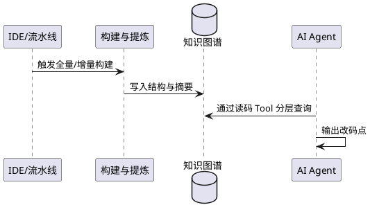
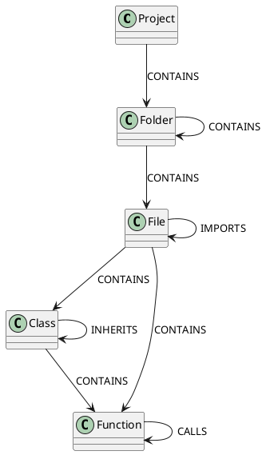
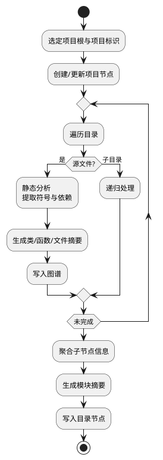
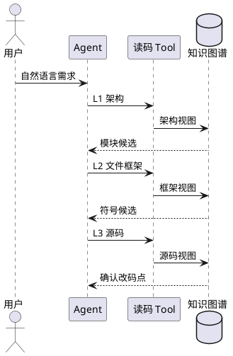

# 代码仓知识图谱与 Agent 读码能力 — 需求分析与设计

修订记录：

| 日期 | 修订版本 | 修改描述 | 作者 |
|----------|----------|----------|----------|
| 2026-05-20 | V1.0 | 初版 | — |
| 2026-05-20 | V2.0 | 聚焦图谱与 Agent 定位改码点 | — |
| 2026-05-20 | V2.1 | 特性拆分为三个子功能 | — |
| 2026-05-20 | V3.0 | **按设计思路重写**：突出方案 rationale，弱化代码实现描述 | — |

---

# 1. 概述

## 1.1 目的

本文档描述 **「如何让 AI 编码 Agent 理解存量代码仓并定位改码点」** 的设计思路与方案，供产品、架构与 Agent 集成方评审和对齐。

核心问题：用户用自然语言描述需求时，Agent 面对的是体量远超上下文窗口的代码仓；若仅提供仓库路径或鼓励整文件阅读，Agent 要么反复「扫目录」，要么消耗大量 Token，且难以稳定找到应修改的**模块、文件、函数**。

本方案通过 **代码仓数字孪生（以知识图谱为主）+ 分层读码 Tool**，把「理解架构 → 缩小范围 → 确认改码点」变成可重复、可约束的流程。本文**不展开** Agent 运行时、会话、模型选型等基础框架。

## 1.2 范围

本特性由三个子功能构成：

| 子功能 | 设计关切 |
|--------|----------|
| **一、代码知识图谱管理** | 图谱建什么模型、存哪些关系、如何按项目隔离与查询 |
| **二、代码知识图谱构建与语义提炼** | 如何从存量源码形成「结构 + 依赖 + 语义摘要」并写入图谱 |
| **三、基于代码图谱的需求开发** | 如何封装 Tool、规定 Agent 如何用图谱完成需求分析与改码点定位 |

| 在范围内 | 在范围外 |
|----------|----------|
| 数字孪生与分层读码的设计思路 | 宿主服务、会话、WebSocket |
| 图谱概念模型、关系语义、查询视图 | 写文件、补丁应用等改码 Tool |
| 读码 Tool 的能力定义与使用策略 | IDE UI、鉴权、多模型接入 |
| 片段向量库（演进方向） | 对话历史压缩（演进方向） |

---

# 2. 特性需求概述

## 2.1 子功能一：代码知识图谱管理

| 需求编码 | 需求标题 | 需求描述 |
|----------|----------|----------|
| REQ-CG-M01 | 图谱概念模型 | 定义项目、目录、文件、类、函数等节点及必备属性 |
| REQ-CG-M02 | 关系体系 | 定义包含、调用、导入、继承等边及其业务语义 |
| REQ-CG-M03 | 多项目隔离 | 同一物理仓库在不同租户/项目名下图谱互不干扰 |
| REQ-CG-M04 | 持久化与更新 | 支持全量构建与按文件/目录增量刷新 |
| REQ-CG-M05 | 分层查询视图 | 对外提供架构视图、文件框架视图、符号源码视图 |

## 2.2 子功能二：代码知识图谱构建与语义提炼

| 需求编码 | 需求标题 | 需求描述 |
|----------|----------|----------|
| REQ-CG-A01 | 结构事实抽取 | 从源码识别类、函数、方法及物理归属关系 |
| REQ-CG-A02 | 依赖事实抽取 | 识别调用链、文件导入、类继承等 |
| REQ-CG-A03 | 语义摘要提炼 | 为目录、文件、类、函数生成简短功能说明，供自然语言匹配 |
| REQ-CG-A04 | 全量构建 | 首次接入项目时生成完整图谱 |
| REQ-CG-A05 | 增量同步 | 源码变更后局部更新图谱，保持与仓库一致 |

## 2.3 子功能三：基于代码图谱的需求开发

| 需求编码 | 需求标题 | 需求描述 |
|----------|----------|----------|
| REQ-CG-D01 | 读码 Tool 体系 | 将图谱查询能力封装为 Agent 可调用的工具集 |
| REQ-CG-D02 | 分层读码策略 | 规定 L1 架构 → L2 文件框架 → L3 符号源码 的递进顺序 |
| REQ-CG-D03 | 改码点定位 | 从用户需求收敛到明确的文件 + 类/函数 |
| REQ-CG-D04 | 依赖辅助 | 支持沿调用/导入关系做影响面分析（含规划能力） |

---

# 3. 需求场景分析

## 3.1 特性需求来源与价值概述

### 3.1.1 原始需求

在 AI Agent 执行编码任务时，需要从代码仓获取：

1. **代码仓架构** — 有哪些子系统/模块、各自职责；
2. **子模块与文件结构** — 模块下有哪些文件、文件内有哪些类/函数；
3. **函数依赖关系** — 调用谁、被谁调用、导入与继承关系；

从而根据用户的自然语言描述 **分析并定位** 需要修改的代码位置。

### 3.1.2 设计背景（Prompt 实验结论）

先期 Prompt 实验（见 `设计思路.md`）形成以下 **设计依据**，后文方案均由此推导：

| 结论 | 对设计的约束 |
|------|----------------|
| 「项目结构 → 文件框架（隐藏实现）→ 指定函数源码」流程 **可行且有效** | 必须提供 **分层读码 Tool**，禁止默认整文件灌入 |
| 若不在上下文中提供 **模块说明、文件说明**，Agent 仍会反复索要工程结构 | 图谱须含 **Folder/File 级语义摘要**，且 L1 Tool 必选 |
| 仅靠 Prompt 罗列「初始文件里有哪些函数」 **不足以** 替代按需取框架 | 须支持 Agent **主动拉取** 单文件符号清单（L2） |
| 整文件 `read_file` 效果可能好，但 **Token 成本极高** | `read_file` 仅作兜底；改码后对话历史 **不应长期保留全文**（演进） |
| 代码仓需 **数字孪生**：图谱（结构+关系）+ 向量库（片段语义，规划） | 当前以图谱为主；向量库作模糊召回补充 |

**价值概述（>300 字）：**

本特性的价值在于把「理解大型存量仓库」从 Agent 的即兴探索，变成 **可设计、可约束、可复用** 的能力链。

对 **Agent** 而言：用户需求往往是业务语言（如「给缓存加 TTL」），而代码是符号与路径。图谱在结构与依赖之上叠加 **中文摘要**，使 Agent 能在 L1/L2 用「语义相似」快速缩小到少量模块与文件，再在 L3 用精确源码确认改码点，避免在全仓盲搜。依赖边（调用、导入、继承）支撑 **影响面判断**：改一个函数前，可沿图查询调用方与关联文件，降低漏改风险。

对 **工程组织** 而言：图谱在项目接入时 **构建一次**（或增量更新），多会话、多任务共享，避免每次对话重新解析仓库。图数据库适合表达 **层级包含** 与 **网状依赖**，比扁平文件索引更贴近「架构—模块—符号」的人类认知，也为后续 Caller/Callee 查询、依赖可视化留出统一数据基础。

对 **成本与体验** 而言：分层读码把 Token 消耗控制在「先摘要、后源码」，与实验结论一致；相比每次让 Agent 列举目录树，结构化 Tool 返回更稳定、可解析，减少无效轮次。

## 3.2 特性场景分析

**场景 A：项目接入 — 构建数字孪生**

IDE 或流水线在「打开项目 / 首次启用 AI」时触发图谱构建：扫描源码树，抽取符号与依赖，生成各层摘要，写入图谱存储。此后 Agent 不再直接面对原始文件树，而是面对 **已标注职责的架构视图**。

**场景 B：接收需求 — 分层定位改码点**

用户提出修改诉求后，Agent 按 **L1 → L2 → L3** 调用读码 Tool：先在模块树中根据 `description` 锁定子系统，再在候选文件的 **框架视图**（类/函数清单 + 摘要、无实现体）中锁定符号，最后读取该符号的完整源码确认改码点。若涉及连带修改，再查询调用关系（规划 Tool）。

**场景 C：源码演进 — 图谱与仓库同步**

开发者在本地修改并保存后，对变更文件或目录触发 **增量构建**，替换图中对应子树，保证 Agent 读到的框架与依赖与当前仓库一致。

## 3.3 特性影响分析

### 3.3.1 硬件限制

建图阶段计算与 I/O 随仓库规模增长；图存储需独立部署。不涉及专用硬件。

### 3.3.2 技术限制

- 结构/依赖抽取以 **静态分析** 为主，动态分发、反射等场景可能漏边，设计上接受「近似完整」并预留人工兜底读文件。
- 语义摘要依赖外部生成能力，需考虑隐私与合规。
- 多语言需分别定义抽取规则，未覆盖语言不参与图谱。

### 3.3.3 对 License 的影响分析

不涉及。

### 3.3.4 对系统性能规格的影响分析

- 首次建图：大仓耗时与「符号数量 × 摘要次数」相关，宜异步、可展示进度（演进）。
- Agent 单次任务：多次 Tool 调用延迟累加，宜控制 L3 调用次数。

### 3.3.5 对系统可靠性规格的影响分析

- 单文件抽取失败不应导致全项目失败。
- 图谱未构建或项目标识不一致时，Agent 应明确提示先构建孪生。

### 3.3.6 对系统可信相关的安全、韧性、隐私规格的影响分析

- 源码与摘要属敏感数据，图库需访问控制。
- 读码 Tool 仅能访问已授权项目根下的路径。

### 3.3.7 对系统可用性规格的影响分析

图存储不可用时，本子功能不可用；可考虑只读缓存降级（演进）。

### 3.3.8 对系统可服务性规格的影响分析

宜提供构建状态、图谱版本/更新时间查询（演进）。

### 3.3.9 对系统兼容性的影响分析

项目根路径在构建与查询阶段须一致；路径表示宜统一规范。

### 3.3.10 与其他重大特性的交互性、兼容性的影响分析

- Agent Prompt/技能须 **内化分层读码策略**，否则易退化为整文件读取。
- 规划中的 **片段向量库** 与图谱分工：图谱管精确结构与依赖，向量管「说法不同但逻辑相近」的模糊命中。

## 3.4 友商实现方案分析

不涉及

---

# 4. 特性/功能总体方案

## 4.1 总体方案

### 4.1.1 业务方案

> 500 字以上总体业务说明

本方案将存量代码仓视为 Agent 的 **外部知识源**，通过「构建孪生 → 管理图谱 → 分层消费」三段子功能，解决 **懂仓库、找得到、改得准** 三件事。

**（1）为什么需要「数字孪生」而不是直接把仓库路径交给 Agent**

实验表明：仅给路径时，Agent 的第一反应是 **列举目录、猜测文件**，轮次浪费且不稳定。人类开发者改代码时，脑中已有 **模块分工、文件职责、函数谁调谁** 的 mental model；Agent 缺少这层模型。数字孪生要把这层 model **外置、结构化、可查询**。孪生分两层设计：**代码知识图谱**（本方案主体）承载层级、符号、依赖与摘要；**片段向量库**（规划）承载「逻辑片段 + 自然语言描述」的双向量召回，补足「用户表述与符号名不一致」时的模糊检索。

**（2）三子功能如何分工**

- **子功能一（图谱管理）** 回答「孪生长什么样、怎么存、怎么查」。采用 **图模型**：节点表示项目/目录/文件/类/函数，边表示包含、调用、导入、继承。摘要作为节点属性，不替代结构。对外暴露三种 **查询视图**——架构树（模块 + 职责说明）、文件框架（符号清单 + 摘要、无实现）、符号源码（改码前最终确认用）——与 Agent 认知粒度对齐。

- **子功能二（构建与语义提炼）** 回答「孪生从哪来」。分两层提炼：**结构事实**（语法分析得到的符号边界与依赖，要求准确、可复核）；**语义摘要**（用自然语言压缩模块/文件/函数职责，要求简短、利于与用户说法匹配）。文件夹摘要 **自底向上** 聚合，形成与架构视图一致的模块说明。支持全量构建与增量同步，使孪生随仓库演进。

- **子功能三（基于图谱的需求开发）** 回答「Agent 怎么用孪生干活」。不把图谱 API 直接暴露给模型，而是封装为 **语义清晰的读码 Tool**，并规定 **L1→L2→L3** 递进策略：先懂架构，再看文件框架，最后才拉源码。Tool 命名与返回结构对应用户心智（项目结构、文件定义、函数代码），与实验中「list_file_definitions → read_file」的成功路径一致，但数据源改为 **预构建图谱** 而非现场扫盘。改码点定位的输出是 **(文件, 类或函数)**，后续改码由其他能力完成。

**（3）与原始需求的三项能力如何覆盖**

| 原始能力项 | 设计落点 |
|------------|----------|
| 代码仓架构 | 图谱 CONTAINS 层级 + Folder 模块摘要 + L1 Tool |
| 子模块/文件结构 | 架构树中的文件列表 + L2 文件框架视图 |
| 函数依赖关系 | 图谱 CALLS/IMPORTS/INHERITS + 规划中的 Caller/Callee Tool |
| 定位改码点 | L1/L2 语义收敛 + L3 源码确认 |

整体业务闭环：**构建一次孪生 → 多次需求任务复用 → 源码变更后增量刷新 → Agent 按层读码直至锁定改码点**。

### 4.1.2 数据方案

**图谱概念模型（业务视角）：**

```plantuml
@startuml
package "物理与逻辑层级" {
  Project "项目" --> Folder "目录/模块"
  Folder --> Folder
  Folder --> File "源文件"
}
package "代码符号" {
  File --> Class "类/结构体"
  File --> Function "函数"
  Class --> Function : 方法
}
package "依赖关系" {
  Function --> Function : 调用 CALLS
  Class --> Class : 继承 INHERITS
  File --> File : 导入 IMPORTS
}
note bottom of Project
  节点属性含：路径、语言、
  源码（符号级）、summary（语义）
end note
@enduml
```

**设计说明：**

- **节点** 承载「是什么」：路径、语言、签名、源码（按需）、**summary（必读）**。
- **边** 承载「与谁有关」：包含关系支撑架构浏览；调用/导入/继承支撑依赖分析。
- **项目标识** 由「租户 + 项目名 + 仓库根路径」派生，保证多项目共存。

**数字孪生双层（演进）：**

| 层级 | 内容 | 召回方式 |
|------|------|----------|
| 图谱层 | 结构 + 依赖 + 摘要 | 精确查询、图遍历 |
| 向量层（规划） | 逻辑片段 + 描述 | 描述与片段双向量、多路召回 |

### 4.1.3 对接方案



| 对接方 | 关系 |
|--------|------|
| 源码仓库 | 构建阶段只读扫描 |
| 图谱存储 | 构建写入、Agent 只读查询 |
| AI Agent | 仅通过读码 Tool 消费图谱；改码不在本子功能 |
| 摘要生成能力 | 构建阶段调用，为节点生成 summary |

---

## 4.2 特性功能性设计（三子功能总览）

| 子功能 | 设计目标 | 关键能力 |
|--------|----------|----------|
| **一、代码知识图谱管理** | 定义稳定、可扩展的「代码仓孪生」数据契约 | 概念模型、关系语义、多项目隔离、三种查询视图、生命周期管理 |
| **二、代码知识图谱构建与语义提炼** | 把存量源码转化为可查询的图谱数据 | 结构抽取、依赖抽取、分层摘要、全量/增量构建 |
| **三、基于代码图谱的需求开发** | 让 Agent 按用户需求高效定位改码点 | 读码 Tool 集、L1/L2/L3 策略、定位流程与规范 |

---

## 4.3 子功能一：代码知识图谱管理 — 详细设计

### 4.3.1 设计思路

本子功能定义 **「代码仓孪生在系统中如何存在」**，是子功能二（填入数据）与子功能三（读出数据）的 **共同语言**。

**要解决的问题：**

- 若没有统一模型，构建端与 Agent 端会对「项目结构」「文件定义」理解不一致；
- 若只用文件树 JSON，难以表达 **调用、继承、导入** 等依赖；
- 若把源码全文都塞进节点，图谱膨胀且 Agent 仍会在 L1 就耗尽 Token。

**设计原则：**

1. **结构先行、摘要辅助**：层级与依赖是骨架；`summary` 是帮助 Agent 做语义匹配的「标签」，不能代替 CONTAINS/CALLS 等边。
2. **一种关系一种语义**：例如 CALLS 仅表示调用事实，不混用「引用」「依赖」等多义边，便于后续做影响分析 Tool。
3. **查询视图 = Agent 读码粒度**： deliberately 设计三种视图，与子功能三的 L1/L2/L3 一一对应，避免 Agent 自选随意粒度。
4. **项目级命名空间**：任何节点、边均隶属某一逻辑项目，支持多仓、多租户。

**存储选型思路（图数据库）：**

代码仓天然是 **树（目录）+ 网（调用/导入）** 的组合；关系型表或多层 JSON 对「沿调用链查五跳」「某函数被谁调用」表达繁琐。图数据库以节点—边为一等公民，与 `设计思路.md` 中的图谱 schema 一致，且支持反向遍历（如被调者查调用方），故采用图存储承载孪生。

### 4.3.2 数据设计

#### （1）节点建模（业务属性）

| 节点 | 业务含义 | 关键属性 | 设计说明 |
|------|----------|----------|----------|
| Project | 一个接入的代码仓库实例 | 名称、所有者、根路径、项目级描述 | 图谱入口；描述可来自 README 或人工配置 |
| Folder | 目录/子模块 | 路径、模块摘要 | 摘要由子节点聚合提炼，体现 **架构说明** |
| File | 源文件 | 路径、语言、文件摘要、导入列表 | 摘要用自然语言说明「本文件主要职责」 |
| Class | 类/结构体/接口 | 全限定名、所属文件、类摘要、源码 | 改类级需求时 L3 目标 |
| Function | 函数/方法/外部 API | 全限定名、签名、类型、摘要、源码 | 改函数级需求时 L3 目标；API 节点用于外部调用 |

#### （2）关系管理

| 关系 | 语义 | 服务场景 |
|------|------|----------|
| CONTAINS | 上级包含下级 | 架构浏览、路径导航 |
| CALLS | 调用方 → 被调方 | 影响面分析、调用链（规划 Tool） |
| IMPORTS | 文件间导入 | 模块边界、变更传播 |
| INHERITS | 子类 → 父类 | 继承体系、重写范围 |
| IMPLEMENTS / OVERRIDES | 实现接口 / 重写方法 | 面向对象变更（按语言启用） |



#### （3）三种对外查询视图（与子功能三对齐）

| 视图 | 内容 | 不包含 | 对应读码层 |
|------|------|--------|------------|
| 架构视图 | 目录树、每模块 summary、下属文件列表 | 函数体 | L1 |
| 文件框架视图 | 文件 summary、类/函数清单及各符号 summary | 函数体、类体实现 | L2 |
| 符号源码视图 | 指定类或函数的完整 source | — | L3 |

**项目标识（逻辑契约）：** 由「所有者 + 项目名 + 规范化根路径」生成唯一 `project_id`，构建与查询必须使用同一套项目描述，否则视为未构建。

### 4.3.3 方案说明

**生命周期：**

| 阶段 | 设计意图 |
|------|----------|
| 全量构建 | 首次接入，生成完整孪生 |
| 增量更新 | 源码变更后仅刷新受影响子图，控制成本 |
| 只读查询 | Agent 侧不修改图谱，保证孪生为「事实快照」 |

**与子功能二的接口：** 子功能二按本模型 **灌入** 节点与边；**禁止** 子功能三绕过模型直接写库。

**与子功能三的接口：** 每种查询视图对应一类读码 Tool 的数据来源；返回结构宜 **稳定、可解析**（树形 JSON 或约定字段），便于 Agent 多轮推理。

---

## 4.4 子功能二：代码知识图谱构建与语义提炼 — 详细设计

### 4.4.1 设计思路

> 本子功能不是「逆向工程文档」，而是：**如何把存量源码转化为子功能一定义的图谱数据**。

**要解决的问题：**

- 源码体量大，不能在建图时就把所有全文塞进图谱并在 L1 暴露；
- 仅有目录树没有 **「这个模块干什么的」**，Agent 仍无法理解架构；
- 仅有符号表没有 **调用/导入关系**，无法支撑依赖分析；
- 用户说「缓存」「鉴权」而代码叫 `StockDataCache`，需要 **语义桥梁**。

**双层提炼模型（核心设计）：**

| 层次 | 回答的问题 | 方法 | 质量要求 |
|------|------------|------|----------|
| **结构事实层** | 有哪些类/函数、在哪、谁调谁 | 多语言静态分析（语法树） | 尽量准确、可追溯到源码 |
| **语义提炼层** | 用业务语言说清职责 | 对 Folder/File/Class/Function 生成短摘要 | 简短、偏「职责」而非复述代码 |

二者叠加后才形成完整孪生：**结构保证查得到，摘要保证对得上用户说法**。

**构建顺序设计（自底向上）：**

1. 先 **文件级**：解析单文件符号与依赖，写符号节点与 CALLS 等边，并生成函数/类/文件摘要；
2. 再 **目录级**：聚合子文件、子目录的摘要，生成 **模块摘要**，形成架构视图所需信息；
3. 最后 **项目级**：挂载项目节点与全局描述。

大文件摘要策略：当单文件过长时，**用子符号摘要合成文件摘要**，避免单次提炼输入过长——这是设计上的 Token/成本权衡，而非实现细节。

**多语言：** 按文件类型选择分析方式，统一落入同一套概念模型（Class/Function/CONTAINS/CALLS…），对 Agent 透明。

**与向量库（规划）的边界：** 图谱负责 **确定性结构与依赖**；语义模糊、跨文件「找相似逻辑」留给片段向量库，二者通过同一数字孪生体系互补。

### 4.4.2 数据设计

**构建流水线（逻辑）：**



**摘要提炼规则（设计约定）：**

| 对象 | 提炼输入（设计意图） | 输出用途 |
|------|----------------------|----------|
| Function / Method | 函数体或签名 | L2 符号列表中的「这函数干什么」 |
| Class | 类定义 | L2 类一行说明 |
| File | 全文或「子符号摘要列表」（大文件） | L2 文件级定位 |
| Folder | 子目录 + 子文件摘要列表 | L1 模块 description |

**扫描范围：** 排除版本库、依赖目录、构建产物等 **与业务源码无关** 的路径；测试目录是否纳入由产品策略决定（默认可排除以降噪）。

### 4.4.3 方案说明

**触发时机（建议）：**

- 项目首次启用 AI 辅助；
- 周期性 CI 预构建（大仓）；
- 开发者保存文件后的增量刷新（近实时）。

**质量与局限（设计认知）：**

- 静态分析对动态特性不完整 → 依赖边 **允许不完整**，Agent 可用 L3/L* 兜底；
- 摘要可能漂移 → 源码大改后须 **增量刷新**；
- 建图成本与仓库规模正相关 → 宜异步、可中断恢复（演进）。

**交付物：** 满足子功能一模型的、带摘要与依赖边的 **项目级图谱**，供子功能三全程只读消费。

---

## 4.5 子功能三：基于代码图谱的需求开发 — 详细设计

### 4.5.1 设计思路

> 300 字以上：本子功能定义 **Agent 在编码任务中如何使用图谱**。

子功能三不重复建图，而是把图谱能力翻译成 **Agent 能理解和调用的 Tool**，并用 **策略** 约束调用顺序，从而落实 `设计思路.md` 中已验证的分层读码路径。

**核心观点：**

1. **Tool 是图谱的「人机接口」**  
   模型不直接写 Cypher；每个 Tool 对应一个清晰的业务意图（看架构、看文件框架、看某函数代码），返回结构适合作为下一轮推理的「观察」。

2. **分层是策略，不是可选项**  
   L1 解决「在哪个模块」；L2 解决「在哪个文件的哪个符号」；L3 解决「改之前长什么样」。跳过 L1/L2 直接读全文，在实验上 **浪费 Token** 且易迷失。

3. **定位改码点是本子功能的终点**  
   输出 `(file_path, class_name | function_name)` 及必要上下文说明，**改代码** 交给写文件类 Tool（特性外）。

4. **依赖关系通过专用 Tool 释放**  
   图谱已存 CALLS 等边，应提供「谁调用了我 / 我调用了谁」类 Tool（规划），直接满足原始需求中的 **函数依赖关系**，而不强迫 Agent 读完整 callee 源码猜测。

5. **与 Prompt 协同**  
   System 级须强调：已有孪生则 **禁止** 反复索要目录；用户已给出内容则 **禁止** 重复读取；每轮 **一个 Tool**，根据观察再决定下一步。

### 4.5.2 数据设计

**Tool 抽象（逻辑契约）：**

| 要素 | 说明 |
|------|------|
| 输入 | 项目描述（与构建时一致）+ Tool 特有参数（路径、符号名） |
| 输出 | 成功/失败 + 结构化或文本载荷，作为 Agent 的「观察」 |
| 副作用 | 无；只读图谱 |

**读码 Tool 体系（封装清单与作用）：**

| Tool | 作用（设计意图） | 服务的需求能力 | 读码层 |
|------|------------------|----------------|--------|
| **read_project_struct** | 获取 **代码仓架构**：带自然语言说明的模块树、各模块下有哪些文件。用于将用户诉求 **映射到子系统/目录**。 | 代码仓架构、子模块结构（第一层） | **L1** |
| **read_file_summary** | 获取 **单文件框架**：文件职责摘要 + 类列表 + 函数/方法列表（各带一行说明），** deliberately 不含实现代码**。用于在候选文件中 **锁定类或函数名**。 | 子模块文件结构、符号清单 | **L2** |
| **read_function_code** | 获取 **某一函数的完整实现**（含签名、注释、源码）。用于 **确认改码点** 并理解实现细节。 | 精确定位、改前理解 | **L3** |
| **read_class_code** | 获取 **某一类的完整定义**（含方法）。用于类级别修改或需要类上下文的场景。 | 精确定位 | **L3** |
| **read_file** | 读取 **整文件原文**。**仅当** L2 框架不足以判断（如全局常量、复杂导入）时使用；Token 成本高，非默认路径。 | 兜底 | **L\*** |
| *read_function_callers*（规划） | 沿 **CALLS 反向** 查询：谁调用了指定函数。用于评估修改 **波及范围**。 | 函数依赖关系 | 依赖 |
| *read_function_callees*（规划） | 沿 **CALLS 正向** 查询：指定函数调用了谁。用于理解 **下游逻辑**。 | 函数依赖关系 | 依赖 |
| *read_file_dependencies*（规划） | 沿 **IMPORTS** 查询文件依赖。用于 **模块/文件级** 影响分析。 | 文件依赖 | 依赖 |

**为何 Tool 名称与实验路径对应：**

| 实验阶段 | 本方案 Tool |
|----------|-------------|
| 项目文件夹 + 模块说明 | read_project_struct |
| 文件定义（隐藏实现） | read_file_summary |
| 指定函数准确代码 | read_function_code / read_class_code |

### 4.5.3 方案说明

#### （1）分层读码策略（必须遵守）

```text
用户自然语言需求
        │
        ▼
┌───────────────────┐
│ L1 read_project_struct │  架构：哪个模块相关？
└─────────┬─────────┘
          ▼
┌───────────────────┐
│ L2 read_file_summary   │  框架：哪个文件、哪个类/函数？
└─────────┬─────────┘
          ▼
┌───────────────────┐
│ L3 read_function_code  │  源码：改点确认
│    / read_class_code   │
└─────────┬─────────┘
          ▼
    改码点 (文件, 符号)
          │
          ▼
    （可选）依赖 Tool → 影响面
          │
          ▼
    写码 Tool（特性外）
```

#### （2）需求开发典型流程（业务叙事）

**需求：**「给股票 K 线缓存增加 TTL。」

| 步骤 | Agent 行为（设计） | 获得的信息 |
|------|-------------------|------------|
| 1 | 调用 L1 | 模块树中「cache」「Redis」「K线」等摘要指向缓存子模块 |
| 2 | 调用 L2 | 某 py 文件摘要含 K 线读写；符号列表中有 `set_stock_kline` |
| 3 | 调用 L3 | 该函数完整实现，确认 TTL 逻辑应加在此处 |
| 4 | （规划）调用 callers | 评估哪些上游需适配 |
| 5 | 输出 | 改码点：`…/stock_cache.py :: set_stock_kline` |



#### （3）三子功能协作关系

| 时机 | 子功能 | 说明 |
|------|--------|------|
| 准备 | 二 → 一 | 构建并写入孪生 |
| 每次编码任务 | 三 → 一 | 只读查询，不改图谱 |
| 源码变更后 | 二 → 一 | 增量刷新，保证三读到最新事实 |

#### （4）Agent 集成规范（设计约束）

- **必须** 优先 L1→L2→L3；禁止默认 `read_file`。
- 图谱未构建时，应提示完成 **子功能二** 而非让 Agent 裸扫磁盘。
- 每轮对话 **一个读码 Tool**，根据返回再决策（与 Tool 型 Agent 节奏一致）。
- 改码完成后，对话历史中对大段 `read_file` 结果 **宜压缩为「已成功读取」**（演进，见设计思路）。

---

# 5. 可靠性/可用性/Function Safety 设计

## 5.1 软件功能流 FMEA

不涉及。设计关注：半构建图谱、项目标识不一致导致查询为空。

## 5.2 冗余设计

不涉及

## 5.3 故障管理设计

- 构建：单文件失败跳过，不阻断全项目。
- 查询：失败时返回明确原因，Agent 可换路径或提示重建孪生。

## 5.4 过载控制设计

不涉及。建议对全量构建做队列与限流。

## 5.5 升级不中断设计

不涉及

## 5.6 人因差错设计

- 分层读码写入 Agent 使用规范，降低误用整文件读取。
- 构建与查询使用同一项目根路径约定。

## 5.7～5.9

不涉及

---

# 6. 安全/韧性/隐私设计

| 维度 | 设计考虑 |
|------|----------|
| 数据分级 | 源码与摘要属敏感资产，图库需权限与网络隔离 |
| 路径边界 | 读码仅允许访问已授权项目根下路径 |
| 多租户 | 项目标识隔离图空间 |
| 摘要外发 | 构建阶段若调用外部生成能力，须符合企业合规 |

---

# 7. 特性非功能性质量属性设计

## 7.1 可测性

- 用固定样例仓验证：构建后架构视图、框架视图、源码视图字段完整。
- 用场景用例验证：给定需求描述，L1→L2→L3 能否收敛到预期改码点。

## 7.2 可服务型

- 构建进度、图谱版本/更新时间可观测（演进）。

## 7.3 可演进性

- 新语言：扩展静态分析覆盖面，模型不变。
- 新关系/新 Tool：在图模型上增加边类型与查询即可。
- 向量库：与图谱并行，承担模糊语义召回。

## 7.4 开放性

- 查询能力可同时服务 REST 与 Agent Tool，契约统一。

## 7.5 兼容性

- 路径规范跨平台一致；同一项目标识重复构建为覆盖更新。

## 7.6 可伸缩性

- 超大仓：分批构建、子图合并（演进）；读查询可读写分离。

## 7.7 可用性

- 依赖图存储与构建任务；读查询宜低延迟。

## 7.8 资料

- 设计思路与实验结论：`设计思路.md`

## 7.9 其他

- 增量更新须保证「删旧子图 + 写入新子图」原子性（设计待完善）。

---

# 8. 词汇表

| 术语 | 说明 |
|------|------|
| 代码知识图谱 | 代码仓的结构、依赖与语义摘要构成的图状数字孪生 |
| 数字孪生 | 代码仓在系统中的可查询镜像；含图谱层与规划中的向量层 |
| 结构事实层 | 静态分析得到的符号与依赖，强调准确 |
| 语义提炼层 | 为节点生成的自然语言职责摘要，强调可读、可匹配 |
| 架构视图 | L1 查询结果：模块树 + 模块说明 + 文件列表 |
| 文件框架视图 | L2 查询结果：符号清单 + 摘要，无实现体 |
| 符号源码视图 | L3 查询结果：类或函数完整源码 |
| 分层读码 | L1 架构 → L2 框架 → L3 源码 |
| 改码点 | 待修改的文件路径 + 类名或函数名 |
| CALLS / IMPORTS / INHERITS | 调用、导入、继承关系 |

---

# 9. 需求清单

## 9.1 子功能一：代码知识图谱管理

| 需求 ID | 优先级 | 需求描述 |
|---------|--------|----------|
| REQ-CG-M01 | P0 | 图谱概念模型（Project/Folder/File/Class/Function） |
| REQ-CG-M02 | P0 | 关系体系（CONTAINS/CALLS/IMPORTS/INHERITS 等） |
| REQ-CG-M03 | P0 | 多项目隔离（项目标识契约） |
| REQ-CG-M04 | P0 | 图持久化与全量/增量生命周期 |
| REQ-CG-M05 | P0 | 架构 / 文件框架 / 符号源码 三种查询视图 |
| REQ-CG-M06 | P1 | 增量更新一致性（删旧写新） |

## 9.2 子功能二：代码知识图谱构建与语义提炼

| 需求 ID | 优先级 | 需求描述 |
|---------|--------|----------|
| REQ-CG-A01 | P0 | 多语言结构事实抽取 |
| REQ-CG-A02 | P0 | 调用/导入/继承等依赖事实抽取 |
| REQ-CG-A03 | P0 | Folder/File/Class/Function 语义摘要 |
| REQ-CG-A04 | P0 | 全量构建（自底向上模块摘要） |
| REQ-CG-A05 | P1 | 增量构建与仓库同步 |

## 9.3 子功能三：基于代码图谱的需求开发

| 需求 ID | 优先级 | 需求描述 |
|---------|--------|----------|
| REQ-CG-D01 | P0 | read_project_struct（L1 架构） |
| REQ-CG-D02 | P0 | read_file_summary（L2 文件框架） |
| REQ-CG-D03 | P0 | read_function_code / read_class_code（L3 源码） |
| REQ-CG-D04 | P0 | 分层读码策略与 Agent 集成规范 |
| REQ-CG-D05 | P0 | 需求 → 改码点定位流程 |
| REQ-CG-D06 | P1 | read_function_callers / callees |
| REQ-CG-D07 | P1 | read_file_dependencies |
| REQ-CG-D08 | P2 | read_file 兜底与对话历史瘦身 |
| REQ-CG-D09 | P2 | 片段向量库辅助模糊定位 |

---

**附录：原始需求 ↔ 三子功能 ↔ 读码 Tool**

| 原始需求 | 子功能一 | 子功能二 | 子功能三（Tool） |
|----------|----------|----------|------------------|
| 构建 Graph | 模型与存储 | 构建与提炼 | — |
| 代码仓架构 | 架构视图 | 模块摘要 | read_project_struct |
| 子模块/文件结构 | 框架视图 | 符号清单+摘要 | read_file_summary |
| 函数依赖 | CALLS 等边 | 依赖抽取 | callers/callees（规划） |
| 定位改码点 | 源码视图 | — | read_function_code 等 + 分层策略 |
