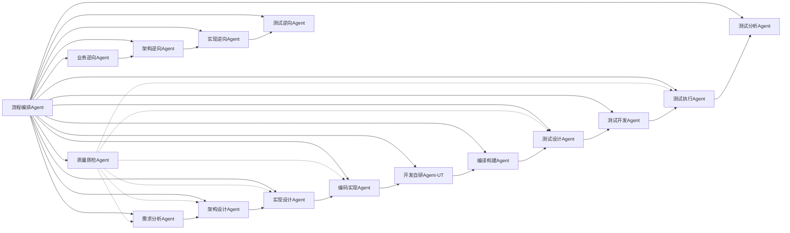

# AI驱动的核心网产品研发全流程自动化框架设计文档

## 1. 概述

### 1.1 背景与目标
- 核心网设备产品具有规模大、可靠性/性能要求高、数十年版本演进、功能继承性高等特点。
- 现有研发流程从需求收集到测试结果分析涉及多个阶段，人工参与多、信息传递易丢失、质量保障依赖专家经验。
- 目标：利用多Agent框架 + Skill机制，实现从客户需求输入到验证结果的全流程AI自动化，同时支持基于存量代码的反向分析（业务→架构→实现→测试）。

### 1.2 产品特点与研发挑战
- 规模大：文档、代码仓、测试用例数量庞大。
- 可靠性/性能要求高：需要多层次质量质检。
- 长期演进：需求变更需考虑对存量功能的影响。
- 功能继承性高：逆向分析能力至关重要。

### 1.3 整体设计原则
- 增量可落地：先逆向再正向。
- 人机协同：关键决策点保留人工审核。
- 知识沉淀：所有Agent执行记录、Skill调用结果存入知识库。
- 标准驱动：依赖产品规格、架构JSON、编码规范等结构化信息。

### 1.4 文档范围与读者
- 本文档面向AI工程专家、系统架构师、研发流程负责人。
- 主要定义工作空间结构、Agent职责及输入输出、各Agent内嵌Skill的定义。

### 1.5 关键成功指标
| 指标 | 目标值 | 测量方式 |
|------|--------|----------|
| 需求→测试报告全流程时间 | 缩短至原来30% | 流程编排记录 |
| 人工审核介入次数 | ≤2次/需求迭代 | 工作流日志 |
| 需求场景覆盖率 | ≥95% | 测试分析报告 |
| 逆向分析结果准确率（业务场景识别） | ≥85% | 人工抽检 |
| 质检门禁自动拦截缺陷比例 | ≥70% | 漏测率对比 |

### 1.6 设计约束
- **技术栈**：Agent框架使用LangGraph（Python实现），Skill支持Python函数、Shell脚本、容器化工具。
- **集成约束**：必须对接现有GitLab、Jenkins、Jira、Allure测试平台。
- **安全合规**：代码仓只读访问，版本包签名，测试环境隔离。
- **性能要求**：单个Agent响应时间≤5分钟，全流程（不含编译执行）≤30分钟。
- **成本约束**：LLM调用费用控制在每需求迭代≤$10（使用企业内部模型可忽略）。

### 1.7 术语表
| 术语 | 定义 |
|------|------|
| Agent | 承担一个特定研发阶段任务的自主AI单元，具有明确的输入输出和内部Skill集合。 |
| Skill | Agent可调用的原子能力，通常实现为一个函数或服务，完成单一任务（如解析需求、生成代码）。 |
| 工作空间 | 产品名/ 目录及其子目录，是Agent读写信息的标准文件系统布局。 |
| 架构元素 | 产品中的服务、组件、子系统、接口等可独立识别和变更的架构单元。 |
| 逆向分析 | 从已有代码、脚本、配置中提取业务、架构、实现、测试信息的过程。 |
| 质量门禁 | 阶段产物必须满足的质量条件，由质量质检Agent自动判定。 |
| 流程编排 | 由流程编排Agent负责调度各Agent按工作流定义执行。 |

## 2. 工作空间结构设计

### 2.1 设计目标
- **完整镜像**：从业务（特性）、架构、实现、验收、知识五个视角完整描述产品，成为AI研发唯一可信源。
- **增量跟踪**：每个需求（变更单元）对应的所有视角变更可追溯、可回滚，任何一次增量均可回滚、审计。
- **一致性校验**：不同视角之间的信息（如业务场景 ↔ 架构元素 ↔ 代码实现 ↔ 测试用例）必须满足约束规则，防止视角漂移。通过 .agent/一致性规则.yml 保证跨视角对齐。
- **机器可读+人类可读**：结构化格式（YAML/JSON）便于Agent解析，Markdown用于解释性文档。

### 2.2 完整目录结构（带注释）
```
产品名/
├── .agent/                                      # 隐藏元数据目录，AI自动维护
│   ├── consistency_rules.yaml          # 跨视角一致性硬约束规则集
│   ├── change_log.md                   # 变更审计日志（轻量Markdown表格）
│   ├── workflow_definitions.yaml       # 工作流模板定义（Agent编排与异常处理）
│   └── cross_perspective_cache.yaml    # 跨视角映射缓存（场景→接口→代码）
│
├── 产品简介.md
│
├── features/
│   ├── features_tree.yaml                          # 一级特性索引（全局）
│   ├── charging/                             # 一级特性目录（英文）
│   │   ├── charging_feature.yaml             # 二级索引：计费下所有子特性/场景
│   │   ├── voice_call_charging/              # 子特性目录（英文）
│   │   │   ├── spec.md                       # 子特性规格说明
│   │   │   ├── arch_ref.yaml                 # 关联架构元素清单
│   │   │   ├── SCENARIO_001_正常通话计费交互流程.md
│   │   │   ├── SCENARIO_002_语音信箱计费交互流程.md
│   │   │   └── SCENARIO_003_接听失败计费交互流程.md
│   │   └── sms_charging/
│   │       ├── spec.md
│   │       ├── arch_ref.yaml
│   │       ├── SCENARIO_004_发送短信计费交互流程.md
│   │       └── SCENARIO_005_接收短信计费交互流程.md
│   ├── session_mgmt/                         # 另一一级特性
│   │   ├── session_mgmt_feature.yaml
│   │   └── ...
│   └── ...                                   # 其他一级特性
│
├── architectures/
│   ├── overview.md                               # 总体架构说明
│   ├── logic_view/                               # 逻辑视角：元素、接口、关系、映射
│   │   ├── elements_tree.yaml                    # 逻辑架构全景图，描述元素间依赖和交互
│   │   ├── MME/
│   │   │   ├── spec.md                           # 架构元素定位、规格、质量属性、业务能力
│   │   │   ├── intefaces.yaml                    # 对外提供的接口列表（引用接口定义ID）
│   │   │   └── c                    # 依赖的外部接口列表
│   │   └── HSS/
│   │       ├── spec.md
│   │       ├── intefaces.yaml  
│   │       └── intefaces.yaml  
│   │
│   └── deployment_view/                            # 部署、构建等实现相关
│       ├── environment.md                          # 编译工具链、依赖库、环境变量、构建脚本说明
│       └── deployment.md                           # 部署结构（节点分布、副本数、资源规格、网络连接），内含 PlantUML 图
│
├──repos/
│   ├── mme_service/                     # 代码仓示例（Git 子模块或软链接）
│   │   └── .agent
│   │       ├── spec.md                      # 仓级说明：定位、技术栈、外部依赖、目录概览
│   │       ├── design.md                    # 仓级设计：模块划分、数据对象、模块接口、关键流程
│   │       ├── rules.md                     # (可选) 本仓特有约束：第三方库限制、接口使用规则等
│   │       └── xxxxx/                     # (大仓时存在) 模块级设计
│   │           ├── attach/
│   │           │   ├── spec.md              # 模块简短说明
│   │           │   └── design.md            # 模块详细设计：类/函数、状态机、数据流
│   │           └── paging/
│   │               ├── spec.md
│   │               └── design.md
│   ├── hss_service/
│   │   └── .agent                     # 该仓特有规则（若无则可省略）
│   └── ...                              # 其他代码仓
│
├── tests /                                       # 验收视角：测试用例、脚本、覆盖
│   ├── test_strategy.md                    # 版本级测试策略：范围、目标、入口/出口准则
│   ├── test_cases/                         # 测试用例（按特性组织）
│   │   ├── charging/
│   │   │   ├── TC_VCC_001_正常通话计费.md
│   │   │   ├── TC_VCC_002_余额不足释放.md
│   │   │   └── ...
│   │   └── session_mgmt/
│   │       ├── TC_ATT_001_初始附着成功.md
│   │       └── ...
│   └── scripts/                            # 自动化测试脚本
│       ├── test_voice_call_charging.py
│       ├── test_sms_charging.py
│       └── ...
│
├── requirements
│   ├── IR-001-语音计费优化/
│   │   ├── requirement.md                      # 需求说明：原始+澄清后需求、细分场景列表
│   │   ├── feature_changes/                    # 业务视角变更设计
│   │   │   └── voice_call_charging/
│   │   │       ├── SR-001-SCENARIO_紧急呼叫计费_变更说明.md
│   │   │       └── SR-002-SCENARIO_普通呼叫修改_变更说明.md
│   │   ├── architecture_changes/               # 架构视角变更设计
│   │   │   └── MME/
│   │   │       ├── AR-001-MME_变更说明.md
│   │   │       └── AR-002-PGW_变更说明.md
│   │   ├── repo_changes/                       # 实现视角变更设计
│   │   │   ├── overview.md                        # 所有受影响代码仓总览
│   │   │   └── mme_service/
│   │   │       └── implementation_design.md
│   │   ├── test_changes/                       # 验收视角变更指导
│   │   │   ├── test_scope.md                   # 测试范围、策略补充、重点关注点
│   │   │   └── test_points.md                  # 需验证的测试点清单（不引用用例ID）
│   │   └── delivery_report.md                  # 需求交付报告（最终闭环总结）
│   └── IR-002-....    
│
└── knowledge /                                # 静态知识库（AI检索用）
    ├── 编码规范/                            # 全局编码规范（所有代码仓默认遵守）
    │   ├── cpp_规范.md                      # C++ 编码风格
    │   ├── python_规范.md                   # Python 编码风格
    │   ├── 安全规则.md                      # 安全编码检查项
    │   └── 命名规范.md                      # 命名约定
    ├── 领域知识/                            # 电信与核心网协议知识
    │   ├── 3gpp协议/
    │   │   ├── TS_23_401_LTE架构.md
    │   │   ├── TS_29_272_S6a接口.md
    │   │   └── TS_32_299_Gy计费接口.md
    │   ├── 术语表.md                        # 核心网领域术语与缩写
    │   └── 常见模式.md                      # 领域内典型设计模式与最佳实践
    ├── 历史决策/                            # 关键设计决策记录（DEC-xxx 索引）
    │   ├── DEC-001-OCS超时重试策略选择.md
    │   └── DEC-002-紧急呼叫鉴权策略选择.md
    ├── 质量门禁/                            # 各阶段门禁规则（YAML）
    │   ├── 需求阶段门禁.yaml
    │   ├── 架构阶段门禁.yaml
    │   ├── 实现阶段门禁.yaml
    │   ├── 代码阶段门禁.yaml
    │   └── 测试阶段门禁.yaml
    └── 模板库/                              # 各类文件模板（Agent与人工创建文件时参考）
        ├── 产品简介模板.md
        ├── 需求说明模板.md
        ├── 业务变更说明模板.md
        ├── 架构元素设计模板.md
        ├── 代码仓spec模板.md
        ├── 代码仓design模板.md
        ├── 测试用例模板.md
        └── 交付报告模板.md
```

### 2.3 各目录详细定义与文件格式
#### 2.3.1 `.agent/` 目录

`.agent/` 目录是 AI 自动化系统的控制面与元数据中心，存放跨视角一致性约束、变更审计日志、工作流定义及跨视角映射缓存。该目录对所有 Agent 可见，但写入权限仅赋予流程编排 Agent、质量质检 Agent 和索引合并 Agent。

**视角（Perspective）** 是产品研发信息的顶层分类维度：业务、架构、实现、验收、知识。视角与工作空间目录的映射关系如下：

| 视角 | 主要对应目录 |
|------|--------------|
| 业务 | `features/`、`requirements/` |
| 架构 | `architectures/` |
| 实现 | `repos/` |
| 验收 | `tests/` |
| 知识 | `knowledge/` |

一致性规则和工作流定义均使用视角来声明作用域，具体文件匹配通过上述目录的 glob 模式表达。

---

##### 1. 一致性规则 `consistency_rules.yaml`

**文件作用**  
定义跨视角产物之间的硬性约束规则。质量质检 Agent 在每个阶段产物生成后，依据此规则集自动校验产物与上游视角的一致性，例如：
- 场景步骤中引用的接口是否在关联的架构元素中真实存在；
- 测试用例是否覆盖了需求声明的所有场景 ID；
- 代码修改是否关联到了对应的架构元素变更。

规则集随产品演进可增量扩充，并支持 `error`（阻断）和 `warning`（告警但允许人工放行）两种严重级别。

**格式说明**  
- `rules` 列表，每条包含 `id`、`name`、`severity`、`check_type`。  
- `source` 和 `target` 分别以 `视角` 声明所属领域，`file_pattern` 使用 glob 模式匹配具体文件（路径相对于工作空间根目录），`field` 描述需检查的具体字段或内容块。  
- `parameters` 提供具体检查条件（如是否允许部分覆盖）。

**样例**
```yaml
rules:
  - id: RULE_001
    name: "场景步骤接口一致性"
    severity: error
    check_type: "reference_integrity"
    source:
      视角: "业务"
      file_pattern: "features/**/SCENARIO_*.md"
      field: "步骤表格中'使用接口'列"
    target:
      视角: "架构"
      file_pattern: "architectures/logical/interfaces/*.yaml"
      field: "interface_id"
    parameters:
      allow_partial: false

  - id: RULE_002
    name: "测试场景覆盖"
    severity: error
    check_type: "coverage"
    source:
      视角: "需求"
      file_pattern: "requirements/*/business_changes/*.md"
      field: "涉及的场景ID列表"
    target:
      视角: "验收"
      file_pattern: "tests/coverage_mapping.yaml"
      field: "scenario_coverage"
```
##### 2. 变更日志 change_log.md
**文件作用**
Markdown 格式的变更审计日志，记录每一次需求增量合并的摘要信息。流程编排 Agent 在增量合并成功后，向此文件表格末尾追加一行记录。文件纯文本、可直接通过 Git diff 审查变更历史，满足初期轻量化审计需求。

**格式说明**
文件以 Markdown 表格组织，每行一条变更记录。后面正式版本可以考虑轻量数据库存储。

表格列：需求ID、影响范围（子特性/架构元素）、操作类型（新增/修改/删除）、摘要、执行Agent、时间（ISO 8601）、关联commit哈希。

**样例**

```markdown
# 变更日志

| 需求ID | 影响范围 | 操作 | 摘要 | 执行Agent | 时间 | Commit |
|--------|----------|------|------|-----------|------|--------|
| REQ-001 | 计费/语音电话计费 | 新增 | 新增场景 SCENARIO_010 | 需求分析Agent | 2026-05-13T10:30:00Z | a1b2c3d |
| REQ-001 | MME接口S1AP | 修改 | 增加过载拒绝cause | 架构设计Agent | 2026-05-13T10:35:00Z | a1b2c3d |
```

##### 3. 工作流定义 workflow_definitions.yaml
**文件作用**
定义正向交付、存量反向分析等工作流的模板。该文件仅描述 Agent 的编排逻辑、依赖顺序和异常处理策略，不记录任何执行日志或一致性校验日志（执行日志存放于 workflow_runs/ 目录，一致性校验结果由质量质检 Agent 输出到对应需求目录或报告路径）。流程编排 Agent 读取此文件来动态构建任务图。

**格式说明**

workflows 列表，每项含 id、name、trigger（触发条件）和 steps。

steps 定义每一步调用的 agent、依赖的上游步骤 depends_on，以及失败处理 on_failure（值可为 pause_for_human、rollback_to:<step_id>、reject_and_notify 等）。

**样例**

```yaml
workflows:
  - id: WF_001
    name: "正向需求交付全流程"
    trigger: "requirements/ 目录新增或修改需求描述.md"
    steps:
      - id: step_01
        agent: "需求分析Agent"
        depends_on: []
        on_failure: "pause_for_human"
      - id: step_02
        agent: "架构设计Agent"
        depends_on: ["step_01"]
        on_failure: "rollback_to:step_01"
      - id: step_03
        agent: "实现设计Agent"
        depends_on: ["step_02"]
        on_failure: "reject_and_notify"
      - id: step_04
        agent: "质量质检Agent"
        depends_on: ["step_03"]
        on_failure: "reject_and_notify"

  - id: WF_002
    name: "存量反向分析"
    trigger: "手动或定时触发"
    steps:
      - id: step_biz_rev
        agent: "业务逆向Agent"
        depends_on: []
      - id: step_arch_rev
        agent: "架构逆向Agent"
        depends_on: ["step_biz_rev"]
      - id: step_impl_rev
        agent: "实现逆向Agent"
        depends_on: ["step_arch_rev"]
```
##### 4. 跨视角映射缓存 cross_perspective_cache.yaml
**文件作用**
存放由质量质检 Agent 或逆向 Agent 计算出的跨视角关系快照（如场景→接口→代码函数链）。正向流程 Agent 可直接查询此缓存，避免每次都扫描大量文件来重建关联。该文件完全由 Agent 自动维护，人工无需介入。

**格式说明**

mappings 列表，每项记录一条跨视角链路，包含 scenario_id、interface_id、code_function、last_verified 等字段。

last_full_update 记录全量缓存的最新刷新时间。

**样例**

```yaml
last_full_update: "2026-05-13T12:00:00Z"
mappings:
  - scenario_id: SCENARIO_001
    interface_id: Gy
    code_function: "pgw_gy_ccr_initiate()"
    last_verified: "2026-05-13"
  - scenario_id: SCENARIO_001
    interface_id: S5
    code_function: "sgw_create_bearer()"
    last_verified: "2026-05-13"
```

#### 2.3.2 `产品简介.md`
- 描述产品定位、在客户网络场景中的位置、关键性能指标。

**样例**
```
---
product_id: PRODUCT_001
product_name: "5G核心网控制面"
version: "v1.0"
last_updated: "2026-05-13"
---

# 产品简介：5G核心网控制面

## 1. 产品定位
本产品是移动通信网络中的核心网控制面设备，负责终端的移动性管理、会话管理、策略控制与计费触发等控制面功能。产品部署于运营商核心机房，上接无线接入网（eNodeB/gNodeB），下联用户数据管理（HSS/UDM）、策略控制（PCRF/PCF）及在线计费系统（OCS），是承载网络会话与用户信令的中枢节点。

**客户场景**：
- 为电信运营商提供 4G/5G 融合核心网控制面能力
- 支持大规模物联网（IoT）终端的并发附着与会话保持
- 支撑语音、数据、短信等全业务的计费触发与控制

## 2. 目标用户概述

## 3. 外部系统依赖
| 外部系统 | 缩写 | 交互接口 | 依赖说明 |
|----------|------|----------|----------|
| 在线计费系统 | OCS | Gy (Diameter) | 实时信用控制与话单生成 |
| 归属用户服务器 | HSS | S6a (Diameter) | 用户签约与鉴权数据 |
| 策略控制服务器 | PCRF | Gx (Diameter) | QoS策略与计费规则 |
| 域名系统 | DNS | DNS协议 | 网元域名解析与负载均衡 |
| 网络时间协议 | NTP | NTP | 全系统时钟同步 |

## 4. 关键特性概览
> 完整特性树及细分场景请参见 `features/` 目录下的索引文件与场景交互流程文档。

## 5. 产品架构概览
本产品由以下架构元素组成，元素间通过标准接口交互。详细设计参见 `architectures/` 目录。

## 6. 关键性能与可靠性指标
| 指标 | 目标值 | 备注 |
|------|--------|------|
| 最大附着用户数 | 1000万/节点 | 单节点容量 |
| 附着请求处理能力 | ≥50,000次/秒 | 峰值信令吞吐 |
| 承载创建响应时延 | ≤10ms（99.9分位） | S5/S8接口创建承载 |
| 系统可用性 | ≥99.999% | 电信级高可用 |
| 故障切换时间 | ≤50ms | MME池内切换 |

## 7. 关键可维护性要求


## 8. 安全&隐私要求

## 9. 版本演进与约束
- **版本演进策略**：每季度发布一个增强版本，每年一次长期支持（LTS）基线版本。
- **继承性约束**：所有新需求不得破坏已有特性子场景的接口契约与信令流程；架构元素接口变更必须通过兼容性评审。
- **设计原则**：
  - 控制面与用户面分离（CUPS），便于独立扩容
  - 接口标准化（基于3GPP TS 23.401/TS 23.501），保障多厂商互通
  - 无状态设计（控制面节点），支持灵活扩缩容
```

#### 2.3.3 `Features/` 目录

`Features/` 目录是产品的业务视角权威源，按 **一级特性 → 子特性 → 场景** 三层结构组织，每个叶子节点包含规格文档、流程规格（时序图/状态机可使用 PlantUML）。索引文件由 Agent 自动维护，人工只需维护业务语义文件（`spec.md`、场景交互流程 `.md`），架构关联文件 `arch_ref.yaml` 由逆向 Agent 初始生成并随架构变更增量更新。

---

##### 1. 一级特性索引 `Features_tree.yaml`

**文件作用**  
全局特性树顶层索引，列出所有一级特性及其目录名，并指向每个一级特性目录下的二级索引文件。任务启动时首先加载该文件，按需加载二级索引，避免一次性解析全量特性数据。

**格式说明**  
- YAML 格式。  
- `features` 为列表，每项包含：  
  - `id`（一级特性全局唯一ID）
  - `name`（中文名称）
  - `dir`（英文目录名）
  - `index_file`（指向该特性下的二级索引文件，路径相对于 `features/` 目录）。

**样例**
```yaml
product: "5G核心网控制面"
last_updated: "2026-05-13"
features:
  - id: FEAT_001
    name: 计费
    dir: charging
    index_file: charging_feature.yaml
  - id: FEAT_002
    name: 会话管理
    dir: session_mgmt
    index_file: session_mgmt_feature.yaml
```

##### 2. 二级特性索引 *_feature.yaml（例：charging_feature.yaml）
**文件作用**
描述单个一级特性下的所有子特性、场景及关联文件，是子特性与场景的唯一结构化索引。
需求分析、架构影响域分析、测试设计等 Agent 均直接解析此文件获取场景列表、关联架构元素文件路径及场景文件位置。

**格式说明**
subfeatures 列表每项定义一个子特性，包含：
- `id`（子特性全局唯一ID）
- `name`（中文名）
- `dir`（英文目录名）
- `spec`（规格文件名）
- `arch_ref`（架构关联文件名）
- `scenarios`（场景列表）。

scenarios 中每项含：
- `id`（场景全局唯一ID）
- `name`（中文名）
- `file`（场景文件名，相对于子特性目录）。

样例
```yaml
feature_id: FEAT_001
feature_name: 计费
last_updated: "2026-05-13"
subfeatures:
  # 分支节点：语音电话计费（其下还有子特性，故无 spec/arch_ref/scenarios）
  - id: SUB_001_01
    name: 语音电话计费
    dir: voice_call_charging
    subfeatures:
      # 叶子特性：普通语音计费
      - id: SUB_001_01_01
        name: 普通语音计费
        dir: normal_call_charging
        spec: spec.md
        arch_ref: arch_ref.yaml
        scenarios:
          - id: SCENARIO_001
            name: 正常通话计费
            file: SCENARIO_001_正常通话计费交互流程.md
          - id: SCENARIO_002
            name: 语音信箱计费
            file: SCENARIO_002_语音信箱计费交互流程.md
          - id: SCENARIO_003
            name: 接听失败计费
            file: SCENARIO_003_接听失败计费交互流程.md
      # 叶子特性：紧急呼叫计费
      - id: SUB_001_01_02
        name: 紧急呼叫计费
        dir: emergency_call_charging
        spec: spec.md
        arch_ref: arch_ref.yaml
        scenarios:
          - id: SCENARIO_010
            name: 紧急呼叫正常计费
            file: SCENARIO_010_紧急呼叫计费交互流程.md
  # 叶子特性：短信计费（二层叶子，直接拥有业务定义）
  - id: SUB_001_02
    name: 短信计费
    dir: sms_charging
    spec: spec.md
    arch_ref: arch_ref.yaml
    scenarios:
      - id: SCENARIO_004
        name: 发送短信计费
        file: SCENARIO_004_发送短信计费交互流程.md
      - id: SCENARIO_005
        name: 接收短信计费
        file: SCENARIO_005_接收短信计费交互流程.md
```
##### 3. 子特性规格文件 spec.md
**文件作用**
定义子特性的业务说明、功能范围、关键规格指标及关联场景，是“特性是什么”的权威定义。文件头部包含 YAML 元数据，正文为 Markdown 格式，兼顾 Agent 解析与人工阅读。

**格式说明**
顶部以 --- 包裹的 YAML 元数据（front matter）提供自描述信息：subfeature_id、name、parent_feature、last_modified。

正文采用 Markdown 组织，建议包含：业务概述、功能范围、关键规格（表格）、关联业务场景（相对链接）、对外依赖。

样例
```markdown
---
subfeature_id: SUB_001_01
name: 语音电话计费
parent_feature: FEAT_001 计费
last_modified: "2026-05-13"
---

# 子特性：语音电话计费

## 1. 业务概述
针对语音呼叫产生的话单进行在线计费，支持实时信用控制、中间上报及最终话单生成。

## 2. 功能范围
- 在线计费（Gy接口）
- 通话时长粒度为秒级
- 异常处理：OCS超时重试、呼叫失败不扣费

## 3. 关键规格
| 指标         | 要求       |
|--------------|------------|
| 计费精度     | ≥99.999%   |
| 最低计费粒度 | 1秒        |
| OCS超时重试  | 2秒，最多3次 |

## 4. 业务场景
- [SCENARIO_001: 正常通话计费](SCENARIO_001_正常通话计费交互流程.md)
- [SCENARIO_002: 语音信箱计费](SCENARIO_002_语音信箱计费交互流程.md)
- [SCENARIO_003: 接听失败计费](SCENARIO_003_接听失败计费交互流程.md)

## 5. 架构依赖
参见 [arch_ref.yaml](arch_ref.yaml)。
```

##### 4. 架构关联文件 arch_ref.yaml
**文件作用**
描述子特性所有场景共同涉及的架构元素、接口及外部依赖，是连接业务视角与架构视角的纽带。架构影响域分析、测试覆盖逆向等 Agent 直接基于此文件开展工作。

**格式说明**

arch_elements 列表列出架构元素及其涉及的接口，id 必须与 架构/逻辑架构/元素/ 目录下的元素 ID 一致。

dependencies 列出外部系统或共享库等非直接可变更的依赖项。

样例
```yaml
subfeature_id: SUB_001_01
name: 语音电话计费
arch_elements:
  - id: MME
    name: 移动性管理实体
    involved_interfaces:
      - id: S1AP
        usage: "传递附着/去附着信令"
      - id: S11
        usage: "承载管理"
  - id: PGW
    name: PDN网关
    involved_interfaces:
      - id: Gy
        usage: "在线计费信用控制"
      - id: Gx
        usage: "策略与计费控制"
dependencies:
  - type: external_system
    name: OCS
    description: "在线计费系统，通过Gy接口交互"
```

##### 5. 场景交互流程文件 SCENARIO_xxx_*.md
**文件作用**
定义单个业务场景的前置条件、触发事件、参与架构实体、交互步骤（时序图/状态机）、后置条件及测试关注点，是需求分析、测试设计和执行的核心输入。

**格式说明**

顶部 YAML 元数据包含 scenario_id（全局唯一）、name、subfeature_id、priority、last_modified。

正文包含：业务描述、前置条件、触发事件、交互流程（PlantUML 图）、后置条件、异常路径、测试关注点。

样例

```markdown
---
scenario_id: SCENARIO_001
name: 正常通话计费
subfeature_id: SUB_001_01
priority: High
last_modified: "2026-05-13"
---

# 场景：正常通话计费

## 1. 业务描述
UE已附着并建立默认承载，发起普通语音呼叫，通话正常结束后生成计费话单。

## 2. 前置条件
- UE附着成功，默认承载建立
- OCS账户余额充足
- PGW已激活Gy在线计费会话

## 3. 触发事件
UE发起SIP Invite。

## 4. 交互流程（PlantUML）
本场景包含 **正常呼叫建立与结束** 的主交互流程，以及 **中间计费更新** 的周期性交互。

### 4.1 呼叫建立与承载创建
plantuml
@startuml
actor UE
participant MME
participant PGW
participant OCS

UE -> MME: Service Request (call)
MME -> PGW: Create Bearer Request
PGW -> OCS: Credit-Control-Request (INITIAL)
OCS --> PGW: Credit-Control-Answer (Granted units)
PGW -> MME: Create Bearer Response
MME -> UE: RRC Reconfiguration
@enduml

| 步骤	| 发起方 |	接收方 |	消息/事件 |	使用接口 |	说明 |
| :--- | :--- | :--- | :--- | :--- | :--- |
|1 | UE	| MME	| Service Request (call)	| S1AP	| UE向核心网发起语音呼叫服务请求 |
|2 | MME	| PGW	| Create Bearer Request	| S5/S8 (GTPv2)	| MME请求PGW为该呼叫创建专用承载 |
|3 | PGW	| OCS	| Credit-Control-Request (INITIAL)	| Gy (Diameter)	| PGW向OCS申请初始信用配额，携带用户ID、请求服务类型等 |
|4 | OCS	| PGW	| Credit-Control-Answer (Granted units)	| Gy	| OCS返回授权的时长额度（如600秒） |
|5 | PGW	| MME	| Create Bearer Response	| S5/S8	| PGW确认专用承载已创建 |
|6 | MME	| UE	| RRC Reconfiguration	| Uu (RRC)	| MME通知UE无线承载配置更新，呼叫建立完成 |


### 4.2 中间计费更新（周期上报）
plantuml
@startuml
participant PGW
participant OCS

loop 每额度耗尽前
    PGW -> OCS: Credit-Control-Request (UPDATE, used units)
    OCS --> PGW: Credit-Control-Answer (Granted new units)
end
@enduml

| 步骤	| 发起方 |	接收方 |	消息/事件 |	使用接口 |	说明 |
| :--- | :--- | :--- | :--- | :--- | :--- |
| 1	| PGW	| OCS	| Credit-Control-Request (UPDATE)	| Gy |	已使用量达到阈值或配额即将耗尽，向OCS上报已使用时间/流量并请求新配额 |
| 2	| OCS	| PGW	| Credit-Control-Answer	| Gy |	OCS从账户扣除相应金额，返回新授予的额度 |


## 5. 后置条件
- 用户话单记录生成，金额=通话时长×费率
- 承载被释放

## 6. 异常路径
- OCS额度用尽前未收到UPDATE：PGW强制终止
- 通话中OCS不可达：重试超时后释放呼叫

## 7. 测试关注点
- 计费精度（秒级一致性）
- 中间上报间隔
- OCS应答异常处理
```

#### 2.3.4 `architectures` 目录
##### 1. 总体架构说明 `overview.md`

**文件作用**  
描述产品架构的整体背景、参考行业标准、关键架构诉求、核心原则与模式。Agent 启动架构分析时首先加载此文件获得全局上下文。

**样例（框架）**
```markdown
---
last_updated: "2026-05-13"
---

# 5G核心网控制面 架构概览

## 1. 背景
本产品为移动通信核心网控制面，遵循3GPP CUPS架构，控制面与用户面分离。主要网元包括MME、SGW、PGW、HSS、PCRF等，通过标准Diameter/GTP/SCTP接口互连。

## 2. 参考架构
- 3GPP TS 23.401 / TS 23.501
- 3GPP TS 32.299 在线计费接口
- IETF RFC 3588 Diameter基础协议

## 3. 关键架构诉求
- 电信级高可用 ≥99.999%
- 千万级用户附着
- 毫秒级故障切换
- 多厂商接口互操作性

## 4. 架构原则与模式
- **控制面与用户面分离**：控制面无状态，用户面分布式
- **接口向后兼容**：新增字段不可破坏已有语义
- **服务化驱动**：按领域聚合，减少跨元素事务
- **无状态设计**：用户上下文外存，支持快速恢复
```

##### 2. 架构元素树与关系全景 logic_view/elements_tree.yaml
**文件作用**
全局架构元素的树形索引与关系全貌。元素可按子系统→组件等层次递归嵌套，非叶子节点可不绑定代码仓而作为组织单元。文件同时定义元素间的关键业务交互关系。Agent 加载此文件即获知整体架构分解及直接交互，按需深入各元素的 spec.md 与接口文件。

Agent 只需加载此文件即可获得架构全貌，按需深入具体元素目录查阅细节。

**格式说明**

elements 为树的根节点列表。每个节点包含：
- id、name、summary（功能简述）
- repo_path：若当前节点直接对应一个代码仓则填写，否则可省略或为空（分支节点）
- spec_file、interfaces_file、dependencies_file：若节点为叶子（直接保有设计与接口），则指定相对于 logic_view/ 的文件路径；若为分支节点，这些字段可省略
- sub_elements（可选）：子元素列表，格式递归同上
- relationships 仍然保留为全局列表，描述元素间（可以是任意层级节点）的业务交互。

**样例**

```yaml
product: "5G核心网控制面"
last_updated: "2026-05-13"
elements:
  - id: CONTROL_PLANE
    name: 控制面系统
    summary: "包含移动性管理、会话管理、策略控制等子系统"
    sub_elements:
      - id: MME_SUBSYSTEM
        name: MME子系统
        summary: "移动性管理子系统，处理信令与承载建立请求"
        sub_elements:
          - id: MME_CORE
            name: MME核心组件
            summary: "附着/去附着、位置更新、寻呼逻辑"
            repo_path: repos/mme_service
            spec_file: MME/spec.md
            interfaces_file: MME/interfaces.yaml
            dependencies_file: MME/dependencies.yaml
          - id: MME_GW_SELECTOR
            name: GW选择组件
            summary: "负责SGW/PGW选择算法"
            repo_path: repos/mme_gw_selector
            spec_file: MME_GW_SELECTOR/spec.md
            interfaces_file: MME_GW_SELECTOR/interfaces.yaml
            dependencies_file: MME_GW_SELECTOR/dependencies.yaml
      - id: SGW_SUBSYSTEM
        name: SGW子系统
        summary: "用户面锚点、承载管理、转发"
        sub_elements:
          - id: SGW_CORE
            name: SGW核心
            summary: "承载处理、隧道管理"
            repo_path: repos/sgw_service
            spec_file: SGW/spec.md
            interfaces_file: SGW/interfaces.yaml
            dependencies_file: SGW/dependencies.yaml
  - id: DATA_MANAGEMENT
    name: 数据管理层
    summary: "用户数据存储、鉴权向量生成"
    sub_elements:
      - id: HSS
        name: 归属签约用户服务器
        summary: "签约数据、鉴权向量"
        repo_path: repos/hss_service
        spec_file: HSS/spec.md
        interfaces_file: HSS/interfaces.yaml
        dependencies_file: HSS/dependencies.yaml

relationships:
  - source: MME_CORE
    target: HSS
    interface_id: S6a
    purpose: "获取签约数据、鉴权向量"
  - source: MME_CORE
    target: SGW_CORE
    interface_id: S11
    purpose: "承载请求/修改/删除"
  - source: SGW_CORE
    target: PGW_CORE
    interface_id: S5
    purpose: "用户面隧道管理"
```
##### 3. 架构元素设计 logic_view/{ELEMENT}/spec.md
**文件作用**
定义单个元素的功能定位、关键规格、质量属性及业务能力。Agent 结合接口文件即可完整理解元素职责，并应用于需求影响域分析、测试设计等任务。

**格式说明**
顶部 YAML 元数据包含 element_id、name、last_modified。

正文分节：功能概述、关键规格（表格）、质量属性（表格）、业务能力列表。

**样例（MME）**

```markdown
---
element_id: MME
name: 移动性管理实体
last_modified: "2026-05-13"
---

# 移动性管理实体 (MME)

## 1. 功能概述
负责终端附着/去附着、位置管理、寻呼、承载建立请求发起。支持N+1池内冗余，是控制面信令中枢。

## 2. 关键规格
| 指标 | 目标值 | 备注 |
|------|--------|------|
| 最大附着用户数 | 1000万 | 单节点容量 |
| 附着请求处理能力 | ≥50,000次/秒 | 峰值 |
| 故障切换时间 | ≤50ms | 池内 |

## 3. 质量属性
| 属性 | 目标值 |
|------|--------|
| 可用性 | 99.999% |
| 附着时延 P99 | ≤100ms |

## 4. 业务能力
- 初始附着与TAU处理
- 寻呼触发与响应
- NAS安全上下文派生
```

##### 4. 提供的接口 logic_view/{ELEMENT}/interfaces.yaml
**文件作用**
定义该元素对外提供的所有接口，包含协议、参考规范、消息列表及方向，是接口影响域分析、测试用例生成和契约一致性检查的关键输入。

**格式说明**
interfaces 列表，每项含 id、name、protocol、spec_ref、messages（消息列表，含名称、方向、简要说明）。

**样例（MME）**
```yaml
element_id: MME
interfaces:
  - id: S1AP
    name: "MME-eNodeB控制面接口"
    protocol: SCTP
    spec_ref: "3GPP TS 36.413"
    messages:
      - name: InitialUEMessage
        direction: eNodeB -> MME
        description: "初始附着/TAU请求"
      - name: DownlinkNASTransport
        direction: MME -> eNodeB
        description: "下行NAS消息"
  - id: S6a
    name: "MME-HSS Diameter接口"
    protocol: Diameter
    spec_ref: "3GPP TS 29.272"
    messages:
      - name: Authentication-Information-Request
        direction: MME -> HSS
        description: "鉴权向量请求"
      - name: Update-Location-Request
        direction: MME -> HSS
        description: "位置更新请求"
```

##### 5. 依赖的接口 logic_view/{ELEMENT}/dependencies.yaml
**文件作用**
声明该元素为实现自身功能而需调用的外部接口（包括其他元素提供的接口及外部系统接口），用于影响域分析和端到端测试设计。

**格式说明**

dependencies 列表，每项含 interface_id、provider（元素ID或 external:系统名）、purpose。

**样例（MME）**

```yaml
element_id: MME
dependencies:
  - interface_id: DNS
    provider: external:DNS
    purpose: "域名解析与网元选择"
  - interface_id: NTP
    provider: external:NTP
    purpose: "时钟同步"
  - interface_id: S11
    provider: SGW
    purpose: "承载建立/修改/删除"
```

##### 6. 部署视图
deployment_view/environment.md
编译构建环境说明，包含工具链版本、依赖库、环境变量及构建命令，供编译构建 Agent 使用。格式为自由 Markdown，由开发团队维护。

deployment_view/deployment.md
描述部署拓扑、节点规格、网络划分及高可用策略，可内嵌 PlantUML 图。供测试执行 Agent 的环境拓扑建模 Skill 解析，生成测试环境部署脚本。典型内容包括节点表格与网络配置说明。

#### 2.3.5 `repos/` 目录
`repos/` 是产品的实现视角物理存储区，存放各架构元素对应的代码仓库。每个代码仓通过 `spec.md`、`design.md` 及可选的 `rules.md` 提供从仓级说明到详细设计的结构化信息；大型代码仓（源码文件数 > 500）可在 `modules/` 下按模块进一步组织设计文档。架构元素到代码仓的映射由 `architectures/logic_view/elements_tree.yaml` 中的 `repo_path` 字段维护，此处不再重复映射索引。

##### 1. 仓级说明 `spec.md`
**文件作用**  
描述当前代码仓的定位、技术栈、关键外部依赖及整体目录结构。Agent 在进入该仓前先读取此文件以了解技术语境，逆向分析 Agent 也可据此选择正确的静态分析工具。

**格式说明**  
- 顶部 YAML 元数据仅保留可枚举的关键字段：`repo_id`、`language`、`build_system`、`test_framework`，供 Agent 快速匹配构建与测试命令。  
- 正文中通过表格详细展开技术栈，含版本与说明，便于人工阅读和 Agent 深入分析。

**样例（mme_service）**
```markdown
---
repo_id: {repo_id}
language: {language}
build_system: {build_system}
test_framework: {test_framework}
template_version: "1.0"
last_modified: {last_modified}
last_modified_by: {human / agent_name}
---

# {repo_id} 代码仓规格

## 1. 概述
{一段话描述本仓整体定位与核心功能}

## 2. 功能规格

### 2.1 业务功能

| 功能名称 | 功能说明 |
|----------|----------|
| {功能1} | {说明} |
| {功能2} | {说明} |

**关键规格与指标**
| 功能项 | 规格项 | 目标值 | 备注 |
|--------|--------|--------|------|
| {功能项1} | {规格项1} | {值} | {说明} |
| {功能项1} | {规格项2} | {值} | {说明} |
| {功能项2} | {规格项3} | {值} | {说明} |

### 2.2 DFX 功能
{介绍本项目相关的非业务功能，包含安全韧性、可靠性、可维护性、隐私、性能、容量等方面，按子章节展开。若某项不涉及，写“不涉及”}

#### 2.2.1 安全韧性
{详细DFX功能说明}

**关键规格与指标**
| 指标 | 目标值 | 备注 |
|------|--------|------|
| {指标1} | {值} | {说明} |
| {指标2} | {值} | {说明} |

#### 2.2.2 可靠性
{详细DFX功能说明}

**关键规格与指标**
| 指标 | 目标值 | 备注 |
|------|--------|------|
| {指标1} | {值} | {说明} |

#### 2.2.3 可维护性
{详细DFX功能说明}

**关键规格与指标**
| 指标 | 目标值 | 备注 |
|------|--------|------|
| {指标1} | {值} | {说明} |

#### 2.2.4 隐私
{详细DFX功能说明}

**关键规格与指标**
| 指标 | 目标值 | 备注 |
|------|--------|------|
| {指标1} | {值} | {说明} |

#### 2.2.5 性能
{详细DFX功能说明}
{若本章节没内容，写“不涉及”}

**关键规格与指标**
| 指标 | 目标值 | 备注 |
|------|--------|------|
| {指标1} | {值} | {说明} |

#### 2.2.6 容量
{详细DFX功能说明}
{若本章节没内容，写“不涉及”}

**关键规格与指标**
| 指标 | 目标值 | 备注 |
|------|--------|------|
| {指标1} | {值} | {说明} |

## 3. 技术栈
| 类别 | 技术/库 | 版本 | 说明 |
|------|---------|------|------|
| 语言 | {语言} | {版本} | |
| 构建系统 | {构建系统} | {版本} | |
| 核心框架 | {框架1} | {版本} | |
| 测试框架 | {测试框架} | {版本} | |

## 4. 外部依赖
| 依赖 | 版本 | 用途 |
|------|------|------|
| {依赖1} | {版本} | {用途} |
| {依赖2} | {版本} | {用途} |

## 5. 目录概览
- `{目录1}/` - {一句话功能摘要}
- `{目录2}/` - {一句话功能摘要}
- `{目录3}/` - {一句话功能摘要}

## 6. 模块清单
| 模块 | 职责摘要 | 对应功能 | 详细设计 |
|------|----------|----------|----------|
| {模块1} | {职责} | {功能项} | `modules/{模块1}/design.md` 或 仓 design §6.1 |
| {模块2} | {职责} | {功能项} | `modules/{模块2}/design.md` 或 仓 design §6.2 |
```

##### 2. 仓级设计 design.md
**文件作用**
描述代码仓的整体设计：模块划分及与架构元素的对应、核心数据对象定义、模块间接口约定、关键流程（可含 PlantUML 图）。Agent 在实现设计阶段与逆向分析阶段以此作为理解代码的顶层逻辑入口。

**格式说明**

章首 YAML 元数据声明 repo_id。

正文包含模块划分表、核心数据对象、模块间接口、关键流程概述。

**样例（mme_service）**

```markdown
---
repo_id: {repo_id}
template_version: "1.0"
last_modified: {last_modified}
last_modified_by: {human / agent_name}
---

# {repo_id} 代码仓设计

## 1. 设计目标与约束

### 1.1 整体设计目标
{概述本仓设计要达成的核心目标，可对应 spec 中业务功能与 DFX 的规格要求}

### 1.2 关键设计约束
- {约束1：如必须遵循3GPP TS 23.401接口规范}
- {约束2：如不允许直接调用第三方库，需通过封装层}
- {约束3：如控制面必须无状态}
- {约束4：根据 spec 中功能规格推导出的设计限制}

## 2. 关键设计要素
| 要素 | 描述 | 状态 | 影响范围 |
|------|------|------|----------|
| {要素1} | {描述} | 有效/已变更/待验证 | {影响哪些模块或接口} |
| {要素2} | {描述} | 有效/已变更/待验证 | {影响哪些模块或接口} |

> 关键设计要素应与 spec 中的业务功能清单对齐，描述实现各功能的关键设计决策。

## 3. 模块划分
| 模块 | 职责 | 对应功能 | 详细设计 |
|------|------|----------|----------|
| {模块1} | {职责摘要} | {spec 中的功能项} | 见 §6.1 / `modules/{模块1}/design.md` |
| {模块2} | {职责摘要} | {spec 中的功能项} | 见 §6.2 / `modules/{模块2}/design.md` |

> 若模块有独立 `design.md`，此处直接引用；若无独立文档，则在 §6 中展开完整设计。

## 4. 核心数据对象
| 数据对象 | 定义位置 | 用途 | 关联功能 |
|----------|----------|------|----------|
| {结构体/类名} | {文件路径} | {说明} | {spec 中的功能项} |

## 5. 模块间接口
| 接口函数 | 提供模块 | 消费模块 | 说明 | 关联功能 |
|----------|----------|----------|------|----------|
| {函数签名} | {提供模块} | {消费模块} | {用途} | {功能项} |

## 6. 模块详细设计
{对每个模块，若其有独立 `design.md`，则简要引用；若无，则按模板展开完整设计}

### 6.1 模块：{模块名称}
- **职责**：{一句话职责}
- **对应功能**：{spec 中的功能项}
- **详细设计**：{若该模块有独立 `design.md`，写“详见 `modules/{模块}/design.md`”，跳过后续子小节；否则继续展开}

#### 设计目标与约束
- **目标**：{模块要达成的单一职责}
- **约束**：{受限于上层契约、性能指标、依赖库等}

#### 核心类/函数
| 名称 | 类型 | 职责 | 关键参数 |
|------|------|------|----------|
| {类名/函数名} | 类/函数 | {职责} | {参数列表} |

#### 数据结构
| 结构体/类 | 字段 | 说明 |
|-----------|------|------|
| {名称} | {字段} | {用途} |

#### 状态机（若有）

    @startuml
    ' TODO: 请替换为实际的状态转移描述
    @enduml

{状态说明}

#### 关键交互流程（模块内部）

    @startuml
    ' TODO: 请替换为实际的模块内部交互序列
    @enduml

{流程说明}

#### 模块接口约定
| 接口函数 | 方向 | 调用条件 | 说明 |
|----------|------|----------|------|
| {函数签名} | 提供/消费 | {触发条件} | {用途} |

### 6.2 模块：{模块名称}
...（格式同 6.1）

## 7. 关键跨模块流程
{描述跨越多个模块的端到端业务流程，每个流程配 PlantUML 序列图，参与者为模块，标注接口调用，并显式关联 §5 接口表}

### 7.1 {端到端流程名称1}
{简要说明该流程的业务背景、触发条件，服务于 spec 中的哪个功能}
涉及接口：{接口1}, {接口2}（详见 §5 模块间接口表）

    @startuml
    ' TODO: 请替换为实际的跨模块序列图
    ' 参与者为模块名称，箭头标注接口函数名
    @enduml

{流程步骤说明：第1步…第2步…直到流程结束}

### 7.2 {端到端流程名称2}
...

## 8. DFX 设计
{对应 spec 中 DFX 功能章节，描述如何通过设计实现各项 DFX 指标}

### 8.1 安全韧性设计
{若 spec 中此项为"不涉及"，则写"无特殊设计"}
- {设计手段1}
- {设计手段2}

### 8.2 可靠性设计
{若 spec 中此项为"不涉及"，则写"无特殊设计"}
- {设计手段1}
- {设计手段2}

### 8.3 可维护性设计
{若 spec 中此项为"不涉及"，则写"无特殊设计"}
- {设计手段1}
- {设计手段2}

### 8.4 隐私设计
{若 spec 中此项为"不涉及"，则写"无特殊设计"}
- {设计手段1}
- {设计手段2}

### 8.5 性能设计
{若 spec 中此项为"不涉及"，则写"无特殊设计"}
- {设计手段1}
- {设计手段2}

### 8.6 容量设计
{若 spec 中此项为"不涉及"，则写"无特殊设计"}
- {设计手段1}
- {设计手段2}
```

##### 3. 仓级特有规则 rules.md（可选）
**文件作用**
记录本代码仓范围内需遵守的特有约束，如第三方库版本锁定、接口使用限制、已知技术债或性能注意事项。该文件为可选：若仓无特殊规则则无需创建，Agent 默认使用全局 knowledge/编码规范/ 中的公共规范。当两者冲突时，仓级规则仅用于追加细化，不可违背全局规范，质量质检 Agent 将对此进行校验。

**格式说明**

顶部 YAML 元数据包含 repo_id。

正文可包含：第三方库限制、接口使用约束、已知技术债等小节，形式为表格或列表。

**样例（mme_service）**

```markdown
---
repo_id: mme_service
last_modified: "2026-05-13"
---

# mme_service 仓级特有规则

## 1. 第三方库限制
- **freeDiameter ≥ 1.5.0**：S6a 接口需使用扩展 AVP，低版本不支持。

## 2. 接口使用约束
- **S6a 调用**：必须通过 `s6a_client.h` 封装接口，禁止直接构造 Diameter 消息。
- **S1AP**：所有 S1AP 消息处理必须在 `src/s1ap/` 模块内完成，其他模块不得直接解析。

## 3. 已知技术债
- 寻呼模块当前不支持多 PLMN 并发，需在 R18 修复。
```

##### 4. 模块级设计 modules/{MODULE}/（大仓可选）
当某代码仓的源码文件数超过 500 时，应在 modules/ 下为每个关键模块提供独立的设计文档。每个模块包含：
- spec.md：模块定位、职责范围、对外接口简述。
  ```markdown
---
module_id: {module_id}
repo_id: {repo_id}
template_version: "1.0"
last_modified: {last_modified}
last_modified_by: {human / agent_name}
---

# {module_id} 模块规格

## 1. 概述
{一句话描述本模块的功能定位与职责}

## 2. 技术栈（若有特殊补充）
{如果与仓级 spec 一致，写“同仓级 spec”；若有特殊要求，列出}

## 3. 对外接口
| 接口函数 | 方向 | 说明 |
|----------|------|------|
| {函数签名} | 提供/消费 | {用途} |
| {函数签名} | 提供/消费 | {用途} |

## 4. 依赖
| 依赖项 | 类型 | 说明 |
|--------|------|------|
| {依赖模块或外部系统} | 内部模块/外部系统 | {用途} |
  ```
- design.md：模块详细设计，包括类图/状态机（PlantUML）、数据流、关键函数说明。
```markdown
---
module_id: {module_id}
repo_id: {repo_id}
template_version: "1.0"
last_modified: {last_modified}
last_modified_by: {human / agent_name}
---

# {module_id} 模块设计

## 0. 在仓级流程中的角色
{说明本模块参与了哪些端到端流程，担任什么角色，调用/被调用哪些关键接口。引用仓级 design.md §7}

| 仓级流程 | 角色 | 调用的关键接口 | 被调用的关键接口 |
|----------|------|---------------|------------------|
| {流程名称1} | {角色} | {接口1} | {接口2} |
| {流程名称2} | {角色} | {接口3} | {接口4} |

## 1. 设计目标与约束

### 1.1 设计目标
{本模块要解决的具体问题，期望达成的效果}

### 1.2 设计约束
- {受限于上层接口契约}
- {受限于性能指标}
- {受限于第三方库版本}

## 2. 核心类/函数
| 名称 | 类型 | 职责 | 关键参数 |
|------|------|------|----------|
| {类名/函数名} | 类/函数 | {一句话职责} | {参数列表} |

## 3. 数据结构
| 结构体/类 | 字段 | 说明 |
|-----------|------|------|
| {名称} | {字段1, 字段2} | {用途} |

## 4. 状态机（若有）

    @startuml
    ' TODO: 请替换为实际的状态定义与转移
    @enduml

{状态说明}

## 5. 关键交互流程
{至少包含以下两种流程之一：模块内部关键流程（参与者为类/函数），或跨模块交互（参与者为本模块和外部模块）。标注 §6 中的接口函数}

### 5.1 {流程名称}

    @startuml
    ' TODO: 请替换为实际的交互序列
    @enduml

{流程说明}

## 6. 模块间接口约定
| 接口函数 | 方向 | 调用条件 | 说明 |
|----------|------|----------|------|
| {函数签名} | 调用/被调用 | {何时触发} | {用途} |
```
- rules.md：本模块特有的细化约束，仅在该模块范围内生效。
模块级文件格式与仓级类似，仅作用域更聚焦，此处不单独举例。

##### 5. 与全局规范的配合关系
- knowledge/编码规范/          →  全局编码风格、安全规则，所有仓默认遵守
- repos/{仓}/rules.md          →  仅本仓特有约束，不可与全局规范冲突
Agent 在执行编码实现、合规检视等任务时，一律先加载全局规范，然后读取当前目标仓是否存在 rules.md 并合并规则集。若检测到冲突，质量质检 Agent 会将其标记为 error 阻断流程，确保全局规范不被局部覆盖。

#### 2.3.6 `tests/` 目录
##### 1. 版本级测试策略 test_strategy.md
**文件作用**
定义当前版本的总体测试方针：测试范围、测试类型、入口/出口准则、覆盖目标及特殊关注点。测试设计 Agent 据此生成或补充测试用例，测试分析 Agent 据此评估整体测试充分性。

**样例**
```markdown
---
version: v1.3.0
last_updated: "2026-05-13"
---

# 测试策略

## 1. 测试范围
- 计费特性：语音电话计费、短信计费（含新增紧急呼叫计费场景）
- 会话管理：附着/去附着、承载建立与释放
- 回归范围：所有 Level 1 场景

## 2. 测试目标
| 类型 | 目标 |
|------|------|
| 功能测试 | 需求场景覆盖率 ≥ 95% |
| 性能测试 | 附着吞吐 ≥50K/s，P99时延 ≤100ms |
| 稳定性测试 | 72小时无内存泄漏、无死锁 |

## 3. 入口/出口准则
- **入口**：所有代码 MR 合并完毕，编译通过，单元测试通过率 100%
- **出口**：Level 1 场景用例全部通过，无 Critical/Blocker 缺陷

## 4. 特殊关注
- 紧急呼叫计费为新特性，重点测试 OCS 超时处理
```

##### 2. 测试用例文件 test_cases/{特性}/TC_{ID}_{名称}.md
**文件作用**
定义单个测试用例的完整信息。顶部 YAML 元数据声明：
- requirement_id：服务于哪个需求（关联 requirements/ 目录）
- scenario_id：覆盖哪个业务场景（关联 features/ 场景ID）
- script：指向 tests/scripts/ 下的具体执行函数

环境与数据依赖、优先级、测试类型等

正文包含测试目标、环境要求、前置条件与数据、测试步骤及期望结果。

**格式说明**

```yaml
---
case_id: TC_xxx
requirement_id: REQ-xxx          # 强制：服务于哪个需求
scenario_id: SCENARIO_xxx        # 强制：覆盖哪个业务场景
script: scripts/test_xxx.py::test_func  # 强制：执行的脚本入口
feature: 一级特性/子特性           # 可选
priority: P0                     # P0/P1/P2
type: 功能测试                   # 功能/性能/稳定性
env_requirements:
  topology: "3 MME + 2 PGW + 模拟OCS"
data_requirements:
  - "IMSI 460010000000001，余额 999 元"
  - "费率 0.01元/秒"
last_modified: "2026-05-13"
---
```

**样例 (TC_VCC_001_正常通话计费.md)**

```markdown
---
case_id: TC_VCC_001
requirement_id: REQ-001-语音计费优化
scenario_id: SCENARIO_001
script: scripts/test_voice_call_charging.py::test_normal_call
feature: 计费/语音电话计费
priority: P0
type: 功能测试
env_requirements:
  topology: "3 MME + 2 PGW + 2 HSS + 模拟OCS"
data_requirements:
  - "IMSI 460010000000001，余额 999 元"
  - "费率 0.01元/秒"
last_modified: "2026-05-13"
---

# TC_VCC_001：正常通话计费

## 1. 测试目标
验证 UE 正常语音通话期间，PGW 正确向 OCS 发起信用控制请求，通话结束后生成准确话单。

## 2. 环境要求
- 拓扑：3 MME + 2 PGW + 2 HSS + 模拟 OCS

## 3. 前置条件与数据
| 项目 | 内容 |
|------|------|
| UE 状态 | 已附着，默认承载建立 |
| OCS 余额 | 999 元 |
| 费率 | 0.01 元/秒 |

## 4. 测试步骤
| 步骤 | 操作 | 检查点 |
|------|------|--------|
| 1 | UE 发起语音呼叫 | MME 收到 Service Request |
| 2 | MME 向 PGW 发起 Create Bearer | PGW 创建专用承载 |
| 3 | PGW 向 OCS 发送 CCR(INITIAL) | OCS 授予额度 600秒 |
| 4 | 通话 120 秒后 UE 挂机 | PGW 发送 CCR(TERMINATION)，U-S-U=120s |
| 5 | OCS 返回 CCA(TERMINATION) | PGW 释放承载 |

## 5. 期望结果
- 话单金额 = 120秒 × 0.01元 = 1.20元
- 专用承载释放，UE 保持默认承载
```

##### 3. 自动化测试脚本 scripts/
**文件作用**
由测试开发 Agent 根据测试用例自动生成，或由测试工程师维护。每个函数对应一条用例，通过用例元数据中的 script 字段声明映射关系。

文件命名规约：test_<特性>.py，一个脚本文件可包含多个用例函数。

##### 4. 全量用例管理机制（无中心索引）
用例发现：Agent 通过扫描 tests/test_cases/ 目录树及每个文件的 YAML 头部来获取所有用例 ID、关联需求、场景与脚本。

覆盖校验：质量质检 Agent 按需求维度聚合用例元数据，与 requirements/ 中的场景声明做交集，生成覆盖率报告。

大量用例支持：数十万用例通过文件系统分目录承载，避免单文件性能瓶颈。每次增量扫描可基于文件修改时间增量更新，避免全量遍历。


#### 2.2.5 `requirements/` 目录
- 每次需求迭代以唯一ID命名，内含原始需求与澄清后需求、业务变更设计、架构元素变更设计。

##### 1. 需求说明 `requirement.md`

**文件作用**  
该需求的核心入口文件，记录原始需求描述、澄清与完善后的最终需求、细分出的场景 ID 列表、影响范围初判及关联的架构元素。需求分析 Agent 生成初稿，SE/SA 审核确认。

**格式说明**  
- 顶部 YAML 元数据声明需求 ID、状态、关联场景列表、受影响特性/元素。  
- 正文包含：原始需求、澄清后需求、细分场景、影响范围分析。

**样例**
```markdown
---
requirement_id: IR-001
name: 语音计费优化
status: analyzed
priority: High
last_modified: "2026-05-13"
---

# IR-001 语音计费优化

## 1. 原始需求
客户要求：当MME过载时，拒绝新的附着请求并返回特定cause code…（此处略去业务场景化原始描述）

## 2. 澄清后需求
经过分析和澄清，最终确定：
- 新增紧急呼叫计费场景：UE发起紧急呼叫时不进行余额检查，事后计费
- 修改正常通话计费：当OCS不可达时，MME应重试最多3次，之后释放呼叫
- ……

## 3. 细分场景
| 场景ID | 名称 | 变更类型 | 说明 |
|--------|------|----------|------|
| SCENARIO_010 | 紧急呼叫计费 | 新增 | 紧急呼叫跳过信用检查 |
| SCENARIO_001 | 正常通话计费 | 修改 | 增加OCS超时重试流程 |

## 4. 测试重点
紧急呼叫计费正确性、OCS重试次数、超时后释放
```

##### 2. 业务视角变更设计 feature_changes/
**组织方式**
以受影响的子特性英文目录名分组，目录内存放一个或多个 SR-序号-场景名称_变更说明.md。当本需求仅涉及一个子特性的少量场景时，亦可直接在该子特性目录下放置一个总览文件。

**文件作用**
描述该需求对某个业务场景的具体修改或新增内容，包括交互流程调整、前置条件变化、异常路径补充等，作为架构设计和测试设计的业务输入。

**样例** (SR-001-紧急呼叫计费_变更说明.md)

```markdown
---
sr_id: SR-001
requirement_id: IR-001
feature: voice_call_charging
scenario_id: SCENARIO_010
change_type: 修改
last_modified: "2026-05-13"
---

# 2.1 修改场景：正常通话计费 (SCENARIO_001)

## 1. 变更概述
在原 voice_call_charging 子特性下新增紧急呼叫计费场景，UE发起紧急呼叫时不进行在线信用检查，但通话结束后生成离线话单。

## 2. 交互流程变更要点

### xx流程变更说明
plantuml
@startuml
actor UE
participant MME
participant PGW
participant OCS

UE -> MME: Service Request (call)
MME -> PGW: Create Bearer Request
PGW -> OCS: CCR(INITIAL)
activate PGW
note over PGW: 启动超时定时器 (2s)

alt 正常应答
    OCS --> PGW: CCA(Granted units)
    deactivate PGW
    PGW -> MME: Create Bearer Response
    MME -> UE: RRC Reconfiguration
    
    loop 每额度耗尽前
        PGW -> OCS: CCR(UPDATE)
        OCS --> PGW: CCA
    end
    
    UE -> MME: Service Request (release)
    MME -> PGW: Delete Bearer Request
    PGW -> OCS: CCR(TERMINATION)
    OCS --> PGW: CCA
    PGW -> MME: Delete Bearer Response
    MME -> UE: RRC Connection Release

else OCS超时/无应答
    note over PGW: 2s超时，重试1
    PGW -> OCS: CCR(INITIAL) (retry 1)
    note over PGW: 再次启动2s超时

    alt 重试成功
        OCS --> PGW: CCA
        deactivate PGW
        ... (后续流程同正常情况)
    else 重试3次后仍超时
        deactivate PGW
        PGW -> PGW: 标记释放
        PGW -> OCS: CCR(TERMINATION, used=0)
        OCS --> PGW: CCA (或超时忽略)
        PGW -> MME: Delete Bearer Request
        MME -> UE: RRC Connection Release
    end
end
@enduml

变更要点说明：
- OCS 超时检测：PGW 发出 CCR(INITIAL) 后立即启动 2 秒超时定时器。
- 重试机制：超时未收到应答，PGW 自动重发 CCR（最多 3 次），每次重置定时器。
- 失败处理：3 次重试全部超时后，PGW 视为 OCS 不可达，主动发送 CCR(TERMINATION) 携带已用量（可能为 0），随后释放承载。

### yy流程变更
@startuml
participant PGW
participant OCS

PGW -> OCS: CCR(INITIAL)
OCS --> PGW: CCA(DIAMETER_AUTHORIZATION_REJECTED 5003)

note over PGW: 根据错误码立即终止，不重试
PGW -> OCS: CCR(TERMINATION, used=0)
OCS --> PGW: CCA
PGW -> MME: Delete Bearer Request
@enduml

变更要点说明：
当 OCS 返回明确错误（如 5003）而非超时，PGW 应立即终止流程，不进行重试。

## 3. 前置条件补充
- UE 可以不附着也可以发起紧急呼叫（需支持紧急附着）

## 4. 异常路径
- 紧急呼叫期间 OCS 可达性不影响通话
```

##### 3. 架构视角变更设计 architecture_changes/
**组织方式**：以受影响的架构元素英文目录名分组，文件命名 AR-序号-元素名_变更说明.md。

**文件作用**
描述为满足需求，架构元素需进行的修改：新增/修改的接口消息、状态机变更、性能规格调整等。架构设计 Agent 基于此生成正式的架构元素设计更新。

**样例** (AR-001-MME_变更说明.md)

```markdown
---
ar_id: AR-001
requirement_id: IR-001
element_id: MME
change_type: 修改
affected_interfaces:
  - S1AP
last_modified: "2026-05-13"
---

# MME 变更说明

## 1. 变更概述
为支持紧急呼叫与超时重试机制，MME 需在 S1AP 接口中识别紧急标识，并在 S11 接口中传递紧急指示。自身状态机增加紧急附着子状态，但不涉及重大流程变更。

## 2. 接口变更

### 2.1 S1AP 接口
**变更类型**：修改

**变更描述**：
- `InitialUEMessage` 消息中的 `Establishment-Cause` 字段新增枚举值 `emergency`。
- MME 解析该值时，标记为紧急呼叫，跳过部分鉴权流程（如网络策略允许）。

**交互流程图**（无新增流程，仅增加解析逻辑，略去 PlantUML）

**影响范围**：eNodeB 需要支持发送紧急原因值（已有支持）。

### 2.2 S11 接口
**变更类型**：修改

**变更描述**：
- `Create Session Request` 消息增加可选字段 `Emergency Indication`（布尔类型），用于通知 SGW/PGW 本次承载为紧急承载。
- MME 在识别紧急呼叫后，必须在创建承载时携带此字段。

## 3. 状态机调整
- 增加紧急附着子状态
- 紧急呼叫期间跳过鉴权（如果网络策略允许）

## 4. 规格影响
- 紧急附着处理能力需达到正常附着吞吐的 90%
- 紧急附着处理能力需 ≥ 正常附着吞吐的 90%
- 预计无显著内存或 CPU 增加。
```

##### 4. 实现视角变更设计 repo_changes/
**组织方式**：以受影响的代码仓英文目录名分组，每个仓下可包含 spec_变更说明.md 和 design_变更说明.md。

**文件作用**
描述代码仓级 spec.md 或 design.md 需进行的修改，指导编码实现 Agent 或开发人员更新相应文档和代码。

**样例** (总览文件 overview.md)
```markdown
---
requirement_id: IR-001
last_modified: "2026-05-13"
---

# 实现变更总览

## 受影响代码仓清单

| 代码仓ID | 代码仓名称 | 变更类型 | 关联架构元素 | 变更概要 |
|----------|------------|----------|--------------|----------|
| mme_service | MME核心服务 | 修改 | MME | 新增紧急呼叫模块，修改 S1AP 解析逻辑 |
| pgw_service | PGW核心服务 | 修改 | PGW | Gy 接口增加超时重试状态机 |
```

**样例** (implementation_design.md)

```markdown
---
repo_id: mme_service
requirement_id: IR-001
associated_architecture: AR-001-MME_变更说明
change_type: 修改
last_modified: "2026-05-13"
---

# mme_service 实现设计说明

## 1. 变更概述

本仓需实现 IR-001 语音计费优化需求中的 MME 侧变更：
- **新增**紧急呼叫识别与处理能力。
- **修改** S1AP 解析逻辑，提取 `Establishment-Cause = emergency`。
- **修改** S11 接口客户端，支持发送 `Emergency Indication` 标志。

## 2. 技术栈变更

| 变更项 | 变更前 | 变更后 | 原因 |
|--------|--------|--------|------|
| 第三方库 | - | `libs1ap-ext` v2.1 | 支持 S1AP 紧急字段扩展解析 |
| 构建依赖 | CMakeLists.txt 无特殊依赖 | 增加 `find_package(libs1ap-ext)` | 新增库 |

无其他技术栈变化。

## 3. 模块变更

| 模块 | 变更类型 | 变更内容 |
|------|----------|----------|
| `src/s1ap/` | 修改 | `s1ap_parser.c` 增加 `Establishment-Cause` 枚举值 `emergency` 的解析分支 |
| `src/s11_client/` | 修改 | `s11_session.c` 中 `create_session_request()` 增加 `Emergency Indication` 可选字段填充 |
| `src/emergency/` | **新增** | 新增紧急呼叫处理模块，包含紧急附着子状态机 |

## 4. 数据对象变更

| 数据对象 | 变更类型 | 变更字段 | 说明 |
|----------|----------|----------|------|
| `ue_context_t` | 修改 | 新增 `bool is_emergency` | 标识当前 UE 上下文是否为紧急呼叫 |
| `ue_context_t` | 修改 | 新增 `emergency_attach_state_t emergency_state` | 紧急附着子状态 |
| `s1ap_message_t` | 修改 | `Establishment-Cause` 枚举增加 `EMERGENCY` | 新枚举值 |
| `s11_create_session_req_t` | 修改 | 新增 `bool emergency_indication` | 紧急承载指示 |

## 5. 文件变更清单

| 文件 | 变更类型 | 说明 |
|------|----------|------|
| `src/s1ap/s1ap_parser.c` | 修改 | 增加紧急 Establishment-Cause 解析 |
| `src/s1ap/s1ap_parser.h` | 修改 | 枚举定义更新 |
| `src/s11_client/s11_session.c` | 修改 | 增加 Emergency Indication 填充逻辑 |
| `src/s11_client/s11_session.h` | 修改 | 函数签名增加参数 |
| `src/emergency/emergency_handler.c` | **新增** | 紧急附着状态机实现 |
| `src/emergency/emergency_handler.h` | **新增** | 紧急附着模块接口 |
| `CMakeLists.txt` | 修改 | 增加 `libs1ap-ext` 依赖与 `src/emergency/` 编译目标 |

## 6. 关键流程实现

### 6.1 紧急呼叫识别流程
plantuml
@startuml
start
:UE 发送 InitialUEMessage;
:S1AP Parser 解析 Establishment-Cause;
if (Establishment-Cause == emergency?) then (yes)
  :ue_context.is_emergency = true;
  :触发 emergency_handler;
else (no)
  :正常附着流程;
endif
stop
@enduml

实现要点：
- s1ap_parser.c 中 parse_establishment_cause() 函数增加 if (cause == EMERGENCY) 分支。

- 调用 emergency_handler_initiate(ue) 跳转至紧急附着状态机。

### 6.2 紧急附着状态机
plantuml
@startuml
[*] --> EMERGENCY_ATTACHING
EMERGENCY_ATTACHING --> AUTH_SKIP : 网络策略允许跳过鉴权
EMERGENCY_ATTACHING --> AUTH_NORMAL : 网络策略要求鉴权
AUTH_SKIP --> BEARER_SETUP
AUTH_NORMAL --> BEARER_SETUP
BEARER_SETUP --> [*] : 承载建立完成
@enduml

实现要点：
- 新增状态枚举 emergency_attach_state_t。
- emergency_handler.c 中实现状态跳转逻辑，根据全局配置决定是否跳过鉴权。

### 6.3 S11 创建会话流程（携带紧急指示）
plantuml
@startuml
MME -> SGW: Create Session Request\n(Emergency Indication = true)
SGW -> PGW: Create Session Request\n(Emergency Indication = true)
@enduml

实现要点：
- s11_session.c 中 create_session_request() 增加参数 bool is_emergency。
- 如果 is_emergency == true，则在消息中填充 Emergency Indication 字段为 true。

## 7. 接口与函数签名变更
| 函数	| 变更类型	| 新签名 |
|------|----------|------|
| s1ap_parse_initial_ue()	 | 修改	| int s1ap_parse_initial_ue(s1ap_message_t *msg, ue_context_t *ue) — 返回紧急标识填充 ue 上下文 |
| create_session_request() | 修改	| int create_session_request(ue_context_t *ue, bool is_emergency) — 新增紧急参数 |
| emergency_handler_initiate()	| 新增	| int emergency_handler_initiate(ue_context_t *ue) — 进入紧急附着状态机 |

## 8. 配置与构建变更
CMakeLists.txt：新增 src/emergency/ 子目录编译目标。
全局配置（可选）：增加 emergency_auth_skip 布尔配置项，控制紧急呼叫是否跳过鉴权。

## 9. 单元测试影响
需新增：
- test_s1ap_parser.c：验证 Establishment-Cause=emergency 的解析。
- test_emergency_handler.c：验证紧急附着状态机各路径。
- test_s11_session.c：验证带有 Emergency Indication 的会话创建请求正确组包。
- 建议在 modules/ 下新增 emergency/ 模块级设计文件（若本仓存在模块级设计）。
```

##### 5. 验收视角变更指导 test_changes/
**文件作用**
描述本需求带来的测试策略调整、需关注的测试点及回归范围，但不引用具体测试用例 ID（用例 ID 由测试设计 Agent 在 tests/ 侧生成，通过 requirement_id 关联）。包含两个文件：
- test_scope.md：测试范围、策略、回归建议
- test_points.md：具体需验证的测试点清单

**样例** (test_scope.md)

```markdown
---
requirement_id: IR-001
last_modified: "2026-05-13"
---

# 测试范围与策略

## 1. 测试范围
- 新增 SCENARIO_010 紧急呼叫计费全路径
- 修改 SCENARIO_001 正常通话计费中 OCS 超时重试分支

## 2. 测试策略
- 功能测试：除正向路径外，重点覆盖 OCS 超时、拒绝、不可达异常
- 性能测试：验证紧急呼叫并发处理能力不低于正常呼叫的90%
- 回归测试：所有 voice_call_charging 已有 Level 1 用例必须复用

## 3. 环境特殊要求
- 需配置可模拟 OCS 超时的测试桩
```

**样例** (test_points.md)

```markdown
---
requirement_id: IR-001
last_modified: "2026-05-13"
---

# 测试点清单

| 测试点ID | 场景 | 验证内容 | 优先级 |
|----------|------|----------|--------|
| TP-001 | 紧急呼叫正常 | 紧急呼叫不触发信用控制，结束生成离线话单 | P0 |
| TP-002 | 紧急呼叫期间OCS可达 | 仍不触发在线计费 | P1 |
| TP-003 | 正常通话OCS超时 | 重试3次后强制释放，话单记录已用量 | P0 |
| TP-004 | 正常通话OCS永久不可达 | 重试耗尽后释放，无脏数据 | P1 |
```

##### 6. 需求交付报告 delivery_report.md
**文件作用**
需求全流程闭环总结，由流程编排 Agent 在所有阶段完成后自动生成初稿，SE/QA 审核归档。汇总变更摘要、质量门禁结果、遗留风险及审批意见。

**样例**

```markdown
---
requirement_id: IR-001
name: 语音计费优化
delivery_date: "2026-05-20"
status: approved
approved_by: "SE-张三, QA-李四"
---

# 需求交付报告：IR-001 语音计费优化

## 1. 需求概述
（简要复述需求目标与范围）

## 2. 变更摘要
### 2.1 业务变更
- 新增 SCENARIO_010 紧急呼叫计费
- 修改 SCENARIO_001 OCS超时处理

### 2.2 架构变更
- MME 增加紧急呼叫识别
- PGW Gy 接口增加超时重试状态机

### 2.3 实现变更
- mme_service 新增 emergency 模块
- pgw_service 更新 gy_client 超时逻辑

### 2.4 测试变更
- 新增紧急呼叫计费、OCS超时等测试点，全量 Level 1 回归通过

## 3. 质量门禁结果
| 门禁项 | 结果 | 备注 |
|--------|------|------|
| 场景接口一致性 | ✅ |  |
| 测试覆盖 | ✅ |  |
| 向后兼容 | ✅ |  |
| 代码合规 | ✅ |  |

## 4. 遗留风险与已知问题
- OCS 重试次数由配置决定，极端场景需后续压测调优

## 5. 交付审批
- SE 审核：通过
- QA 审核：通过
- 合入版本：v1.3.0
```

#### 2.2.9 `knowledge/` 目录
- 决策历史：历史需求对应的架构变更、代码修改、测试设计。
- 质检规则：各阶段质量门禁条件、常见缺陷模式。

### 2.3 版本与一致性管理策略
- 所有Agent读写工作空间均需遵循文件锁或事务机制。
- 关键元数据（架构JSON、需求描述）使用Git进行版本控制。
- Agent执行时记录读取的文件Hash，用于缓存与增量更新。

## 3. Agent框架设计

### 3.1 Agent角色总览与协作关系图

系统包含三类Agent：
- **正向流程Agent**：覆盖从需求分析到测试报告的全自动化闭环，共10个Agent。
- **逆向存量分析Agent**：从现有代码与文档中挖掘业务、架构、实现、测试知识，共4个Agent。
- **支撑流程Agent**：提供质量质检与流程编排能力，共2个Agent。



#### 3.1.1 正向Agents
| Agent 名称 | 主要职责 | 关键输入 | 关键输出 | 所需 Skill |
|------------|----------|----------|----------|------------|
| 需求分析 Agent | 将原始需求转化为结构化场景，生成业务变更说明与继承性分析 | `产品简介.md`、`features/`、原始需求文本、领域知识 | `requirement.md`、`feature_changes/` 下变更文件、继承性报告 | Skill A：需求场景化解析<br>Skill B：业务变更说明生成<br>Skill C：需求继承性分析 |
| 架构设计 Agent | 分析架构影响域，生成接口与元素变更设计 | `requirement.md`、`elements_tree.yaml`、元素规格文件 | `architecture_changes/` 下各元素变更说明，包含接口变更细节 | Skill D：架构影响域分析<br>Skill E：接口契约变更分析 |
| 实现设计 Agent | 将架构变更细化为模块、数据、文件变更清单与函数签名调整 | 架构变更说明、代码仓 `design.md` | `repo_changes/` 下实现设计文档（含 PlantUML 关键流程） | Skill F：逻辑流设计<br>Skill G：变更范围细化 |
| 编码实现 Agent | 生成代码并执行合规检视，产出单元测试需求 | 实现设计文档、源码、编码规范 | 代码 diff、合规检视报告、单元测试需求说明 | Skill H：代码生成<br>Skill I：代码合规检视 |
| 开发自验 Agent (UT) | 生成单元测试代码，自动编译执行并分析覆盖率，阻断低质量代码 | 代码 diff、实现设计文档、测试框架信息 | 单元测试代码、UT 执行报告（包含覆盖率） | Skill J：单元测试生成<br>Skill K：单元测试执行与覆盖率分析 |
| 编译构建 Agent | 多仓编译并生成版本包，处理编译失败 | 分支/MR、`environment.md`、`elements_tree.yaml` | 版本包、编译日志 | Skill L：多仓依赖解析<br>Skill M：版本打包 |
| 测试设计 Agent | 根据场景和测试点生成或修改测试用例 | `requirement.md`、`test_points.md`、场景交互流程 | `TC_xxx_xxx.md` 测试用例文件 | Skill N：测试用例生成 |
| 测试开发 Agent | 将测试用例转换为可执行自动化测试脚本 | 测试用例 Markdown、脚本模板、部署拓扑 | `test_xxx.py` 等测试脚本 | Skill O：测试脚本转换 |
| 测试执行 Agent | 部署测试环境，执行测试并分类失败根因 | 版本包、测试脚本、`deployment.md` | 测试执行报告、失败分类结果 | Skill P：环境拓扑建模<br>Skill Q：失败根因分析 |
| 测试分析 Agent | 汇总结果，计算覆盖度与质量风险，输出质量报告 | 执行报告、用例元数据、需求场景列表 | 质量报告、加固建议 | Skill R：质量度量<br>Skill S：加固建议生成 |

#### 3.1.2 逆向Agents
| Agent 名称 | 主要职责 | 关键输入 | 关键输出 | 所需 Skill |
|------------|----------|----------|----------|------------|
| 业务逆向 Agent | 从设计文档与代码中挖掘业务场景，生成完整的 `features/` 内容 | 各代码仓 `spec.md`/`design.md`、`architectures/` 逻辑视图、源码、领域知识 | `features/` 下新增或更新的子特性 `spec.md`、`arch_ref.yaml`、所有场景文件，并触发索引更新 | Skill T：代码到业务场景挖掘 |
| 架构逆向 Agent | 结合代码仓设计文档，抽取架构元素、接口及依赖关系 | 各代码仓 `spec.md`/`design.md`、源码、构建脚本、配置文件 | `elements_tree.yaml` 更新、各元素 `spec.md`、`interfaces.yaml`、`dependencies.yaml` | Skill U：架构元素抽取 |
| 实现逆向 Agent | 为复杂模块反向生成逻辑设计说明 | 指定模块源代码、仓级 `design.md` | `modules/{模块}/spec.md`、`design.md`（含 PlantUML 状态机/序列图） | Skill V：设计逻辑还原 |
| 测试逆向 Agent | 从测试脚本反向关联覆盖的业务场景与架构元素 | `tests/scripts/`、现有测试用例、场景规格 | 用例-场景-架构元素覆盖映射 | Skill W：测试覆盖逆向挖掘 |

#### 3.1.3 质检Agents
| Agent 名称 | 主要职责 | 关键输入 | 关键输出 | 所需 Skill |
|------------|----------|----------|----------|------------|
| 质量质检 Agent | 在阶段完成后执行门禁检查，校验跨视角一致性与内在质量 | 阶段产物、`consistency_rules.yaml`、各阶段门禁规则 | 质检报告（通过/不通过，含具体缺陷项） | Skill X：阶段门禁判定<br>Skill Y：产物自动校验 |
| 流程编排 Agent | 调度所有 Agent 按工作流执行，维护全局上下文，处理异常 | `workflow_definitions.yaml`、触发事件 | 执行状态记录、最终通知/回调 | Skill Z1：任务调度<br>Skill Z2：异常处理 |

### 3.2 逆向Agent设计

#### 3.2.1 实现逆向Agent设计

##### 职责
从零开始或基于已有部分文档，对代码仓进行系统级的逆向分析。自动生成或更新仓级设计文档（`spec.md`、`design.md`）以及其下所有模块的设计文档（`modules/{模块}/spec.md`、`design.md`）。确保设计描述与当前源代码完全对齐，为后续正向开发提供准确的理解基础。

##### 输入详细说明
1. **代码仓路径**：`repos/{仓名}/`，包含该仓的全部源代码、构建脚本、配置文件等。
2. **领域知识**：`knowledge/领域知识/` 中与电信核心网相关的协议摘要、常见设计模式、术语表。帮助 Agent 识别代码中的领域概念（如 Diameter 客户端、S1AP 解析器等）。领域知识在工作工按需进行文件查询。

> 初始状态下，不依赖任何已有的 `spec.md`、`design.md` 或架构元素定义。Agent 必须**仅从代码和领域知识**中推导一切。

##### 输出详细说明
- **仓级 `spec.md`**：若不存在则新建；若存在则根据代码变化更新。内容包含：仓库定位、技术栈识别、外部依赖、目录概览。
- **仓级 `design.md`**：若不存在则新建；若存在则更新。内容包含：模块划分（自动发现 `src/` 下主要目录）、核心数据对象、模块间接口归纳、关键流程概要。
- **模块级文档**：对于 `src/` 下每个关键模块（文件数 > 阈值或包含核心逻辑的目录），在 `modules/{模块名}/` 下生成或更新：
  - `spec.md`：模块定位、职责、关联的业务或架构概念。
  - `design.md`：模块的类/函数说明、数据结构、状态机、序列图等。
- **差异报告**（可选）：当更新已有文档时，输出新旧差异摘要，供人工复核。

##### Prompt设计

```markdown
你是一位资深嵌入式/电信软件架构师，精通 C/C++ 代码分析。请对以下代码仓进行全面的逆向分析，生成或更新其设计文档。

# 任务
扫描整个代码仓目录，理解其总体功能和技术栈。

从源代码中提取：
- 仓库的定位、使用的编程语言、构建系统、关键第三方库。
- 主要的内部模块划分（基于目录结构或代码逻辑）。
- 每个模块的核心功能、关键函数/类、数据结构。
- 模块间的接口调用关系，以及对外部系统/库的依赖。
- 任何明显的状态机实现或复杂的控制流。

结合提供的领域知识，将代码中的具体实现映射到已知的协议或模式。

生成以下文件内容：
- 仓级 spec.md（含技术栈表、外部依赖表、目录概览）
- 仓级 design.md（含模块划分表、核心数据对象、模块间接口、关键流程概览）
- 各模块的设计文档（spec.md 和 design.md），包含 PlantUML 图（状态图、序列图），若模块足够复杂。注意：如果目录（模块）下源码文件个数>800，则需要输出模块级设计文档（spec.md 和 design.md）；否则不需要为此模块信息融合到仓级spec.md和design.me即可、不需要为此模块单独生成设计文档（spec.md 和 design.md）
- 如果这些文件已存在，则需要对比当前代码，找出变更点并仅更新差异部分，同时生成差异摘要。

# 输入
代码仓路径：{repo_path}
领域知识路径：{domain_knowledge_path}
模版路径: {template_path}

# 输出格式
严格按照 **模版路径** 下文件模板格式输出。
- repo_spec_teeplate.md：仓基 spec.md
- repo_design_teeplate.md：仓基 design.md
- module_spec_teeplate.md：模块级 spec.md
- module_design_teeplate.md：模块级 spec.md
每个文件的顶部必须包含 YAML 元数据（repo_id/module_id, last_modified）。所有 PlantUML 图使用 ```plantuml 代码块包裹。
```

##### Skill设计
