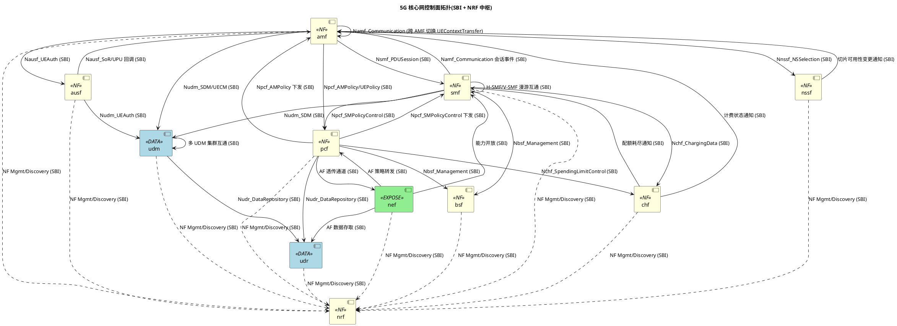
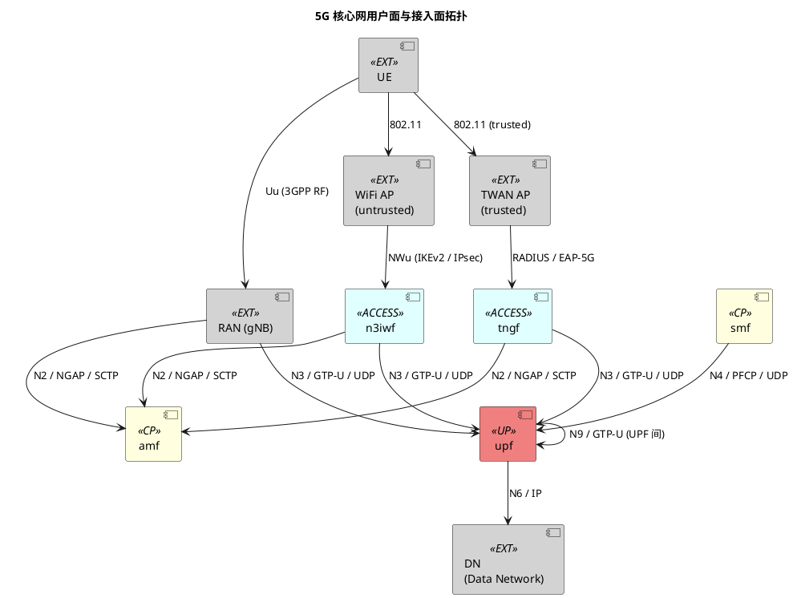

# 系统架构设计:free5gc-based 5G 核心网

> 本文件是**系统级架构总览**,由 `rev-arch-system-design` skill 结合代码逆向(事实域)与历史架构设计文档(意图域)综合生成。
> - **事实域**(接口签名、依赖关系、协议层、部署现状、容量现状):以代码 + `architectures/logic_view/elements/` 为准,标注"现状"。
> - **意图域**(切分理由、决策背景、流程编排意图、架构假设、演进路线):本次执行时 `knowledge/历史方案/架构方案/` 目录为空,`intent_source_count=0`;所有意图域章节均已标注「无历史方案输入,本节仅基于现行代码归纳,置信度降级」;待补齐历史架构设计文档后重跑可补全意图域内容。
> - 元素级细节归 `architectures/logic_view/elements/{name}/`;ADR 详情归 `architectures/decisions/ADR-{NNN}-{topic}.md`;本文件只做系统级聚合与索引。

## 1. 系统定位

**现状**(事实域,归纳自元素层):
本系统由 14 个 5G 核心网网元(NF)构成,覆盖 3GPP 定义的控制面与用户面能力。控制面采用服务化架构(SBI HTTP/2 + JSON),包含移动性管理(amf)、鉴权(ausf)、订阅数据(udm/udr)、会话管理(smf)、策略控制(pcf)、计费(chf)、切片选择(nssf)、网元发现(nrf)、绑定支持(bsf)、能力开放(nef);用户面采用 CUPS(控制面/用户面分离)架构,由 smf 通过 PFCP N4 接口控制 upf 转发业务流量;接入面同时支持 3GPP 接入(amf+RAN via NGAP/N2)与非 3GPP 接入(n3iwf 不受信、tngf 受信)。对外暴露接口面包括:北向 OAM(Prometheus 指标)、AF/SCS-AS 业务暴露面(nef)、计费域北向(chf)、用户面 N6(upf)与接入面 N1/N2/Nwt(amf/n3iwf/tngf)。

**原设计意图**(意图域):
无历史方案输入,本节意图域内容缺失,置信度降级。

| 项目 | 内容(现状) | 原设计意图 |
|------|-----------|-----------|
| 产品名 | free5gc-based 5G Core Network | - |
| 系统类型 | 5G 核心网控制面+用户面 NF 集合 | 无历史方案输入 |
| 标准基线 | 3GPP Release 17(基于 free5gc 当前实现推断) | 无历史方案输入 |
| 关键架构选型 | SBI(HTTP/2 + JSON + OAuth2 + mTLS)+ CUPS(PFCP N4)+ 非 3GPP 接入双分支(n3iwf/tngf)+ NRF 集中发现 | 无历史方案输入 |
| 元素总数 | 14 | 无历史方案输入 |

## 2. 元素分解与切分理由

| 元素 | 类型 | 一句话职责(现状) | 切分理由(原设计意图) | 所属代码仓 |
|------|------|-------------------|---------------------|-----------|
| amf | service | UE 移动性管理与 NAS 信令终结,N2/N1 接入面入口 | 无历史方案输入 | repos/amf |
| ausf | service | UE 鉴权服务,执行 5G-AKA / EAP-AKA' 流程 | 无历史方案输入 | repos/ausf |
| bsf | service | PDU 会话绑定信息注册与查询,支持 AF 流量定位到 PCF | 无历史方案输入 | repos/bsf |
| chf | service | 计费功能,支持在线计费与配额管理(Nchf_ChargingData) | 无历史方案输入 | repos/chf |
| n3iwf | service | 非 3GPP 不受信接入网关,经 IKEv2/IPsec 与 UE 建立隧道,经 NGAP 接入 amf | 无历史方案输入 | repos/n3iwf |
| nef | service | 网络能力开放,向 AF/SCS-AS 暴露业务能力与策略接口 | 无历史方案输入 | repos/nef |
| nrf | service | NF 注册与发现锚点,全系统服务化通信的发现中心 | 无历史方案输入 | repos/nrf |
| nssf | service | 网络切片选择,UE 注册时返回切片可用性 | 无历史方案输入 | repos/nssf |
| pcf | service | 策略控制,下发 AM/UE/SM Policy,接入计费配额联动 | 无历史方案输入 | repos/pcf |
| smf | service | PDU 会话管理,经 PFCP N4 控制 upf,跨 NF 编排会话生命周期 | 无历史方案输入 | repos/smf |
| tngf | service | 非 3GPP 受信接入网关,经 RADIUS + IKEv2 鉴权,经 NGAP 接入 amf | 无历史方案输入 | repos/tngf |
| udm | service | 统一数据管理,封装订阅数据业务语义,供 amf/ausf/smf 访问 | 无历史方案输入 | repos/udm |
| udr | service | 统一数据仓库,持久化订阅/策略/应用数据,后端 MongoDB | 无历史方案输入 | repos/udr |
| upf | service | 用户面转发,接收 PFCP 规则下发,执行 PDR/FAR/QER/URR,使用 gtp5g 内核模块 | 无历史方案输入 | repos/upf |

**切分原则**(意图域):
无历史方案输入,仅按 3GPP TS 23.501 / 23.502 规范继承推断切分主线,置信度降级。粗略推断:控制面按业务能力域(移动性/鉴权/会话/策略/计费/数据/能力开放)切分独立 NF;数据面按 UDM/UDR 业务-持久化两层分离;接入面按 3GPP/非 3GPP/受信非 3GPP 三种接入类型独立 NF;用户面经 PFCP 与控制面解耦(CUPS)。详细切分理由待历史架构设计文档补齐后填入。

参考来源:无

## 3. 系统级拓扑

> 本章节为**事实纯度章节**,不夹意图。所有边与协议层标注与 `elements/{name}/dependencies.yaml` 一致。

### 3.1 控制面拓扑

### 3.2 用户面与接入面拓扑

### 3.3 协议层标注图例

| 协议 | 用途 | 端口/承载 | 涉及元素 |
|------|------|----------|---------|
| SBI HTTP/2 + JSON | 控制面服务化 | TCP/443(mTLS) | 全部控制面 NF(amf/ausf/bsf/chf/nef/nrf/nssf/pcf/smf/udm/udr) |
| PFCP | N4 控制(用户面规则下发) | UDP/8805 | smf ↔ upf |
| GTP-U | N3/N9 用户面 | UDP/2152 | upf / n3iwf / tngf / RAN |
| NGAP/SCTP | N2 控制面信令 | SCTP/PPID=60 | amf ↔ RAN / n3iwf / tngf |
| IKEv2/IPsec | 非 3GPP 安全接入 | UDP/500,4500 | n3iwf / tngf ↔ UE/WiFi |
| RADIUS | 受信非 3GPP 鉴权 | UDP/1812 | tngf ↔ TWAN AP |
| NAS over N1 | UE 与核心网信令 | 承载在 NGAP/IKEv2 之上 | amf ↔ UE |

## 4. 系统级接口面

> 本章节为**事实纯度章节**,不夹意图。归纳对外暴露面,细节不重复元素级。

| 接口面 | 类型 | 入口元素 | 协议 | 用途 | 元素跳转 |
|--------|------|----------|------|------|---------|
| 北向 OAM | 管理面 | 各 NF metrics + readiness 端点 | HTTP / Prometheus | 监控与运维 | elements/*/spec.md §8 |
| AF/SCS-AS 暴露面 | 业务暴露 | nef | REST(对 AF)+ SBI(对 PCF/UDR/SMF) | 第三方应用能力开放 | elements/nef/spec.md |
| 计费域北向 | 业务对接 | chf | FTP / Diameter | CDR 上送 OCS/BSS | elements/chf/spec.md |
| 用户面北向 N6 | 数据面 | upf | IP / GTP-U | 数据网络(DN)接入 | elements/upf/spec.md |
| 接入面 N1/N2 | 3GPP 接入 | amf | NAS / NGAP | UE 与 gNB 接入 | elements/amf/spec.md |
| 接入面 NWu | 非 3GPP 不受信 | n3iwf | IKEv2 / IPsec / NAS | UE 经 WiFi 接入 | elements/n3iwf/spec.md |
| 接入面 Nwt | 非 3GPP 受信 | tngf | RADIUS / IKEv2 / NAS | UE 经 TWAN 接入 | elements/tngf/spec.md |

## 5. 端到端流程索引

每个流程含「现状」(参与元素 + 主要接口 + 简要时序,事实域)与「编排意图」(关键假设与设计理由,意图域)。

### 5.1 流程总表

| 流程编号 | 流程名 | 参与元素 | 主要接口 | 触发场景 | 详细序列图 |
|---------|--------|---------|---------|---------|-----------|
| F-001 | UE 5G-AKA 主鉴权 | amf → ausf → udm | Nausf_UEAuthentication, Nudm_UEAuthentication | UE 注册时鉴权 | (待补 scenario_view/) |
| F-002 | PDU 会话建立 | amf → smf → upf → pcf → chf → bsf | Nsmf_PDUSession, N4-PFCP, Npcf_SMPolicyControl, Nchf_ChargingData, Nbsf_Management | UE 数据业务请求 | (待补 scenario_view/) |
| F-003 | Xn-AMF 切换 | amf(源) → amf(目标) | Namf_Communication_UEContextTransfer | 跨 AMF 切换 | (待补 scenario_view/) |
| F-004 | 切片选择与可用性 | amf → nssf | Nnssf_NSSelection / NSSAIAvailability | UE 注册切片选择 | (待补 scenario_view/) |
| F-005 | AF 策略下发 | af → nef → pcf → smf → upf | Npcf_PolicyAuthorization, Npcf_SMPolicyControl, PFCP N4 | AF 影响流量路由 | (待补 scenario_view/) |
| F-006 | SoR/UPU 推送 | udm → ausf → amf → UE | Nausf_SoRProtection, NAS | 漫游控制与参数推送 | (待补 scenario_view/) |
| F-007 | NF 注册与发现 | 任一 NF → nrf | Nnrf_NFManagement, Nnrf_NFDiscovery | NF 启动与对端发现 | (待补 scenario_view/) |
| F-008 | CHF 配额耗尽 | chf → smf → upf | Nchf_ChargingData, PFCP N4 | 流量超额触发会话动作 | (待补 scenario_view/) |
| F-009 | 非 3GPP 接入(不受信) | UE → WiFi → n3iwf → amf | NWu(IKEv2/IPsec), NGAP, NAS | UE 经 WiFi 注册 5GC | (待补 scenario_view/) |
| F-010 | 非 3GPP 接入(受信) | UE → TWAN → tngf → amf | RADIUS, IKEv2, NGAP, NAS | UE 经 TWAN 注册 5GC | (待补 scenario_view/) |

### 5.2 每个流程的编排意图(意图域)

无历史方案输入,本节意图域内容均缺失,置信度降级。所有 F-001 ~ F-010 流程的「关键设计假设」「关键编排理由」「关键异常处理意图」均待历史架构设计文档补齐后填入。

历史方案缺失时本节标注「无历史方案覆盖该流程,仅基于代码事实给出现状时序,置信度降级」。

## 6. 系统级 DFX 策略

### 6.1 安全
| 维度 | 现状(事实域) | 原目标 / 策略原因(意图域) |
|------|--------------|--------------------------|
| SBI 传输加密 | 全网控制面 NF 强制 mTLS(基于 OAuth2 客户端证书) | 无历史方案输入 |
| 互访鉴权 | OAuth2 客户端令牌(NRF 集中签发) | 无历史方案输入 |
| 非 3GPP 安全 | IKEv2/IPsec(n3iwf)+ EAP-5G + RADIUS(tngf) | 无历史方案输入 |
| 用户面隔离 | PFCP over UDP 无加密,依赖网络隔离;GTP-U 同理 | 无历史方案输入 |

### 6.2 可观测性
| 维度 | 现状 | 原目标 / 策略原因 |
|------|------|------------------|
| 指标体系 | 各 NF 独立 Prometheus /metrics 端点 | 无历史方案输入 |
| 日志规范 | 分模块日志(聚合自各 element §4) | 无历史方案输入 |
| 全链路 trace | 部分 NF 支持 OpenTelemetry(详见元素 §4) | 无历史方案输入 |

### 6.3 可用性
| 维度 | 现状 | 原目标 / 策略原因 |
|------|------|------------------|
| NF 高可用 | 单实例运行为主,部分 NF 支持多实例 + NRF 心跳发现 | 无历史方案输入 |
| 重试退避 | 关键路径 NRF/UDR 等回退有限重试(聚合自元素 §4) | 无历史方案输入 |
| NRF 灾备 | 当前为单点,无 active-active | 无历史方案输入 |

### 6.4 性能
| 维度 | 现状目标 | 原设计目标 / 策略原因 |
|------|---------|--------------------|
| 控制面延迟 | 见元素 §4(各 NF 独立目标值) | 无历史方案输入 |
| 用户面吞吐 | 依赖 gtp5g 内核模块下沉转发能力 | 无历史方案输入 |
| 并发会话 | 单 SMF 实例承载能力见元素 §4 | 无历史方案输入 |

### 6.5 灾备
| 维度 | 现状 | 原目标 / 策略原因 |
|------|------|------------------|
| 跨 region 灾备 | 未声明 | 无历史方案输入 |
| 数据持久化 | UDR 后端 MongoDB,依赖 MongoDB 自身高可用 | 无历史方案输入 |

## 7. 关键架构决策索引

| ADR 编号 | 决策主题 | 一句话决策(现状) | 历史方案覆盖 | ADR 详情 |
|---------|---------|-------------------|------------|---------|
| ADR-001 | 服务化接口 SBI vs 点对点 | 采用 SBI(HTTP/2 + JSON + OAuth2 + mTLS) | 无历史方案 | decisions/ADR-001-sbi.md |
| ADR-002 | 控制面/用户面解耦 CUPS | smf 控制 upf via PFCP N4 | 无历史方案 | decisions/ADR-002-cups.md |
| ADR-003 | NF 发现机制 | NRF 集中注册中心 | 无历史方案 | decisions/ADR-003-nrf-discovery.md |
| ADR-004 | 订阅数据存储 UDR/UDM 分层 | UDM 业务封装 + UDR 持久化(MongoDB) | 无历史方案 | decisions/ADR-004-udr-udm-split.md |
| ADR-005 | 非 3GPP 接入分支 | n3iwf(不受信) + tngf(受信)双分支独立 NF | 无历史方案 | decisions/ADR-005-non-3gpp.md |
| ADR-006 | 用户面数据转发位置 | gtp5g 内核模块下沉 | 无历史方案 | decisions/ADR-006-gtp5g-kernel.md |

> 全部 6 个 ADR 历史方案覆盖列为空:`architectures/decisions/` 下只生成 frontmatter + 决策声明占位,正文待历史架构设计文档补齐或人工补全。

## 8. 外部域整合关系

> 本章节为**事实纯度章节**,不夹意图。

| 外部域 | 类型 | 集成元素 | 集成方式 | 备注 |
|--------|------|---------|---------|------|
| MongoDB | 基础设施持久化 | nrf / bsf / chf / pcf / udr | Go mongo-driver | 各元素独立或共享集群(详见各元素 §8) |
| Prometheus | 监控基础设施 | 所有元素 | HTTP scrape /metrics | 标签规范由各元素独立 |
| OpenTelemetry | 可观测性 | 部分元素(详见 §6.2) | OTLP exporter | 全链路 trace |
| gtp5g 内核模块 | Linux 内核扩展 | upf | netlink + sysfs | 版本范围见 elements/upf |
| xfrm 内核子系统 | Linux 内核 | n3iwf / tngf | netlink | IPsec ESP 数据面 |
| AF / SCS-AS | 第三方业务域 | nef | REST + 回调 | 能力开放消费方 |
| 计费域 OCS/BSS | 第三方业务域 | chf | FTP(CDR)+ Diameter | 离线/在线计费 |
| 接入设备 | 接入网 | amf / n3iwf / tngf / upf | NGAP / IKEv2 / RADIUS / GTP-U | UE / gNB / WiFi AP / TWAN AP |
| DN(Data Network) | 数据网 | upf | IP / N6 | 外部 IP 网络 |

## 9. 系统级风险与演进

### 9.1 风险

| 风险项 | 现状(事实域) | 原设计预判(意图域) |
|--------|--------------|--------------------|
| NRF 单点 | 所有 NF 注册与发现锚点,当前无 active-active 灾备 | 无历史方案输入 |
| smf-upf PFCP 明文 | PFCP over UDP 无 TLS/IPSec,依赖网络隔离 | 无历史方案输入 |
| MongoDB 共享 | 多 NF 共享集群时故障域耦合 | 无历史方案输入 |
| 单实例为主 | 多数 NF 未实现 active-active 多实例 | 无历史方案输入 |
| OAuth2 令牌泄露 | mTLS + OAuth2 同根信任域,根 CA 泄露影响全网 | 无历史方案输入 |

### 9.2 演进方向

| 演进项 | 现状 | 原设计路线(意图域) |
|--------|------|--------------------|
| 多 region 部署 | 未声明 | 无历史方案输入 |
| NRF active-active | 单点 | 无历史方案输入 |
| 切片增强 | 基础 NSSF 选择能力 | 无历史方案输入 |
| 边缘下沉 | upf 已用 gtp5g 内核模块,具备边缘下沉潜力 | 无历史方案输入 |
| 服务网格化 | 未声明 | 无历史方案输入 |

历史方案缺失,本章节意图域内容仅基于现行代码暴露风险给出现状项,置信度降级。

## 参考源

本次执行采纳的历史方案:无。

`intent_source_count`:0。全文意图域章节均已标注「无历史方案输入」。

待 `knowledge/历史方案/架构方案/` 补充历史架构设计文档后重跑本 skill 可补全意图域内容。

## 差异摘要(一次性,不持久化)

- **事实/意图冲突项**:无(意图源为空)
- **元素层发现的一致性问题**:本次未发现,14 元素 depends_on/depended_by 已双向校验通过(见 elements_tree.yaml)
- **置信度降级章节与原因**:
  - §1 系统定位 - 原设计意图段:意图源缺失
  - §2 切分理由:意图源缺失,降级为基于 3GPP 规范推断
  - §5.2 流程编排意图:F-001 ~ F-010 全部缺失
  - §6 DFX 策略原目标列:全部 5 维度缺失
  - §7 ADR 历史方案覆盖列:6 个 ADR 全部缺失
  - §9 风险原设计预判与演进原设计路线:全部缺失
- **本次新增意图条目数**:0
- **本次新建 ADR 数**:6(均为占位)
- **整体 confidence 评估**:medium(事实源完整 14 元素 + 双向校验通过;意图源完全缺失但产物结构完备,可补齐)
