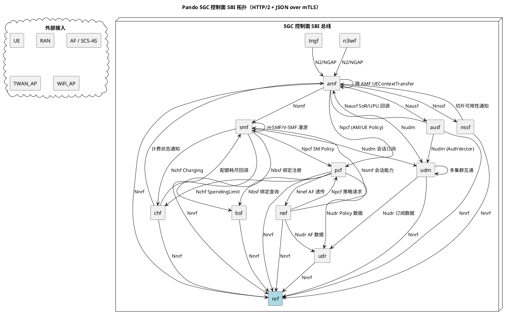
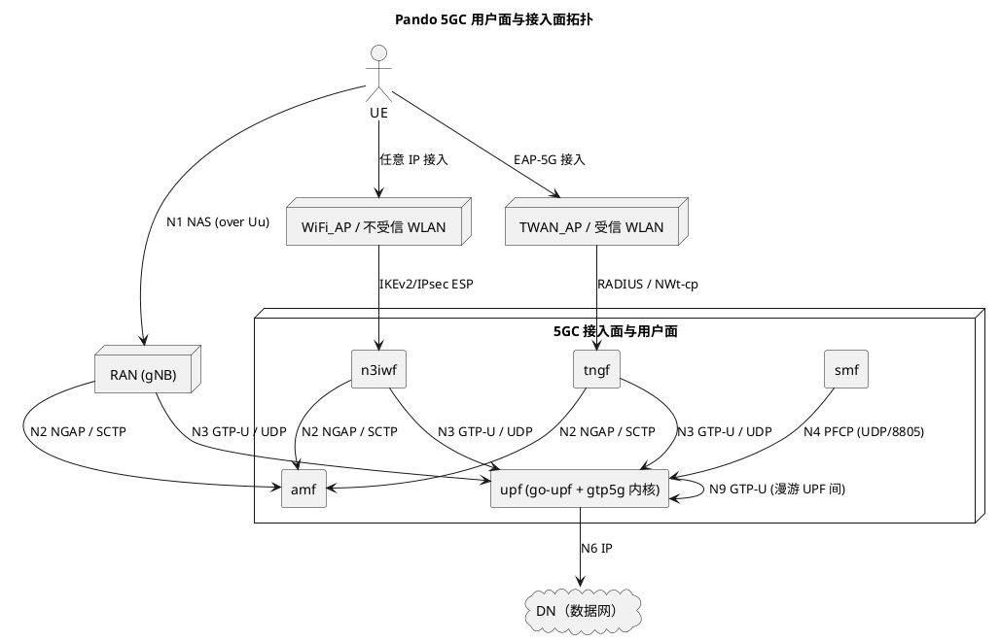

# 系统架构设计：Pando 5GC（基于 free5gc 内核）

## 1. 系统定位

**现状**（事实域，归纳自元素层）：
本系统是一套基于 free5gc 开源内核改造形成的 5G 核心网，覆盖 3GPP 服务化架构（SBA）控制面 NF 与基于 PFCP/CUPS 的用户面，共 14 个元素。控制面 NF 全部以 SBI（HTTP/2 + JSON）互通，并以 NRF 为统一注册发现锚点；用户面由 SMF 通过 PFCP N4 控制 UPF，UPF 借助 Linux 内核 `gtp5g` 模块完成 GTP-U 报文转发。系统额外提供两条非 3GPP 接入分支：N3IWF（不受信非 3GPP）与 TNGF（受信非 3GPP）。对外暴露面包括 NEF 的 AF/SCS-AS 能力开放、CHF 的计费域北向、UPF 的 N6 数据面、AMF/N3IWF/TNGF 的 N1/N2/NWt 接入面，以及所有 NF 的 Prometheus 北向 OAM。

**原设计意图**（意图域）：
-

| 项目 | 内容（现状） | 原设计意图 |
|------|------------|-----------|
| 产品名 | Pando 5GC | - |
| 系统类型 | 5G 核心网控制面 + 用户面（SBA + CUPS） | - |
| 标准基线 | 3GPP Release 17（沿用 free5gc） | - |
| 关键架构选型 | SBI HTTP/2 + JSON + OAuth2 + mTLS、CUPS via PFCP N4、NRF 集中注册发现、UDM/UDR 分层、N3IWF + TNGF 双非 3GPP 分支、gtp5g 内核态用户面 | - |
| 元素总数 | 14（amf/ausf/bsf/chf/n3iwf/nef/nrf/nssf/pcf/smf/tngf/udm/udr/upf） | - |

## 2. 元素分解与切分理由

| 元素 | 类型 | 一句话职责（现状） | 切分理由（原设计意图） | 所属代码仓 |
|------|------|-------------------|---------------------|-----------|
| amf | service | 接入与移动性管理，UE 注册、连接管理、N2/N1 终结、移动性切换 | - | repos/amf |
| ausf | service | 鉴权服务，5G-AKA / EAP-AKA' 鉴权计算与 SoR/UPU 保护 | - | repos/ausf |
| bsf | service | 绑定支持，PDU 会话绑定信息注册/查询 | - | repos/bsf |
| chf | service | 计费功能，会话计费触发、配额管理、CDR 上送 | - | repos/chf |
| n3iwf | service | 不受信非 3GPP 接入网关，IKEv2/IPsec 终结 + N2/N3 转 5GC | - | repos/n3iwf |
| nef | service | 网络能力开放，AF/SCS-AS 业务能力暴露与策略透传 | - | repos/nef |
| nrf | service | NF 注册发现根服务，全网 NF 注册与服务发现的中枢 | - | repos/nrf |
| nssf | service | 网络切片选择，AMF 注册时切片可用性查询与选择 | - | repos/nssf |
| pcf | service | 策略控制功能，AM/SM/UE Policy 下发与 AF 透传 | - | repos/pcf |
| smf | service | 会话管理功能，PDU 会话生命周期与 N4-PFCP 控制 UPF | - | repos/smf |
| tngf | service | 受信非 3GPP 接入网关，IKEv2/EAP-5G + RADIUS 终结 + N2/N3 转 5GC | - | repos/tngf |
| udm | service | 统一数据管理，订阅数据封装、鉴权向量编排、SDM 订阅 | - | repos/udm |
| udr | service | 统一数据存储，订阅/策略/AF 数据持久化层 | - | repos/udr |
| upf | service | 用户面功能，GTP-U 转发 + N4 PDR/FAR/QER/URR 执行（gtp5g 内核） | - | repos/go-upf |

**切分原则**（意图域，抽取自历史方案）：
-

参考来源：无（`intent_source_count = 0`）

## 3. 系统级拓扑

> 本章节为**事实纯度章节**，不夹意图。所有边与协议层标注均与 `elements/{name}/dependencies.yaml` + `elements_tree.yaml` 一致。

### 3.1 控制面拓扑

### 3.2 用户面与接入面拓扑

### 3.3 协议层标注图例

| 协议 | 用途 | 端口/承载 | 涉及元素 |
|------|------|----------|---------|
| SBI HTTP/2 + JSON | 控制面服务化 | TCP/443（mTLS） | 全部控制面 NF |
| PFCP | N4 控制 | UDP/8805 | smf ↔ upf |
| GTP-U | N3/N9 用户面 | UDP/2152 | upf / n3iwf / tngf / RAN |
| NGAP/SCTP | N2 控制 | SCTP/PPID=60 | amf ↔ RAN / n3iwf / tngf |
| IKEv2/IPsec | 不受信非 3GPP 安全 | UDP/500,4500 | n3iwf ↔ UE |
| RADIUS / EAP-5G | 受信非 3GPP 鉴权 | UDP/1812 | tngf ↔ TWAN_AP |
| NAS | UE 与核心网控制信令 | over NGAP/IKEv2 | UE ↔ amf |

## 4. 系统级接口面

> 本章节为**事实纯度章节**，不夹意图。归纳对外暴露面，细节不重复元素级。

| 接口面 | 类型 | 入口元素 | 协议 | 用途 | 元素跳转 |
|--------|------|----------|------|------|---------|
| 北向 OAM（Metrics） | 管理面 | 所有 NF | HTTP / Prometheus scrape | 监控与告警 | elements/*/spec.md §6 |
| 北向 OAM（Readiness/Liveness） | 管理面 | 所有 NF | HTTP | 健康检查与编排 | elements/*/spec.md §6 |
| AF/SCS-AS 业务暴露面 | 业务暴露 | nef | REST + SBI（Nnef_*） | 第三方应用能力开放与策略透传 | elements/nef/spec.md |
| 计费域北向 | 业务对接 | chf | Diameter / FTP CDR | 计费记录上送 OCS/BSS | elements/chf/spec.md |
| 用户面北向 N6 | 数据面 | upf | IP/GTP-U → IP | DN（数据网）接入 | elements/upf/spec.md |
| 3GPP 接入面 N1/N2/N3 | 接入面 | amf / upf | NAS / NGAP / GTP-U | UE-RAN 接入 | elements/{amf,upf}/spec.md |
| 不受信非 3GPP 接入面 | 接入面 | n3iwf | IKEv2/IPsec + GTP-U | UE via 公共 WLAN 接入 | elements/n3iwf/spec.md |
| 受信非 3GPP 接入面 | 接入面 | tngf | EAP-5G + RADIUS + GTP-U | UE via 受信 WLAN 接入 | elements/tngf/spec.md |

## 5. 端到端流程索引

每个流程含「现状」（参与元素 + 主要接口 + 简要时序，事实域）与「编排意图」（关键假设与设计理由，意图域）。

### 5.1 流程总表

| 流程编号 | 流程名 | 参与元素 | 主要接口 | 触发场景 | 详细序列图 |
|---------|--------|---------|---------|---------|-----------|
| F-001 | UE 5G-AKA 主鉴权 | amf → ausf → udm | Nausf_UEAuthentication, Nudm_UEAuthentication | UE 注册时鉴权 | scenario_view/（可选） |
| F-002 | PDU 会话建立 | amf → smf → (pcf, chf, udm, bsf) → upf | Nsmf_PDUSession, Npcf_SMPolicyControl, Nchf_ChargingData, Nudm, Nbsf, N4-PFCP | UE 数据业务请求 | scenario_view/（可选） |
| F-003 | 跨 AMF 切换 | amf(源) → amf(目标) | Namf_Communication_UEContextTransfer | UE 移动跨 AMF | scenario_view/（可选） |
| F-004 | 切片选择与可用性 | amf → nssf | Nnssf_NSSelection / Nnssf_NSSAIAvailability | UE 注册切片选择 | scenario_view/（可选） |
| F-005 | AF 策略下发 | AF → nef → pcf → smf → upf | Nnef_*, Npcf_PolicyAuthorization, Npcf_SMPolicyControl, N4 | AF 影响流量路由 | scenario_view/（可选） |
| F-006 | SoR / UPU 推送 | udm → ausf → amf → UE | Nausf_SoRProtection, NAS | 漫游引导与参数更新 | scenario_view/（可选） |
| F-007 | NF 注册与发现 | 任一 NF → nrf | Nnrf_NFManagement, Nnrf_NFDiscovery | NF 启动与对端发现 | scenario_view/（可选） |
| F-008 | CHF 配额耗尽触发会话动作 | chf → smf → upf | Nchf_ChargingData, N4 | 流量超额 | scenario_view/（可选） |
| F-009 | 不受信非 3GPP 接入注册 | UE → n3iwf → amf → ausf → udm → upf | IKEv2 + NAS-over-IKEv2, N2/NGAP, Nausf, Nudm | UE 经公共 WLAN 接入 | scenario_view/（可选） |
| F-010 | 受信非 3GPP 接入注册 | UE → TWAN → tngf → amf → ausf → udm → upf | EAP-5G + RADIUS, N2/NGAP, Nausf, Nudm | UE 经受信 WLAN 接入 | scenario_view/（可选） |

### 5.2 每个流程的编排意图（意图域）

-

## 6. 系统级 DFX 策略

### 6.1 安全

| 维度 | 现状（事实域） | 原目标 / 策略原因（意图域） |
|------|--------------|--------------------------|
| SBI 传输加密 | 全网控制面 SBI 强制 mTLS（聚合自各元素 spec §4） | - |
| 互访鉴权 | OAuth2 客户端令牌，由 NRF 集中签发 | - |
| 非 3GPP 安全 | n3iwf：IKEv2/IPsec ESP；tngf：EAP-5G + RADIUS | - |
| PFCP N4 | 当前明文 UDP，未启用 IPsec/DTLS，依赖网络隔离 | - |
| 用户面 GTP-U | 明文 UDP，依赖承载网隔离 | - |
| 密钥/凭据管理 | 配置文件 + Mongo 持久化（部分 NF） | - |

### 6.2 可观测性

| 维度 | 现状 | 原目标 / 策略原因 |
|------|------|------------------|
| 指标体系 | 全网 Prometheus `/metrics`，标签命名沿用 free5gc 约定 | - |
| 全链路 trace | OpenTelemetry OTLP exporter（部分元素，覆盖度未达全网） | - |
| 日志 | 各元素独立结构化日志，未统一日志聚合层 | - |

### 6.3 可用性

| 维度 | 现状 | 原目标 / 策略原因 |
|------|------|------------------|
| NF 高可用 | 各 NF 支持多实例 + NRF 心跳；NRF 自身当前无 active-active | - |
| 重试退避 | 关键控制面调用默认退避重试（具体值由元素 spec §4 聚合） | - |
| 存储高可用 | MongoDB 副本集（由部署侧保证） | - |

### 6.4 性能

| 维度 | 现状目标 | 原设计目标 / 策略原因 |
|------|---------|--------------------|
| 控制面单跳延迟 | 由各元素 spec §4 聚合，未在系统级统一基线 | - |
| 用户面吞吐 | 受限于 gtp5g 内核模块与宿主机网卡能力 | - |
| NRF 发现延迟 | 由各 NF 本地缓存抵消 | - |

### 6.5 灾备

| 维度 | 现状 | 原目标 / 策略原因 |
|------|------|------------------|
| 跨 region 灾备 | 未声明 | - |
| 数据备份 | 依赖 MongoDB 自身备份策略 | - |
| 故障切换 | 通过 NRF 重新发现 + 客户端重试 | - |

## 7. 关键架构决策索引

本次执行 `intent_source_count = 0`，意图源（`knowledge/历史方案/架构方案/`）缺失，所有候选 ADR 的「背景、候选方案、决策理由、影响代价」四节均无实质素材，按 skill「不抢元素层职责、不生成空内容」的最小化原则，**本次不产出 ADR 文件**。

下表仅作为系统级决策的事实层观察清单，待历史方案补齐后再由本 skill 增量生成 `architectures/decisions/ADR-{NNN}-*.md`：

| 候选决策主题 | 一句话事实描述（现状） | 事实源 |
|-------------|---------------------|-------|
| 服务化接口 SBI | 控制面 NF 全部使用 HTTP/2 + JSON + OAuth2 + mTLS | elements/*/interfaces.yaml |
| CUPS 控制面/用户面解耦 | smf 经 PFCP N4 控制 upf | elements/{smf,upf}/ |
| NF 发现机制 | NRF 集中注册 + 客户端本地缓存 | elements/nrf/、elements_tree.yaml |
| UDR/UDM 分层 | UDM 业务封装 + UDR 持久化，控制面 NF 不直连 UDR | elements/{udm,udr}/、elements_tree.yaml |
| 非 3GPP 双分支 | n3iwf（不受信）+ tngf（受信）并列存在 | elements/{n3iwf,tngf}/ |
| gtp5g 内核态用户面 | upf 用户面转发由 Linux gtp5g 内核模块承担 | elements/upf/ |

> 重跑触发条件：`knowledge/历史方案/架构方案/` 出现非空文档且涵盖以上任一决策的背景或权衡。

## 8. 外部域整合关系

> 本章节为**事实纯度章节**，不夹意图。

| 外部域 | 类型 | 集成元素 | 集成方式 | 备注 |
|--------|------|---------|---------|------|
| MongoDB | 基础设施持久化 | nrf / bsf / chf / pcf / udr（业务存储入口） | Go mongo-driver | 各元素独立或共享集群（详见各元素 §8） |
| Prometheus | 监控基础设施 | 所有 NF | HTTP scrape `/metrics` | 标签沿用 free5gc 约定 |
| OpenTelemetry | 可观测性 | 部分 NF | OTLP exporter | 全链路 trace（覆盖度不全） |
| gtp5g 内核模块 | Linux 内核扩展 | upf | netlink + sysfs | free5gc 生态约定的用户面实现 |
| xfrm 内核子系统 | Linux 内核 | n3iwf | netlink | IPsec ESP 数据通道 |
| AF / SCS-AS | 第三方业务域 | nef | REST + 回调 | 能力开放消费方 |
| 计费域 OCS/BSS | 第三方业务域 | chf | Diameter + FTP（CDR） | 离线/在线计费 |
| 接入设备 | 接入网 | amf / n3iwf / tngf / upf | NGAP / IKEv2 / RADIUS / GTP-U | UE / RAN / WiFi AP / TWAN AP |
| DN（Data Network） | 数据网 | upf | IP / N6 | 外部 IP 网络 |

## 9. 系统级风险与演进

### 9.1 风险

| 风险项 | 现状（事实域） | 原设计预判（意图域） |
|--------|--------------|--------------------|
| NRF 单点 | 所有 NF 注册与发现的中枢锚点，当前未提供 active-active 集群方案；NRF 失联时新 NF 启动与对端动态发现均不可用，但已注册的 NF 间调用因客户端缓存仍能延续 | - |
| PFCP N4 明文 | smf ↔ upf 之间 PFCP over UDP 未启用 TLS/IPSec/DTLS，依赖部署侧网络隔离 | - |
| 用户面 GTP-U 明文 | N3/N9 GTP-U 报文明文，依赖承载网安全 | - |
| MongoDB 共享 | 多 NF 共享 MongoDB 集群时存在故障域耦合；具体共享/独立策略由部署侧决定 | - |
| gtp5g 内核耦合 | upf 用户面强依赖 Linux 内核 gtp5g 模块版本，跨内核版本升级风险敞口集中在 upf | - |
| 非 3GPP 双分支重复 | n3iwf 与 tngf 在 N2/N3 接入侧逻辑高度相似，存在维护成本与策略一致性风险 | - |

### 9.2 演进方向

| 演进项 | 现状 | 原设计路线（意图域） |
|--------|------|--------------------|
| NRF 高可用 | 当前单实例为主 | - |
| 多 region / 灾备 | 未声明 | - |
| 切片增强（NSSF 跨域协同） | 当前 NSSF 与单核心网内 AMF 协同，未覆盖跨核心网切片协商 | - |
| 边缘下沉 | UPF 支持 N9 漫游链路，具备边缘部署基础，但未声明完整边缘 5GC 编排策略 | - |
| 服务网格化 | 当前依靠 NRF + 客户端发现，未引入 service mesh sidecar | - |

## 参考源

本次执行采纳的历史方案：

| solution_name | era | status | 主要采纳章节 |
|---------------|-----|--------|------------|
| （无） | - | - | - |

`intent_source_count`：0。

意图源候选文件：

- `knowledge/历史方案/架构方案/Pando V1.0版本架构设计说明书.md`：存在但为空文件（1 行 0 内容），未采纳。

## 差异摘要（一次性，不持久化）

- **事实/意图冲突项**：无（意图源缺失，无对照基准）。
- **元素层发现的一致性问题**：
  - `elements_tree.yaml` 已完成双向 depends_on / depended_by 反向校验，未发现新一致性问题。
  - upf 元素 `repo_path: repos/go-upf`，与其它元素以仓名为元素名的约定有别，已通过 `aliases: [go-upf]` 留痕。
- **置信度降级章节与原因**：
  - §1 意图段、§2 切分理由列、§5.2 编排意图（10 个流程全部）、§6.1~§6.5 原目标列、§7 ADR 候选清单（仅事实观察）、§9.1 原设计预判、§9.2 演进路线：全部因 `intent_source_count = 0` 降级。
  - 整体 `confidence: low`（事实源完整 + 历史方案缺失 → low）。
- **本次新增意图条目数**：0
- **本次新建 ADR 数**：0（意图源全缺，无实质背景/权衡可写；生成纯占位会产生无价值文件，故仅在 §7 留事实观察清单，待历史方案补齐后再增量生成）
- **建议下一步动作**：
  1. 补齐 `knowledge/历史方案/架构方案/Pando V1.0版本架构设计说明书.md` 文档实质内容；
  2. 增量重跑 `rev-arch-system-design`，意图域章节将自动差量刷新；
  3. 元素侧（ausf/chf/nssf/pcf/udr 当前 confidence=medium）也会同步从 medium → high。
