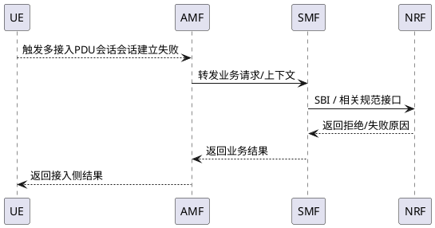

# 场景流程：多接入PDU会话会话建立失败

## 1. 场景概述

| 项目 | 内容 |
|------|------|
| 场景 ID | SCENARIO_003 |
| 场景名 | 多接入PDU会话会话建立失败 |
| L1 一级特性 | cat_session_management — 会话管理特性 |
| L2 二级特性 | sm_ma_pdu — 多接入PDU会话 |
| 场景类型 | 失败场景 |
| 置信度 | low |
| 意图源覆盖 | 0 |

## 2. 业务意图（意图域）

**业务目的**：订阅、策略或网络能力不满足导致多接入PDU会话失败。

**关键假设**：
- 场景属于 `多接入PDU会话` 的具体用户业务场景，而不是固定流程模板。
- 参与方来自架构引用、规范角色或相邻系统角色；缺少代码事实时保持低置信度，不编造函数级实现。

**场景优先级 / 演进定位**：以特性状态 `planned` 和后续版本规划为准。

## 3. 参与方（事实域）

| 角色 | 架构元素 | 元素 spec 链接 | 说明 |
|------|---------|--------------|------|
| 外部/相邻参与方 | UE | - | 场景上下文参与方 |
| 外部/相邻参与方 | AMF | - | 场景上下文参与方 |
| 相关功能 | SMF | architectures/logic_view/elements/smf/spec.md | 参与 `多接入PDU会话会话建立失败` 的架构交互 |
| 外部/相邻参与方 | NRF | - | 场景上下文参与方 |

## 4. 前置条件（事实域）

1. 当前业务请求命中 `多接入PDU会话` 特性范围。
2. 相关配置、订阅、拓扑或对端能力满足 `TS 23.501 §5.32` 要求。

## 5. 场景流程（事实域，与架构元素一致）

## 6. 步骤明细（事实域）

| 步骤 | 发起方 | 接收方 | 动作 | 使用接口 | 数据/参数 | 异常分支编号 |
|------|--------|--------|------|----------|----------|------------|
| 1 | UE | AMF | 触发多接入PDU会话会话建立失败 | 待事实源确认 | 特性相关上下文 | E-1 |
| 2 | AMF | SMF | 转发业务请求/上下文 | 转发业务请求/上下文 | 特性相关上下文 | E-1 |
| 3 | SMF | NRF | SBI / 相关规范接口 | SBI / 相关规范接口 | 特性相关上下文 | E-1 |
| 4 | NRF | SMF | 返回拒绝/失败原因 | 返回拒绝/失败原因 | 特性相关上下文 | E-1 |
| 5 | SMF | AMF | 返回业务结果 | 待事实源确认 | 特性相关上下文 | E-1 |
| 6 | AMF | UE | 返回接入侧结果 | 待事实源确认 | 特性相关上下文 | E-1 |

## 7. 异常处理

### 7.1 异常处理意图（意图域）

| 异常编号 | 业务侧含义 | 用户体验取舍 | 回退策略动机 | 来源 |
|---------|-----------|------------|------------|------|
| E-1 | `多接入PDU会话会话建立失败` 未能满足前置条件、订阅、策略、拓扑或对端能力要求 | 以规范和现网策略约束为准 | 以后续系统方案和代码事实源为准 | - |

### 7.2 异常分支现状（事实域，与代码一致）

| 异常编号 | 触发条件（代码定位） | 当前处理方式 | 当前影响范围 |
|---------|------------------|------------|------------|
| E-1 | 待事实源确认 | 待事实源确认 | 待事实源确认 |

## 8. 后置条件（事实域）

- `多接入PDU会话会话建立失败` 结束后，相关上下文、策略、会话、事件或接口结果与 `多接入PDU会话` 的业务约束保持一致。

## 9. 关联代码实现（事实域）

- 当前场景暂无可确认代码锚点；后续由事实源增量补充。

## 10. 架构关联

参见所属最子特性目录下 [`spec.md`](spec.md) 与 [`arch_ref.yaml`](arch_ref.yaml)。

## 参考源

本场景采纳的历史方案：

| solution_name | 状态 | 主要采纳章节 | 采纳节 |
|---------------|------|------------|--------|
| - | - | - | - |
