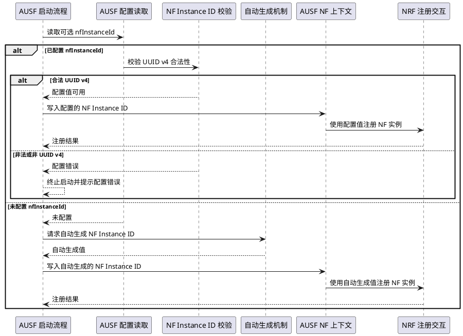
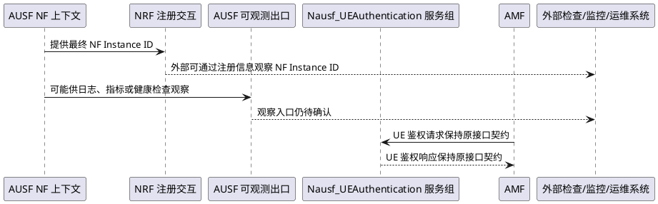
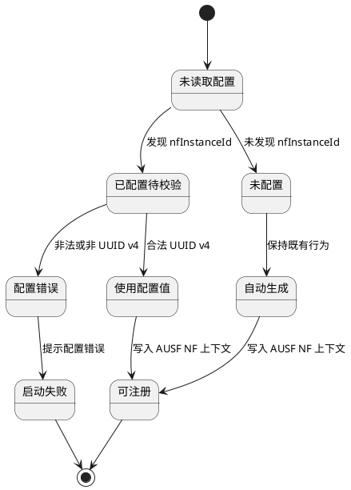

# 实现设计：ausf - AUSF 支持配置 nfInstanceId

## 1. 设计概述
- 关联架构变更：AI-001 / AR-001-AUSF_变更说明.md
- 关联接口契约：IC-001、IC-002、IC-003
- 关联业务变更：FC-001、FC-002、FC-003
- 设计目标（一句话）：在 AUSF 启动阶段确定 NF Instance ID 来源，确保合法配置值优先、未配置时保持自动生成、非法配置时启动失败，并将确定后的身份用于 NRF 注册等可观察路径。

## 2. 模块级参与对象
| 参与对象 | 职责 | 关联来源 |
|----------|------|----------|
| AUSF 启动流程 | 编排配置读取、NF 上下文初始化、启动失败或继续启动的控制路径 | AI-001；SCENARIO_001；SCENARIO_002；SCENARIO_003 |
| AUSF 配置读取 | 读取可选 `nfInstanceId` 配置项，并区分未配置、已配置合法值、已配置非法值 | AI-001；IC-001 |
| NF Instance ID 校验 | 判断已配置值是否为合法 UUID v4 | AI-001；SCENARIO_001；SCENARIO_003 |
| AUSF NF 上下文 | 承载最终确定的 NF Instance ID，供注册、鉴权事件和可观测路径使用 | AI-001；IC-001 |
| 自动生成机制 | 在未配置 `nfInstanceId` 时提供既有自动生成行为 | SI-002；SCENARIO_002 |
| NRF 注册交互 | 使用 AUSF NF 上下文中的 NF Instance ID 完成 NF 实例注册 | IC-001 |
| AUSF 可观测出口 | 可能展示或暴露 NF Instance ID，但具体入口仍未确认 | IC-002 |
| Nausf_UEAuthentication 服务组 | 保持现有 UE 鉴权接口契约不变 | IC-003 |

## 3. 关键交互流程

### 3.1 LF-001 AUSF 启动时确定 NF Instance ID

可观察结果：AUSF 在合法配置时使用配置值作为 NF Instance ID；未配置时保持自动生成；非法配置时启动失败，不进入 NRF 注册。

### 3.2 LF-002 AUSF 对外接口契约保持与待确认出口

可观察结果：NRF 注册路径可观察到最终 NF Instance ID；AUSF 可观测出口保持 unknown，不在本阶段固化具体入口；Nausf_UEAuthentication 服务组无契约变化。

## 4. 状态机设计

### 4.1 SM-001 AUSF NF Instance ID 配置状态

该状态机描述 `nfInstanceId` 配置状态对启动结果的影响：合法配置和未配置均可继续注册；非法配置终止启动。

## 5. 数据流设计

### 5.1 核心数据对象
| 数据对象 | 业务字段或属性 | 说明 |
|----------|----------------|------|
| AUSF 配置 | `nfInstanceId` | 可选配置项；未配置时不得破坏自动生成行为；配置时必须为 UUID v4。 |
| NF Instance ID | 最终实例标识 | 来源为合法配置值或自动生成值，写入 AUSF NF 上下文并供 NRF 注册使用。 |
| 配置错误 | 错误原因 | 表示已配置 `nfInstanceId` 但格式非法或非 UUID v4，导致启动失败。 |
| 外部观察信息 | NF Instance ID 展示或输出 | 观察入口未确认，可能来自 NRF 注册信息、日志、指标、健康检查或其它出口。 |

### 5.2 数据流转
| 数据对象 | 来源 | 目标 | 转换规则 | 可观察结果 |
|----------|------|------|----------|------------|
| NF Instance ID | AUSF 配置 | AUSF NF 上下文 | 合法 UUID v4 配置值直接成为最终 NF Instance ID | NRF 注册信息可观察到稳定配置值。 |
| NF Instance ID | 自动生成机制 | AUSF NF 上下文 | 未配置 `nfInstanceId` 时由既有机制生成 | 未配置路径保持原有自动生成行为。 |
| 配置错误 | NF Instance ID 校验 | AUSF 启动流程 | 非法或非 UUID v4 配置值转换为启动失败原因 | AUSF 启动失败并提示配置错误，不进入 NRF 注册。 |
| 外部观察信息 | AUSF NF 上下文 | 外部检查/监控/运维系统 | 具体观察入口仍待确认 | 本阶段保留 unknown，不固化接口字段或出口形式。 |

## 6. 异常处理设计
| 异常场景 | 检测方式 | 处理策略 | 影响范围 |
|----------|----------|----------|----------|
| 已配置 `nfInstanceId` 但不是合法 UUID v4 | NF Instance ID 校验发现非法值 | 启动失败并提示配置错误，不继续 NRF 注册 | 影响主动配置非法值的部署；不影响未配置路径。 |
| 未配置 `nfInstanceId` | 配置读取未发现该可选项 | 保持既有自动生成行为 | 保护存量部署兼容性。 |
| 外部观察入口未确认 | 05 保留 IC-002 为 unknown | 不在 06 中固化具体日志、指标、健康检查或其它出口 | 后续阶段需继续确认验收和运维观察口径。 |
| 历史非法配置可启动假设未确认 | 03/05 保留兼容性风险 | 在逻辑流中保留启动失败路径，不假设风险已解决 | 需要后续确认历史部署或验收口径。 |

## 7. DFX 设计
| 维度 | 设计影响 | 风险或约束 |
|------|----------|------------|
| 性能 | 启动阶段增加可选配置读取和 UUID v4 校验判断。 | 校验发生在启动路径，不改变运行期 UE 鉴权接口性能语义。 |
| 可靠性 | 非法配置在启动期失败，避免使用错误 NF Instance ID 进入注册和服务状态。 | 需要明确错误提示，避免运维误判为 NRF 或鉴权链路故障。 |
| 安全 | 限制 NF Instance ID 必须为合法 UUID v4，避免异常标识进入 NF 注册与追踪链路。 | 不改变 Nausf_UEAuthentication 鉴权安全语义。 |
| 可维护性 | 配置路径、未配置路径和非法配置路径在逻辑上分离，便于后续范围细化。 | 外部观察入口 unknown 需要后续阶段继续追踪。 |

## 8. 与后续阶段的边界
- 本文件描述模块级逻辑流、数据流和状态转换。
- 本文件不输出最终代码文件路径、函数级新增/修改/删除清单、具体类名、函数名、测试文件或代码实现片段。
- 代码变更范围细化留待 07-fwd-change-scope-refinement。
