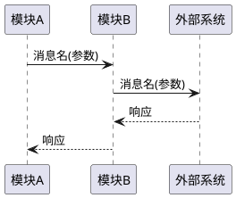
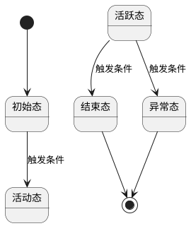

# 实现设计：{代码仓名} - {需求主题}

## 1. 设计概述
- 关联架构变更：{AR-XXX}
- 关联业务变更：{SR-XXX}
- 设计目标（一句话）：

## 2. 模块影响清单
| 模块 | 变更类型 | 变更内容 | 优先级 |
|------|----------|----------|--------|
| {模块名} | 新增/修改/删除 | | 高/中/低 |

## 3. 关键交互流程
### 3.1 {流程名}


### 3.2 {流程名}
（同上）

## 4. 状态机设计
### 4.1 {状态机名}


## 5. 数据流设计
### 5.1 核心数据对象
| 数据对象 | 字段 | 类型 | 说明 |
|----------|------|------|------|
| {对象名} | | | |

### 5.2 数据流转
（描述数据在各模块/流程间的转换路径）

## 6. 函数签名定义
### 6.1 {模块名}
```cpp
// C++ 示例
ReturnType functionName(ParamType1 param1, ParamType2 param2);
```
```python
# Python 示例
def function_name(param1: Type1, param2: Type2) -> ReturnType:
```

## 7. 异常处理设计
| 异常场景 | 检测方式 | 处理策略 | 影响范围 |
|----------|----------|----------|----------|

## 8. DFX 设计
### 8.1 性能
### 8.2 可靠性
### 8.3 安全
### 8.4 可维护性

## 9. 与现有代码的关系
- 复用的现有模块/函数：
- 重构的现有代码：
- 新增依赖：
