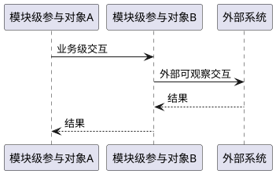
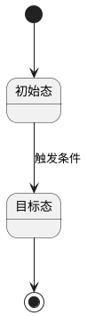

# 实现设计：{代码仓名} - {需求主题}

## 1. 设计概述
- 关联架构变更：{AR-XXX}
- 关联接口契约：{IC-XXX}
- 关联业务变更：{SR-XXX}
- 设计目标（一句话）：

## 2. 模块级参与对象
| 参与对象 | 职责 | 关联来源 |
|----------|------|----------|
| {模块级参与对象} | | AI-XXX / IC-XXX / SCENARIO_XXX |

## 3. 关键交互流程
### 3.1 {流程名}

## 4. 状态机设计
### 4.1 {状态机名}

## 5. 数据流设计
### 5.1 核心数据对象
| 数据对象 | 业务字段或属性 | 说明 |
|----------|----------------|------|
| {对象名} | | |

### 5.2 数据流转
| 数据对象 | 来源 | 目标 | 转换规则 | 可观察结果 |
|----------|------|------|----------|------------|
| {对象名} | | | | |

## 6. 异常处理设计
| 异常场景 | 检测方式 | 处理策略 | 影响范围 |
|----------|----------|----------|----------|

## 7. DFX 设计
| 维度 | 设计影响 | 风险或约束 |
|------|----------|------------|
| 性能 | | |
| 可靠性 | | |
| 安全 | | |
| 可维护性 | | |

## 8. 与后续阶段的边界
- 本文件描述模块级逻辑流、数据流和状态转换。
- 本文件不输出最终代码文件路径、函数级新增/修改/删除清单、具体类名、函数名、测试文件或代码实现片段。
- 代码变更范围细化留待 07-fwd-change-scope-refinement。
