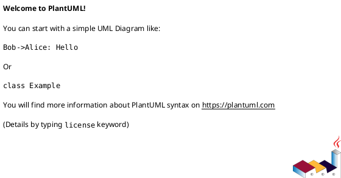

# 系统架构设计：<产品名>

## 1. 系统定位

**现状**（事实域，归纳自元素层）：
<一段架构语言描述：本系统由哪些元素构成、覆盖什么能力、当前对外暴露什么接口面、与哪些外部域整合>

**原设计意图**（意图域，抽取自历史方案 [参考自 {solution_name} §X]）：
<战略定位、产品愿景、不做什么的边界声明、当年的核心架构选型理由>

| 项目 | 内容（现状） | 原设计意图 |
|------|------------|-----------|
| 产品名 | <name> | - |
| 系统类型 | <如 5G 核心网控制面+用户面> | <历史方案原描述> |
| 标准基线 | <如 3GPP Release 17> | <原 release 规划> |
| 关键架构选型 | <现行：SBI + CUPS + 微服务 + OAuth2 + mTLS> | <历史选型理由：参考自 {solution_name}> |
| 元素总数 | <int> | <原规划元素数与差异说明> |

## 2. 元素分解与切分理由

| 元素 | 类型 | 一句话职责（现状） | 切分理由（原设计意图） | 所属代码仓 |
|------|------|-------------------|---------------------|-----------|
| <name> | service / component / subsystem | <聚合自元素 spec §2> | <参考自 {solution_name} §X：当年为什么独立成元素> | repos/<name> |

**切分原则**（意图域，抽取自历史方案）：
<3-5 句话说明本系统的元素切分主线>

参考来源：`<solution_name_1> §X.Y`、`<solution_name_2> §X.Y`

## 3. 系统级拓扑

> 本章节为**事实纯度章节**，不夹意图。所有边与协议层标注必须与 `elements/{name}/dependencies.yaml` 一致。

### 3.1 控制面拓扑

### 3.2 用户面与接入面拓扑

### 3.3 协议层标注图例

| 协议 | 用途 | 端口/承载 | 涉及元素 |
|------|------|----------|---------|
| SBI HTTP/2 + JSON | 控制面服务化 | TCP/443 (mTLS) | 全部控制面 NF |
| PFCP | N4 控制 | UDP/8805 | smf ↔ upf |
| GTP-U | N3/N9 用户面 | UDP/2152 | upf / n3iwf / tngf / RAN |
| NGAP/SCTP | N2 控制 | SCTP/PPID=60 | amf ↔ RAN / n3iwf / tngf |
| IKEv2/IPsec | 非 3GPP 安全 | UDP/500,4500 | n3iwf / tngf ↔ UE |
| RADIUS | 受信非 3GPP 鉴权 | UDP/1812 | tngf ↔ TWAN_AP |

## 4. 系统级接口面

> 本章节为**事实纯度章节**，不夹意图。归纳对外暴露面，细节不重复元素级。

| 接口面 | 类型 | 入口元素 | 协议 | 用途 | 元素跳转 |
|--------|------|----------|------|------|---------|
| 北向 OAM | 管理面 | 各 NF metrics + readiness | HTTP/Prometheus | 监控与运维 | elements/*/spec.md §8 |
| AF/SCS-AS 暴露面 | 业务暴露 | nef | REST + SBI | 第三方应用能力开放 | elements/nef/spec.md |
| 计费域北向 | 业务对接 | chf | FTP/Diameter | CDR 上送 OCS/BSS | elements/chf/spec.md |
| 用户面北向 N6 | 数据面 | upf | IP/GTP-U | DN 接入 | elements/upf/spec.md |
| 接入面 N1/N2/Nwt | 接入面 | amf / n3iwf / tngf | NAS / NGAP / IKEv2-NAS | UE 与 RAN 接入 | elements/{amf,n3iwf,tngf}/spec.md |

## 5. 端到端流程索引

每个流程含「现状」（参与元素 + 主要接口 + 简要时序，事实域）与「编排意图」（关键假设与设计理由，意图域）。

### 5.1 流程总表

| 流程编号 | 流程名 | 参与元素 | 主要接口 | 触发场景 | 详细序列图 |
|---------|--------|---------|---------|---------|-----------|
| F-001 | UE 5G-AKA 主鉴权 | amf → ausf → udm | Nausf_UEAuthentication, Nudm_UEAuthentication | UE 注册时鉴权 | scenario_view/（可选） |
| F-002 | PDU 会话建立 | amf → smf → upf → pcf → chf | Nsmf_PDUSession, N4-PFCP, Npcf_SMPolicyControl, Nchf_ChargingData | UE 数据业务请求 | scenario_view/（可选） |
| F-003 | Xn-AMF 切换 | amf(源) → amf(目标) | Namf_Communication_UEContextTransfer | 跨 AMF 切换 | scenario_view/（可选） |
| F-004 | 切片选择与可用性 | amf → nssf | Nnssf_NSSelection / NSSAIAvailability | UE 注册切片选择 | scenario_view/（可选） |
| F-005 | AF 策略下发 | af → nef → pcf → smf → upf | Npcf_PolicyAuthorization, Npcf_SMPolicyControl, N4 | AF 影响流量路由 | scenario_view/（可选） |
| F-006 | SoR 推送 | udm → ausf → amf → UE | Nausf_SoRProtection, NAS | 漫游控制 | scenario_view/（可选） |
| F-007 | NF 注册与发现 | 任一 NF → nrf | Nnrf_NFManagement, Nnrf_NFDiscovery | NF 启动与对端发现 | scenario_view/（可选） |
| F-008 | CHF 配额耗尽 | chf → smf → upf | Nchf_ChargingData, N4 | 流量超额触发会话动作 | scenario_view/（可选） |

### 5.2 每个流程的编排意图（意图域）

#### F-001 UE 5G-AKA 主鉴权 — 编排意图
- **关键设计假设**：<参考自 {solution_name} §X>
- **关键编排理由**：<为什么必须先经 ausf 再回 amf，而不是 amf 直连 udm>
- **关键异常处理意图**：<AUTS 重同步设计意图、Concealing-IMSI 设计意图>

（其余流程同格式：F-002 ~ F-008，每个流程一节）

## 6. 系统级 DFX 策略

### 6.1 安全
| 维度 | 现状（事实域） | 原目标 / 策略原因（意图域） |
|------|--------------|--------------------------|
| SBI 传输加密 | 全网强制 mTLS（聚合自 elements/*/spec.md §4） | <原策略：为什么选 mTLS 而非 TLS+token，参考自 {solution_name}> |
| 互访鉴权 | OAuth2 客户端令牌（NRF 签发） | <原策略：NRF 集中签发的考量> |
| 非 3GPP 安全 | IKEv2/IPsec + EAP-5G（n3iwf / tngf） | <原策略> |

### 6.2 可观测性
| 维度 | 现状 | 原目标 / 策略原因 |
|------|------|------------------|
| 指标体系 | 全网 Prometheus，标签命名标准化 | <原规范来源> |
| 全链路 trace | OpenTelemetry（部分元素） | <原规划覆盖度> |

### 6.3 可用性
| 维度 | 现状 | 原目标 / 策略原因 |
|------|------|------------------|
| NF 高可用 | 多实例 + NRF 心跳 | <原 SLA 目标> |
| 重试退避 | 关键路径 2s 退避无限重试（聚合） | <原退避策略理由> |

### 6.4 性能
| 维度 | 现状目标 | 原设计目标 / 策略原因 |
|------|---------|--------------------|
| 控制面延迟 | <聚合自元素 §4> | <参考自 {solution_name}> |
| 用户面吞吐 | <同上> | <同上> |

### 6.5 灾备
| 维度 | 现状 | 原目标 / 策略原因 |
|------|------|------------------|
| 跨 region 灾备 | <现状描述或"未声明"> | <原规划> |

## 7. 关键架构决策索引

| ADR 编号 | 决策主题 | 一句话决策（现状） | 历史方案覆盖 | ADR 详情 |
|---------|---------|-------------------|------------|---------|
| ADR-001 | 服务化接口 SBI vs 点对点 | 采用 SBI（HTTP/2 + JSON + OAuth2） | {solution_name} §X | decisions/ADR-001-sbi.md |
| ADR-002 | 控制面/用户面解耦 CUPS | smf 控制 upf via PFCP N4 | {solution_name} §X | decisions/ADR-002-cups.md |
| ADR-003 | NF 发现机制 | NRF 集中注册中心 | <如有原方案> | decisions/ADR-003-nrf-discovery.md |
| ADR-004 | 订阅数据存储 UDR/UDM 分层 | UDM 业务封装 + UDR 持久化 | <如有原方案> | decisions/ADR-004-udr-udm-split.md |
| ADR-005 | 非 3GPP 接入分支 | n3iwf 不受信 + tngf 受信 | <如有原方案> | decisions/ADR-005-non-3gpp.md |
| ADR-006 | 用户面数据转发位置 | gtp5g 内核模块下沉 | <如有原方案> | decisions/ADR-006-gtp5g-kernel.md |

> 历史方案覆盖列为空的 ADR：`architectures/decisions/` 下只生成 frontmatter + 决策声明占位。

## 8. 外部域整合关系

> 本章节为**事实纯度章节**，不夹意图。

| 外部域 | 类型 | 集成元素 | 集成方式 | 备注 |
|--------|------|---------|---------|------|
| MongoDB | 基础设施持久化 | nrf / bsf / chf / pcf / udr | Go mongo-driver | 各元素独立或共享集群（详见各元素 §8） |
| Prometheus | 监控基础设施 | 所有元素 | HTTP scrape /metrics | 标签规范统一 |
| OpenTelemetry | 可观测性 | 部分元素 | OTLP exporter | 全链路 trace |
| gtp5g 内核模块 | Linux 内核扩展 | upf | netlink + sysfs | 版本 [0.9.5, 0.11.0) |
| xfrm 内核子系统 | Linux 内核 | n3iwf / tngf | netlink | IPsec ESP |
| AF / SCS-AS | 第三方业务域 | nef | REST + 回调 | 能力开放消费方 |
| 计费域 OCS/BSS | 第三方业务域 | chf | FTP（CDR） + Diameter | 离线/在线计费 |
| 接入设备 | 接入网 | amf / n3iwf / tngf / upf | NGAP / IKEv2 / RADIUS / GTP-U | UE / RAN / WiFi AP / TWAN AP |
| DN（Data Network） | 数据网 | upf | IP/N6 | 外部 IP 网络 |

## 9. 系统级风险与演进

### 9.1 风险

| 风险项 | 现状（事实域） | 原设计预判（意图域） |
|--------|--------------|--------------------|
| NRF 单点 | 所有 NF 注册与发现锚点，当前无 active-active | <参考自 {solution_name}：原计划灾备方案> |
| smf-upf PFCP 明文 | PFCP over UDP 无 TLS/IPSec，依赖网络隔离 | <原决策：选择网络隔离而非加密的考量> |
| MongoDB 共享 | 多 NF 共享集群时故障域耦合 | <原方案对独享 vs 共享的权衡> |

### 9.2 演进方向

| 演进项 | 现状 | 原设计路线（意图域） |
|--------|------|--------------------|
| <如多 region 部署> | <现状> | <参考自 {solution_name} §X> |
| <如切片增强> | <现状> | <同上> |
| <演进项> | <现状> | <同上> |

## 参考源

本次执行采纳的历史方案：

| solution_name | era | status | 主要采纳章节 |
|---------------|-----|--------|------------|
| <方案名 1> | <时段> | 现行/已演进 | §1, §2, §7-ADR-001 |
| <方案名 2> | <时段> | 现行 | §5-F-002, §9.1 |

`intent_source_count`：<int>。

## 差异摘要（一次性，不持久化）

- **事实/意图冲突项**：
  - <历史方案 X §Y 描述 A，但现行实现为 B，建议人工裁决是否更新历史方案或视为合理演进>
- **元素层发现的一致性问题**：
  - <如 amf interfaces.yaml 与 ausf dependencies.yaml 跨仓校验不一致>
- **置信度降级章节与原因**：
  - <如 §5 F-003 标 medium，因历史方案未覆盖该流程编排意图>
- **本次新增意图条目数**：<int>
- **本次新建 ADR 数**：<int>
