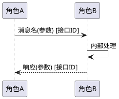

# 场景流程：{场景名}

## 1. 场景概述

| 项目 | 内容 |
|------|------|
| 场景 ID | SCENARIO_{序号} |
| 场景名 | {场景名} |
| L1 一级特性 | {cat_xxx} — {一级特性中文名} |
| L2 二级特性 | {sec_xxx | mob_xxx} — {二级特性中文名} |
| 场景类型 | 成功场景 / 失败场景 / 回退场景 / 迁移场景 / 授权场景 / 计费场景 / 开放场景 / 分析场景 / 注册场景 / 发现场景 |
| 置信度 | high / medium / low |
| 意图源覆盖 | 已采纳 / 部分采纳 / - |

## 2. 业务意图（意图域）

**业务目的**：<这个具体用户业务场景解决什么问题、由什么用户动作或业务条件触发、形成什么业务结果；不得只写“主流程/异常流程/边界流程”；参考自 `{solution_name} §X`>

**关键假设**：
- <假设 1：场景成立的前提，如用户行为/外部系统能力/网络条件；参考自 `{solution_name} §X`>
- <假设 2>

**场景优先级 / 演进定位**：<MVP / 增强 / 规划；与上下游场景的依赖与上线节奏；参考自 `{solution_name} §X`>

## 3. 参与方（事实域）

| 角色 | 架构元素 | 元素 spec 链接 | 说明 |
|------|---------|--------------|------|
| | | architectures/logic_view/elements/{name}/spec.md | |

## 4. 前置条件（事实域）

1. {前置条件 1}
2. {前置条件 2}

## 5. 场景流程（事实域，与代码调用链一致）

## 6. 步骤明细（事实域）

| 步骤 | 发起方 | 接收方 | 动作 | 使用接口 | 数据/参数 | 异常分支编号 |
|------|--------|--------|------|----------|----------|------------|
| 1 | | | | {接口ID} | | E-1 |
| 2 | | | | {接口ID} | | - |

## 7. 异常处理

### 7.1 异常处理意图（意图域）

| 异常编号 | 业务侧含义 | 用户体验取舍 | 回退策略动机 | 来源 |
|---------|-----------|------------|------------|------|
| E-1 | <这条异常对用户业务的影响> | <为什么这样取舍 vs 其他可选项> | <为什么选这种回退而非重试/中止> | 参考自 `{solution_name} §X` |

### 7.2 异常分支现状（事实域，与代码一致）

| 异常编号 | 触发条件（代码定位） | 当前处理方式 | 当前影响范围 |
|---------|------------------|------------|------------|
| E-1 | <文件:行 或 函数名> | <代码中实际的处理逻辑> | <实际影响 NF / 会话 / 用户> |

## 8. 后置条件（事实域）

- {后置条件 1}

## 9. 关联代码实现（事实域）

- **入口函数**：`{仓/模块/路径/函数名}`
- **关键调用链**：
  - `{函数1}` → `{函数2}` → `{函数3}`
- **状态机定位**（如适用）：`{仓/模块/状态机文件}` 的 `{状态名}`
- **关联测试用例**（如已知）：`{TC_XXX}`

## 10. 架构关联

参见所属最子特性目录下 [`spec.md`](spec.md) 与 [`arch_ref.yaml`](arch_ref.yaml)。

## 参考源

本场景采纳的历史方案：

| solution_name | 状态 | 主要采纳章节 | 采纳节 |
|---------------|------|------------|--------|
| <如 Pando V1.0版本系统设计说明书> | 现行 / 已演进 | §X.Y | §2 业务意图 / §7.1 异常意图 |
| <如 xxx场景方案设计说明书> | 现行 | §X | §2 关键假设 |
