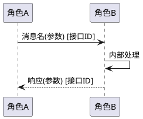

# 场景交互流程：{场景名}

## 1. 场景概述
| 项目 | 内容 |
|------|------|
| 场景ID | SCENARIO_{序号} |
| 场景名 | {场景名} |
| 所属子特性 | {SUB_XXX} |
| 场景类型 | 正常流程 / 异常流程 / 边界条件 |
| 置信度 | 高 / 中 / 低（逆向挖掘） |

## 2. 参与方
| 角色 | 架构元素 | 说明 |
|------|----------|------|
| | | |

## 3. 前置条件
1. {前置条件 1}
2. {前置条件 2}

## 4. 交互流程

## 5. 步骤明细
| 步骤 | 发起方 | 接收方 | 动作 | 使用接口 | 数据/参数 | 异常分支 |
|------|--------|--------|------|----------|-----------|----------|
| 1 | | | | {接口ID} | | |
| 2 | | | | {接口ID} | | |

## 6. 异常处理
| 异常场景 | 触发条件 | 处理方式 | 影响范围 |
|----------|----------|----------|----------|

## 7. 后置条件
- {后置条件 1}

## 8. 关联代码实现
- 入口函数：`{仓/模块/函数名}`
- 关键调用链：
  - `{函数1}` → `{函数2}` → `{函数3}`
- 关联测试用例：`{TC_XXX}`
