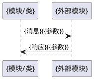

# {module_id} 模块设计（逆向还原）

> 本文档由实现逆向 Agent 从源代码反向生成，用于模块级设计说明的逆向还原。

## 0. 在仓级流程中的角色
{说明本模块参与了哪些端到端流程，担任什么角色，调用/被调用哪些关键接口。引用仓级 design.md §7}

| 仓级流程 | 角色 | 调用的关键接口 | 被调用的关键接口 |
|----------|------|---------------|------------------|
| {流程名称1} | {角色} | {接口1} | {接口2} |

## 1. 设计目标与约束

### 1.1 设计目标
{本模块要解决的具体问题，期望达成的效果}

### 1.2 设计约束
- {受限于上层接口契约}
- {受限于性能指标}

## 2. 核心类/函数
| 名称 | 类型 | 职责 | 关键参数 | 代码位置 |
|------|------|------|----------|----------|
| {类名/函数名} | 类/函数 | {一句话职责} | {参数列表} | {文件:行号} |

## 3. 数据结构
| 结构体/类 | 字段 | 说明 | 代码位置 |
|-----------|------|------|----------|
| {名称} | {字段1, 字段2} | {用途} | {文件:行号} |

## 4. 状态机（若有）

```plantuml
@startuml
[*] --> {状态1}
{状态1} --> {状态2}: {触发条件}
{状态2} --> [*]: {触发条件}
@enduml
```

状态说明：
- {状态1}：{进入条件、退出条件、动作}
- {状态2}：{同上}

状态机代码位置：`{文件:行号}`

## 5. 关键交互流程
{至少包含以下两种流程之一：模块内部关键流程，或跨模块交互。}

### 5.1 {流程名称}



流程说明：{流程的触发条件、关键分支、异常处理}

调用链代码位置：
- `{函数1}` @ `{文件:行号}`
- `{函数2}` @ `{文件:行号}`

## 6. 模块间接口约定
| 接口函数 | 方向 | 调用条件 | 说明 | 代码位置 |
|----------|------|----------|------|----------|
| {函数签名} | 调用/被调用 | {何时触发} | {用途} | {文件:行号} |

## 7. 逆向来源
- 源代码根目录：`repos/{repo_id}/{module_path}/`
- 源码文件数：{N}（触发模块级独立文档的阈值：>800）
- 主要源文件清单：
  | 文件 | 行数 | 关键内容 |
  |------|------|----------|
- 状态机识别依据：{switch-case / 状态表 / 枚举+转换函数 / 状态模式类}
- 调用链追踪方法：{静态分析 / 动态追踪 / 注释推断}
- 置信度评估：
  - 高：代码结构清晰，有充分注释，状态机和调用链明确
  - 中：主要逻辑可识别，部分细节需推断
  - 低：代码复杂度高，存在大量动态分发或反射，需人工复核
- 已知不确定项：
  - {不确定项 1}
- 建议人工复核点：
  - {复核点 1}
- 与原设计文档的差异（若已存在 design.md）：
  | 章节 | 原文档 | 代码实际 | 差异原因 |
  |------|--------|----------|----------|
