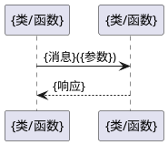
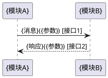

# {repo_id} 代码仓设计（逆向还原）

> 本文档由实现逆向 Agent 从源代码反向生成，用于仓级设计说明的逆向还原（小模块场景，模块信息融合到仓级文档）。

## 1. 设计目标与约束

### 1.1 整体设计目标
{概述本仓设计要达成的核心目标}

### 1.2 关键设计约束
- {约束1：如必须遵循3GPP TS 23.401接口规范}
- {约束2：如不允许直接调用第三方库，需通过封装层}
- {约束3：代码证据：{文件:行号}}

## 2. 关键设计要素
| 要素 | 描述 | 状态 | 影响范围 | 代码证据 |
|------|------|------|----------|----------|
| {要素1} | {描述} | 有效/已变更/待验证 | {影响哪些模块或接口} | {文件:行号} |

## 3. 模块划分
| 模块 | 职责 | 对应功能 | 详细设计 | 文件数 |
|------|------|----------|----------|--------|
| {模块1} | {职责摘要} | {spec 中的功能项} | 见 §6.1 / `modules/{模块1}/design.md` | {N} |

## 4. 核心数据对象
| 数据对象 | 定义位置 | 用途 | 关联功能 | 代码证据 |
|----------|----------|------|----------|----------|
| {结构体/类名} | {文件路径} | {说明} | {spec 中的功能项} | {文件:行号} |

## 5. 模块间接口
| 接口函数 | 提供模块 | 消费模块 | 说明 | 关联功能 | 代码证据 |
|----------|----------|----------|------|----------|----------|
| {函数签名} | {提供模块} | {消费模块} | {用途} | {功能项} | {文件:行号} |

## 6. 模块详细设计
{对每个模块，若其有独立 `design.md`，则简要引用；若无，则按模板展开完整设计}

### 6.1 模块：{模块名称}
- **职责**：{一句话职责}
- **对应功能**：{spec 中的功能项}
- **详细设计**：{若该模块有独立 `design.md`，写"详见 `modules/{模块}/design.md`"，跳过后续子小节；否则继续展开}

#### 设计目标与约束
- **目标**：{模块要达成的单一职责}
- **约束**：{受限于上层契约、性能指标、依赖库等}

#### 核心类/函数
| 名称 | 类型 | 职责 | 关键参数 | 代码位置 |
|------|------|------|----------|----------|
| {类名/函数名} | 类/函数 | {职责} | {参数列表} | {文件:行号} |

#### 数据结构
| 结构体/类 | 字段 | 说明 | 代码位置 |
|-----------|------|------|----------|
| {名称} | {字段} | {用途} | {文件:行号} |

#### 状态机（若有）

```plantuml
@startuml
[*] --> {状态1}
{状态1} --> {状态2}: {触发条件}
{状态2} --> [*]: {触发条件}
@enduml
```

状态说明：
- {状态1}：{进入条件、退出条件、动作}

状态机代码位置：`{文件:行号}`

#### 关键交互流程（模块内部）



流程说明：{流程的触发条件、关键分支、异常处理}

调用链代码位置：
- `{函数1}` @ `{文件:行号}`

#### 模块接口约定
| 接口函数 | 方向 | 调用条件 | 说明 | 代码位置 |
|----------|------|----------|------|----------|
| {函数签名} | 提供/消费 | {触发条件} | {用途} | {文件:行号} |

### 6.2 模块：{模块名称}
...（格式同 6.1）

## 7. 关键跨模块流程
{描述跨越多个模块的端到端业务流程，每个流程配 PlantUML 序列图}

### 7.1 {端到端流程名称1}
{简要说明该流程的业务背景、触发条件}
涉及接口：{接口1}, {接口2}（详见 §5 模块间接口表）



流程步骤说明：
1. {步骤1}
2. {步骤2}

调用链代码位置：
- `{函数1}` @ `{文件:行号}`
- `{函数2}` @ `{文件:行号}`

## 8. DFX 设计
{对应 spec 中 DFX 功能章节，描述如何通过设计实现各项 DFX 指标}

### 8.1 安全韧性设计
- {设计手段1}（代码证据：{文件:行号}）

### 8.2 可靠性设计
- {设计手段1}（代码证据：{文件:行号}）

### 8.3 可维护性设计
- {设计手段1}（代码证据：{文件:行号}）

### 8.4 隐私设计
- {设计手段1}（代码证据：{文件:行号}）

### 8.5 性能设计
- {设计手段1}（代码证据：{文件:行号}）

### 8.6 容量设计
- {设计手段1}（代码证据：{文件:行号}）

## 9. 逆向来源
- 源代码根目录：`repos/{repo_id}/`
- 源码文件总数：{N}
- 主要目录结构：
  | 目录 | 文件数 | 关键内容 |
  |------|--------|----------|
- 模块划分识别依据：{目录结构 / 命名规范 / 构建目标}
- 接口识别依据：{头文件 / API 定义 / 消息处理函数}
- 状态机识别依据：{switch-case / 状态表 / 枚举+转换函数 / 状态模式类}
- 调用链追踪方法：{静态分析 / 动态追踪 / 注释推断}
- 置信度评估：
  - 高：代码结构清晰，有充分注释，模块/接口/流程明确
  - 中：主要逻辑可识别，部分细节需推断
  - 低：代码复杂度高，存在大量动态分发或反射，需人工复核
- 已知不确定项：
  - {不确定项 1}
- 建议人工复核点：
  - {复核点 1}
- 与原 design.md 的差异（若已存在）：
  | 章节 | 原文档 | 代码实际 | 差异原因 |
  |------|--------|----------|----------|
