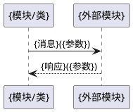

# {module_id} 模块设计（逆向还原）

> 本文档为模块级设计说明。首次由 `rev-repo-to-spec-and-design` skill 逆向生成，后续可由 `fwd-doc-sync` 等正向 skill 增量刷新，由 `qa-artifact-auto-verify` skill 做一致性校验。
>
> **代码定位约定**：所有"代码位置/代码证据"列使用 `文件路径::符号名` 格式（如 `internal/gmm/handler.go::HandleRegistrationRequest`、`internal/context/amf_ue.go::AmfUe.SecurityContext`），不使用行号。行号会随上游提交漂移导致误导，仅在生成时的逆向报告中附一次。

## 0. 在仓级流程中的角色
{说明本模块参与了哪些端到端流程，担任什么角色，调用/被调用哪些关键接口。引用仓级 design.md §7}

| 仓级流程 | 角色 | 调用的关键接口 | 被调用的关键接口 |
|----------|------|---------------|------------------|
| {流程名称1} | {角色} | {接口1} | {接口2} |

## 1. 设计目标与约束

### 1.1 设计目标
{本模块要解决的具体问题，期望达成的效果}

### 1.2 设计约束
- {受限于上层接口契约}
- {受限于性能指标}

## 2. 子模块清单
> 若本模块下存在 >800 文件的子目录，列出子模块级文档路径；否则写"无"。支持多层嵌套。

| 子模块路径 | 一句话职责 | 子模块级文档 | 文件数 |
|------------|-----------|--------------|--------|
| {如 internal/ngap/dispatcher} | {职责} | `modules/{父路径}/{子路径}/spec.md` 与 `design.md` | {N} |

若无 >800 子目录，写"无"。

## 3. 核心类/函数
| 名称 | 类型 | 职责 | 关键参数 | 代码位置 |
|------|------|------|----------|----------|
| {类名/函数名} | 类/函数 | {一句话职责} | {参数列表} | {文件路径}::{类名/函数名} |

## 4. 数据结构
| 结构体/类 | 字段 | 说明 | 代码位置 |
|-----------|------|------|----------|
| {名称} | {字段1, 字段2} | {用途} | {文件路径}::{结构体名} |

## 5. 状态机（若有）

```plantuml
@startuml
[*] --> {状态1}
{状态1} --> {状态2}: {触发条件}
{状态2} --> [*]: {触发条件}
@enduml
```

状态说明：
- {状态1}：{进入条件、退出条件、动作}
- {状态2}：{同上}

状态机代码位置：`{文件路径}::{状态机函数名或枚举名}`

## 6. 关键交互流程
{至少包含以下两种流程之一：模块内部关键流程，或跨模块交互。}

### 5.1 {流程名称}



流程说明：{流程的触发条件、关键分支、异常处理}

调用链代码位置：
- `{函数签名1}` @ `{文件路径}`
- `{函数签名2}` @ `{文件路径}`

## 7. 模块间接口约定
| 接口函数 | 方向 | 调用条件 | 说明 | 代码位置 |
|----------|------|----------|------|----------|
| {函数签名} | 调用/被调用 | {何时触发} | {用途} | {文件路径}::{函数名} |
