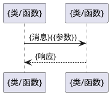
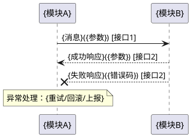

# {repo_id} 代码仓设计

> 本文档为仓级设计说明（小模块场景，模块信息融合到仓级文档）。首次由 `rev-repo-to-spec-and-design` skill 逆向生成，后续可由 `fwd-doc-sync` 等正向 skill 增量刷新，由 `qa-artifact-auto-verify` skill 做一致性校验。
>
> **代码定位约定**：所有"代码位置/代码证据"列使用 `文件路径::符号名` 格式，不使用行号。
>
> **职责边界**：design 只写"通过什么设计手段达成 spec 指标"；业务能力与指标归 spec.md，编码约束与经验归 rules.md。
>
> **分节置信度**：低置信章节末尾标注"本节置信度：低"。

## 1. 设计目标与约束

### 1.1 整体设计目标
{概述本仓设计要达成的核心目标}

### 1.2 关键设计约束
- {约束1：如必须遵循3GPP TS 23.401接口规范}
- {约束2：如不允许直接调用第三方库，需通过封装层}（代码证据：{文件路径}::{符号名}）

## 2. 关键设计要素
| 要素 | 描述 | 状态 | 影响范围 | 代码证据 |
|------|------|------|----------|----------|
| {要素1} | {描述} | 有效/已变更/待验证 | {影响哪些模块或接口} | {文件路径}::{符号名} |

## 3. 模块划分
| 模块 | 职责 | 对应功能 | 详细设计 | 文件数 |
|------|------|----------|----------|--------|
| {模块1} | {职责摘要} | {spec 中的功能项} | 见 §7.1 / `modules/{模块1}/design.md` | {N} |

## 4. 数据流向
> 逻辑架构 + 数据流转规则，供 AI 理解请求/消息在仓内的流转路径。

### 4.1 整体架构图
```plantuml
@startuml
{逻辑架构图：模块布局 + 主要数据流向箭头}
@enduml
```

### 4.2 数据流转规则
| 调用方 | 操作 | 数据来源 | 返回内容 | 代码证据 |
|--------|------|----------|----------|----------|
| {如 UE} | {如 注册请求} | {如 NGAP UplinkNAS} | {如 RegistrationAccept} | {文件路径}::{Handler 函数} |
| {如 SMF} | {如 N1N2 转发} | {如 HTTP POST} | {如 200 OK} | {文件路径}::{Handler 函数} |

## 5. 核心数据对象
| 数据对象 | 定义位置 | 用途 | 关联功能 | 代码证据 |
|----------|----------|------|----------|----------|
| {结构体/类名} | {文件路径} | {说明} | {spec 中的功能项} | {文件路径}::{结构体名} |

## 6. 模块间接口
| 接口函数 | 提供模块 | 消费模块 | 说明 | 关联功能 | 代码证据 |
|----------|----------|----------|------|----------|----------|
| {函数签名} | {提供模块} | {消费模块} | {用途} | {功能项} | {文件路径}::{函数名} |

## 7. 配置项
> 配置文件结构、关键字段、默认值、影响范围。供 AI 修改配置时理解字段语义。

| 配置字段 | 类型 | 默认值 | 影响范围 | 说明 | 代码证据 |
|----------|------|--------|----------|------|----------|
| {如 sbi.port} | int | {如 8000} | {SBI 服务监听端口} | {说明} | {pkg/factory/config.go::Config.Sbi.Port} |

## 8. 模块详细设计
{对每个模块，若其有独立 `design.md`，则简要引用；若无，则按模板展开完整设计}

### 8.1 模块：{模块名称}
- **职责**：{一句话职责}
- **对应功能**：{spec 中的功能项}

#### 设计目标与约束
- **目标**：{模块要达成的单一职责}
- **约束**：{受限于上层契约、性能指标、依赖库等}

#### 核心类/函数
| 名称 | 类型 | 职责 | 关键参数 | 代码位置 |
|------|------|------|----------|----------|
| {类名/函数名} | 类/函数 | {职责} | {参数列表} | {文件路径}::{类名/函数名} |

#### 数据结构
| 结构体/类 | 字段 | 说明 | 代码位置 |
|-----------|------|------|----------|
| {名称} | {字段} | {用途} | {文件路径}::{结构体名} |

#### 状态机（若有）

```plantuml
@startuml
[*] --> {状态1}
{状态1} --> {状态2}: {触发条件}
{状态2} --> [*]: {触发条件}
@enduml
```

状态说明：
- {状态1}：{进入条件、退出条件、动作}

状态机代码位置：`{文件路径}::{状态机函数名或枚举名}`

#### 关键交互流程（模块内部）



流程说明：{触发条件、关键分支、异常处理}

调用链代码位置：
- `{函数签名1}` @ `{文件路径}`

#### 模块接口约定
| 接口函数 | 方向 | 调用条件 | 说明 | 代码位置 |
|----------|------|----------|------|----------|
| {函数签名} | 提供/消费 | {触发条件} | {用途} | {文件路径}::{函数名} |

### 8.2 模块：{模块名称}
...（格式同 8.1）

## 9. 关键跨模块流程
{端到端业务流程，每流程配 PlantUML 序列图，含 happy path 与异常分支}

### 9.1 {端到端流程名称1}
{业务背景、触发条件}
涉及接口：{接口1}, {接口2}（详见 §6）



流程步骤说明：
1. {步骤1（happy path）}
2. {步骤2（happy path）}

异常分支：
| 失败点 | 错误表现 | 处理策略 | 代码证据 |
|--------|----------|----------|----------|
| {如 SBI 调用 AUSF 失败} | {5xx/超时} | {重试 N 次后退避，仍失败则终止注册流程} | {文件路径}::{函数名} |
| {如定时器 T3510 超时} | - | {重发鉴权请求，超过最大次数拒绝} | {文件路径}::{函数名} |

调用链代码位置：
- `{函数签名1}` @ `{文件路径}`
- `{函数签名2}` @ `{文件路径}`

## 10. 兜底策略
> 当正常流程无法完成时的降级/兜底处理，供 AI 理解异常边界与容错设计。

### 10.1 {兜底场景1，如：SBI 调用下游 NF 全部失败}
- **触发条件**：{如 重试 N 次仍失败 / 下游 NF 不可达}
- **策略逻辑**：{如 返回错误码 X / 走本地缓存 / 转人工}
- **与正常流程区别**：{正常返回成功响应 vs 兜底返回错误或降级数据}
- **代码证据**：{文件路径}::{函数名}

### 10.2 {兜底场景2}
...

## 11. DFX 设计
{对应 spec §2.2 DFX 功能，描述如何通过设计实现各项 DFX 指标。只写设计手段，不重复指标值}

### 11.1 安全韧性设计
- {设计手段1}（代码证据：{文件路径}::{符号名}）

### 11.2 可靠性设计
- {设计手段1}（代码证据：{文件路径}::{符号名}）

### 11.3 可维护性设计
- {设计手段1}（代码证据：{文件路径}::{符号名}）

### 11.4 隐私设计
- {设计手段1}（代码证据：{文件路径}::{符号名}）

### 11.5 性能设计
- {设计手段1}（代码证据：{文件路径}::{符号名}）

### 11.6 容量设计
- {设计手段1}（代码证据：{文件路径}::{符号名}）

## 12. 关键设计决策
> 记录本仓设计中的关键决策与权衡，供 AI 理解"为什么这么设计"，避免误改。

### 12.1 {决策主题，如：为什么用 SCTP 而非 TCP 作为 NGAP 传输}
- **决策**：{做了什么选择}
- **背景**：{当时面临的问题与约束}
- **备选方案**：{考虑过的其他方案}
- **选择理由**：{为何选当前方案}
- **代价/权衡**：{接受的妥协}
- **代码证据**：{文件路径}::{符号名}

### 12.2 {决策主题}
...
